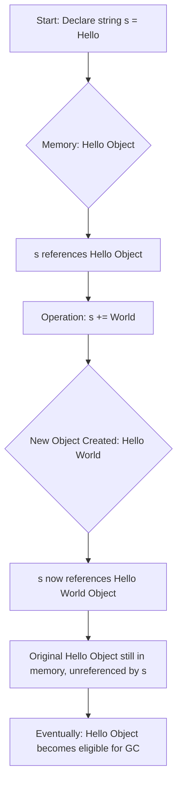
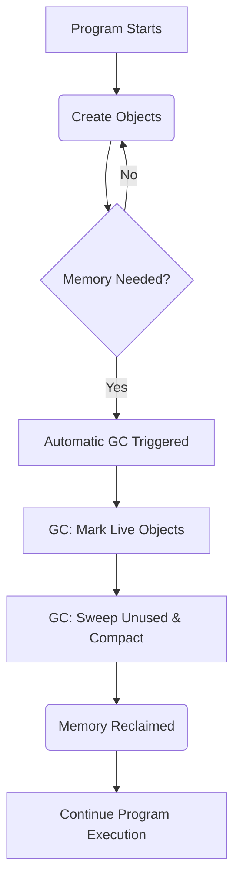

# C# Interview Questions

## 📘 Index
| No | Question | Level |
|----|----------|-------|
| 1 | [What is an immutable object? Why is string immutable?](#q1) | Beginner |
| 2 | [C# Boxing and Unboxing](#q2) | Intermediate |

---
<details>
<summary> ## Question 1: What is an immutable object? Why is string immutable? <a id="q1"></a> </summary>

### Short Answer

An immutable object is an object whose state (data) cannot be modified after it is created. If you try to change it, a new object is created in memory instead. In C#, `string` is immutable primarily to ensure **thread safety**, **security** (preventing accidental data corruption), and to enable **memory optimization** through mechanism called String Interning.

### Detailed Explanation

* **Definition**: Once an immutable object is instantiated, its internal fields cannot be changed.
* **String Behavior**: When you modify a string (e.g., using `.Replace()`, `+`, or `.ToUpper()`), the .NET runtime does not change the existing memory. Instead, it allocates a new block of memory for the modified string and returns a reference to that new object.
* **String Interning**: Because strings are immutable, the Common Language Runtime (CLR) can save memory by storing only one copy of duplicate string literals in a "String Intern Pool". Multiple variables can point to the same memory address safely because no one can modify it.
* **Hash Code Consistency**: Strings are frequently used as keys in HashTables and Dictionaries. If strings were mutable, changing the string content would change its HashCode, causing the item to get lost in the collection.
* **Security**: Strings carry sensitive data like file paths, database connection strings, and network addresses. Immutability ensures that once a string is validated (e.g., checking if a file path is safe), it cannot be changed maliciously or accidentally before it is used.
* **Thread Safety**: Since the data cannot change, multiple threads can read the same string simultaneously without risking race conditions or requiring locks.

### Code Example

```csharp
using System;

public class Program
{
    public static void Main()
    {
        // 1. Assign initial value
        string str1 = "Hello";
        
        // 2. Assign reference to str2
        string str2 = str1;
        
        Console.WriteLine($"Original str1: {str1}"); // Output: Hello
        Console.WriteLine($"Original str2: {str2}"); // Output: Hello
        
        // 3. Modify str1
        // This does NOT change the memory 'Hello' lives in.
        // It creates a new string "Hello World" and points str1 to it.
        str1 = str1 + " World";
        
        Console.WriteLine("--- After Modification ---");
        
        // str1 now points to a new object
        Console.WriteLine($"Modified str1: {str1}"); // Output: Hello World
        
        // str2 still points to the old object ("Hello")
        // If string were mutable, str2 would have also changed to "Hello World"
        Console.WriteLine($"str2 (Reference check): {str2}"); // Output: Hello
    }
}

```

### Real-World Use Case

* **Configuration & Security**: Passing database connection strings or API keys between layers. You want to guarantee that a lower-level function doesn't alter the credentials passed by a higher-level controller.
* **Dictionary Keys**: Using strings as keys in a `Dictionary<string, User>`. If the key changed after being added, the dictionary would fail to retrieve the user.
* **Caching**: Storing data in a cache where multiple threads read the same keys.

### When to Use

* **Value Objects**: When creating custom types representing values like `Address`, `Money`, or `Coordinate` where the identity is defined by the data, not a memory reference.
* **Multi-threading**: When you need high concurrency without the overhead of locks.
* **Hash Keys**: When the object will be used as a key in a Dictionary or HashSet.

### When NOT to Use

* **High-Frequency Updates**: Avoid using immutable objects (especially strings) inside tight loops where values change constantly.
* **Large Data Blobs**: If you have a massive text buffer that needs frequent small edits, immutability forces a full copy of the buffer for every edit, which is disastrous for performance.

### Performance / Memory Notes

* **Memory Pressure**: Frequent string manipulations (concatenation in loops) create thousands of temporary objects that must be garbage collected (GC). This is known as "String Thrashing."
* **Interning Benefit**: Immutable strings allow the CLR to de-duplicate literals. If you have the word "Status" 1000 times in your code, it may only occupy memory once.
* **Stack vs Heap**: Strings are reference types, so they live on the Heap, but the reference (pointer) lives on the Stack.

### Thread Safety

* **Yes, it is Thread-Safe**: Immutable objects are inherently thread-safe.
* Since the state cannot be modified, you do not need `lock` statements or `Monitor` to prevent read/write conflicts. Multiple threads can read the string "Config123" without fear that another thread will change it to "Config999" halfway through the read operation.

### Common Follow-Up Interview Questions

1. **If string is immutable, how does StringBuilder work?**
* *Answer*: `StringBuilder` is a mutable wrapper. It maintains an internal character array that is resized dynamically. It modifies the array in place until `.ToString()` is called.


2. **What is the String Intern Pool?**
* *Answer*: A table in memory where the CLR stores references to unique string literals to save space.


3. **Can you create a custom immutable class in C#?**
* *Answer*: Yes, by making the class `sealed`, declaring all fields `readonly`, and only initializing them via the constructor.


4. **Is `SecureString` immutable?**
* *Answer*: `SecureString` (now deprecated in .NET Core/5+) was mutable but encrypted in memory. It was designed to clear memory explicitly, unlike immutable strings which wait for GC.


### Mistakes Candidates Often Make

* **Loop Concatenation**: Writing `str += "x"` inside a `for` loop of 10,000 iterations. This creates 10,000 throw-away string objects.
* **Confusing `const` with Immutable**: Thinking `const` applies to the object instance. `const` applies to the variable reference at compile time, whereas immutability is a property of the object's memory behavior at runtime.
* **Modifying Parameters**: Assuming that passing a string into a method and changing it there affects the original variable (it doesn't, because strings behave like value semantics despite being reference types).

### Comparison: String vs StringBuilder

| Feature | String | StringBuilder |
| --- | --- | --- |
| **Mutability** | Immutable (cannot change) | Mutable (can change) |
| **Memory** | New object created on every change | Modifies internal buffer |
| **Thread Safety** | Thread-safe | Not thread-safe |
| **Best Use** | Storing static text, Keys, DTOs | Loops, heavy text manipulation |
| **Performance** | Slow for frequent updates | Fast for frequent updates |


**Next Step**:
Would you like me to explain **String Interning** in depth or provide a detailed implementation of a **Custom Immutable Class** in C#?


 
</details>

---

<details>
# Question 2: C# Boxing and Unboxing <a id="q2"></a>

## 1. Short Direct Answer

Boxing in C# is the process of converting a **value type** (like `int`, `bool`, `struct`) into a **reference type** (`object` or an interface type implemented by the value type). This conversion is implicit. Unboxing is the reverse process: converting an `object` type back to a specific value type. This conversion is explicit and requires a cast. Both operations involve overhead, primarily memory allocation on the heap for boxing and type checking for unboxing.

## 2. Detailed Explanation

*   **Boxing:** When a value type is boxed, the Common Language Runtime (CLR) performs the following steps:
    *   It allocates memory on the **managed heap** for a new object. This memory is large enough to hold the value type's data and the overhead of an object (type information, sync block index).
    *   The value of the value type is then **copied** into this newly allocated heap object.
    *   A reference to this new heap object is returned. This reference is then stored in the `object` (or interface) variable.
    *   Boxing is an **implicit** conversion.

*   **Unboxing:** When an `object` is unboxed back to a value type, the CLR performs these steps:
    *   It first checks if the `object` instance is `null` or if it's actually an instance of the target value type. If not, an `InvalidCastException` is thrown.
    *   If the check passes, the value stored in the heap object is **copied** out into the new value type variable.
    *   Unboxing is an **explicit** conversion and requires a cast.

*   **Performance Impact:** Both boxing and unboxing operations incur a significant performance cost. Boxing involves heap allocation and memory copying, which are relatively expensive operations. Heap allocation puts pressure on the garbage collector (GC), potentially leading to more frequent garbage collection cycles. Unboxing involves runtime type checking and memory copying.

*   **Immutability:** When a value type is boxed, a *copy* of its value is placed on the heap. Any subsequent changes to the original value type variable will not affect the boxed copy, and vice-versa.

*   **Type Safety:** Unboxing requires an explicit cast to the correct target value type. Attempting to unbox to an incompatible type will result in an `InvalidCastException` at runtime.

*   **`System.ValueType` and `System.Enum`:** Value types can also be boxed to `System.ValueType` or `System.Enum` (if it's an enum type) instead of just `object`.

## 3. Code Example

```csharp
using System;
using System.Collections; // For a common real-world use case example (pre-generics)

public class BoxingUnboxingExample
{
    public static void Main(string[] args)
    {
        // 1. Boxing Example
        int myInt = 123; // myInt is a value type, stored on the stack
        Console.WriteLine($"Original int value: {myInt}");

        object boxedInt = myInt; // Boxing: myInt (value type) is converted to object (reference type)
                                 // A copy of myInt's value is placed on the heap.
        Console.WriteLine($"Boxed object value: {boxedInt}");

        // Demonstrate immutability of the boxed value
        myInt = 456; // Change the original value type
        Console.WriteLine($"New original int value: {myInt}");
        Console.WriteLine($"Boxed object value (unchanged): {boxedInt}"); // The boxed value remains 123

        // 2. Unboxing Example
        // To unbox, we must explicitly cast the object back to its original value type.
        // It must be cast to the exact type it was boxed from, or an InvalidCastException occurs.
        int unboxedInt = (int)boxedInt; // Unboxing: The value from the heap object is copied back to a stack variable.
        Console.WriteLine($"Unboxed int value: {unboxedInt}");

        // 3. Demonstrating InvalidCastException during unboxing
        object anotherBoxedInt = 789; // int is boxed to object implicitly
        try
        {
            // Attempt to unbox to a different type (e.g., short)
            short invalidUnbox = (short)anotherBoxedInt; // This will throw InvalidCastException
            Console.WriteLine($"This line will not be reached: {invalidUnbox}");
        }
        catch (InvalidCastException ex)
        {
            Console.WriteLine($"Caught an error during invalid unboxing: {ex.Message}");
        }

        // 4. Practical scenario with ArrayList (pre-generics)
        // ArrayList stores elements as 'object', causing boxing for value types.
        ArrayList list = new ArrayList();
        list.Add(1);    // int 1 is boxed to object
        list.Add(2);    // int 2 is boxed to object
        list.Add(3.14); // double 3.14 is boxed to object

        Console.WriteLine("\nElements in ArrayList:");
        foreach (object item in list)
        {
            Console.WriteLine($"Type: {item.GetType().Name}, Value: {item}");
        }

        // Accessing elements from ArrayList involves unboxing
        int firstElement = (int)list[0]; // Unboxing: object to int
        Console.WriteLine($"First element (unboxed): {firstElement}");
    }
}
```

**Output:**
```
Original int value: 123
Boxed object value: 123
New original int value: 456
Boxed object value (unchanged): 123
Unboxed int value: 123
Caught an error during invalid unboxing: Specified cast is not valid.

Elements in ArrayList:
Type: Int32, Value: 1
Type: Int32, Value: 2
Type: Double, Value: 3.14
First element (unboxed): 1
```

## 4. Real-World Use Case

*   **Legacy Code & Non-Generic Collections:** Before C# 2.0 introduced generics, collections like `System.Collections.ArrayList` and `System.Collections.Hashtable` stored all their elements as `object`. Adding a value type to these collections would cause it to be boxed, and retrieving it required unboxing. While modern code heavily favors `List<T>` and `Dictionary<TKey, TValue>` (generics avoid boxing/unboxing), you might encounter boxing in older codebases.
*   **Reflection:** When using reflection to invoke methods or set fields/properties on value types, the values often need to be treated as `object`s, leading to boxing.
*   **`object` Parameters:** Methods that accept `object` as a parameter will box any value type passed to them. For example, `Console.WriteLine()` has overloads that take `object`, causing value types to be boxed before printing.
*   **String Formatting:** Methods like `string.Format()` and interpolated strings often implicitly box value types when they are passed as arguments to `object` parameters for formatting.

## 5. When to Use

Generally, you should **avoid** boxing and unboxing whenever possible in modern C# development due to their performance implications.

However, there are very specific, less common scenarios where it might be unavoidable or even necessary:

*   **Interoperating with older APIs:** When working with legacy libraries or framework components that predates generics and specifically expect `object` types for value types.
*   **Highly dynamic scenarios (e.g., Reflection):** When you need to manipulate value types at runtime where the exact type isn't known until execution, and generics might not be applicable or too complex to set up.
*   **Very rare, specialized cases** where the overhead is negligible for the overall application performance, or the boxing/unboxing happens so infrequently that its impact is not a concern.

## 6. When NOT to Use

*   **Performance-Critical Code:** Avoid boxing and unboxing in loops, frequently called methods, or any code path where performance is a concern. The overhead of heap allocation, memory copying, and GC pressure can quickly degrade performance.
*   **When Generics are Available:** Always prefer generic collections (`List<T>`, `Dictionary<TKey, TValue>`) and generic methods (`<T>`) over non-generic `object`-based alternatives. Generics provide type safety *without* the need for boxing/unboxing for value types.
*   **Avoiding `object` as a "catch-all" type:** While `object` can hold any type, using it liberally for value types without a clear need introduces boxing/unboxing overhead and loses compile-time type safety.
*   **When working with large datasets of value types:** Boxing each element will consume significantly more memory on the heap and slow down processing due to GC activity.

## 7. Performance / Memory Notes

*   **Memory Allocation:** Boxing a value type involves allocating new memory on the **managed heap**. This is much slower than allocating on the stack (where value types usually reside). Each boxed instance is a separate object.
*   **Garbage Collector (GC) Pressure:** The newly allocated heap objects from boxing become candidates for garbage collection. Frequent boxing creates more temporary objects, increasing the workload of the GC and potentially leading to more frequent and longer GC pauses, impacting application responsiveness.
*   **Memory Footprint:** A boxed value type consumes more memory than its unboxed counterpart. An `int` (4 bytes) when boxed becomes an `object` (typically 12-24 bytes for object overhead + 4 bytes for the `int`'s value, depending on the architecture).
*   **Execution Impact:** Beyond memory, boxing involves copying the value, and unboxing involves a type check and another copy. These operations consume CPU cycles.

## 8. Thread Safety

Boxing itself (the act of converting a value type to an `object`) is inherently **thread-safe** in the sense that it creates a *new, distinct copy* of the value type on the heap. This copy is independent of the original value type variable.

*   If multiple threads box the *same* value type variable, each thread will create its own independent boxed object on the heap.
*   If a value type is boxed and then that `object` reference is shared among multiple threads, the thread safety of accessing or modifying the *content* of that boxed `object` depends on whether the original value type itself was mutable (e.g., a custom `struct` with mutable fields) and how it's being accessed.
*   For primitive value types (like `int`, `bool`, `double`), their boxed forms are effectively immutable because the underlying value type itself is immutable. Thus, accessing a boxed primitive from multiple threads is generally safe as no state can be changed.

In summary, the boxing *operation* is safe because it creates isolated copies. Thread safety concerns arise only if the *boxed object itself* is a mutable type and its reference is shared and modified concurrently without proper synchronization.

## 9. Common Follow-Up Interview Questions

1.  **Why is boxing generally considered bad practice in modern C#?** (Focus on performance, memory, GC overhead, and loss of type safety.)
2.  **How can you avoid boxing and unboxing in C#?** (Generics, specifically `List<T>`, `Dictionary<TKey, TValue>`, generic methods.)
3.  **What happens if you try to unbox an object to an incorrect type?** (It throws an `InvalidCastException` at runtime.)
4.  **Can you box a null value type?** (No, value types cannot be `null`. However, `Nullable<T>` can be boxed, and if its `HasValue` is false, it boxes to a `null` reference.)
5.  **Explain the difference between boxing/unboxing and type casting.** (Boxing/unboxing specifically involves conversion between value and reference types with heap allocation. Type casting is about converting between compatible reference types or compatible value types, without changing memory location or allocating new heap memory for the original data.)

## 10. Mistakes Candidates Often Make

*   **Confusing with Type Casting:** Believing boxing/unboxing is just another form of type casting. While unboxing uses a cast syntax, the underlying mechanism is fundamentally different (heap allocation, copying, runtime checks).
*   **Underestimating Performance Impact:** Not realizing the significant performance and memory overhead, especially in loops or frequently called methods.
*   **Incorrectly Stating Unboxing is Implicit:** Unboxing *always* requires an explicit cast. Boxing is implicit.
*   **Not Knowing `InvalidCastException`:** Forgetting that unboxing to an incompatible type results in a runtime error.
*   **Ignoring Generics as the Solution:** Failing to mention generics as the primary and most effective way to avoid boxing/unboxing in modern C#.
*   **Thinking `string` is a value type:** Sometimes candidates mistake `string` for a value type, leading to incorrect discussions about its boxing behavior. `string` is a reference type, so it doesn't box.

## 11. Comparison (Boxing/Unboxing vs. Generics)

| Feature             | Boxing/Unboxing                                | Generics (`List<T>`, `Dictionary<TKey, TValue>`)                                |
| :------------------ | :--------------------------------------------- | :------------------------------------------------------------------------------- |
| **Purpose**         | Convert value types to `object` and back.      | Provide type-safe operations on data structures/methods without `object`.        |
| **Type Safety**     | Compile-time type safety is lost (uses `object`). Runtime `InvalidCastException` during unboxing. | Full compile-time type safety.                                                   |
| **Performance**     | **Poor:** Involves heap allocation, memory copying, and GC overhead. | **Excellent:** Avoids heap allocation and copying for value types. Direct access. |
| **Memory Usage**    | Higher due to object overhead on the heap for value types. | Efficient, stores value types directly without overhead for each element.        |
| **Usage**           | Mostly in legacy code or very specific dynamic scenarios requiring `object`. | Standard practice for type-safe collections and methods in modern C#.            |
| **Syntax**          | Implicit for boxing, explicit cast for unboxing. | Type parameters (`<T>`) used at compile time.                                    |

## 12. Diagram prompt (for nano banana)

**Diagram Title:** C# Boxing & Unboxing Lifecycle

**Type:** Flowchart / Memory Diagram

**Elements:**

*   **`int myValue = 10;`** (Stack memory block with value 10)
*   **`object obj = myValue;`** (Arrow from `myValue` to a new Heap memory block labeled "Boxed `int` (10)", with an arrow from `obj` to this heap block.)
    *   Annotation: "Boxing: Value copied to Heap. New `object` created."
*   **Heap Memory** (Large box containing the "Boxed `int`" object)
*   **Stack Memory** (Large box containing `myValue` and `obj` reference)
*   **`int retrievedValue = (int)obj;`** (Arrow from "Boxed `int` (10)" on Heap to a new Stack memory block labeled "retrievedValue (10)")
    *   Annotation: "Unboxing: Value copied from Heap to Stack. Runtime type check."
*   **`InvalidCastException`** (Conditional path from unboxing if type mismatch)

**Visual Flow:**
Stack -> (Boxing) -> Heap -> (Unboxing) -> Stack

## 13. Infographic Content (for Nano Banana)

**Title:** C# Boxing & Unboxing: The Basics

**Winning Points Summary:**

*   **Convert Types:** Boxing turns small "value types" (like `int`) into bigger "reference types" (`object`) by copying them to a special memory area (the Heap). Unboxing is the reverse.
*   **Hidden Cost:** These conversions are slow! Boxing needs new memory on the Heap, and both involve copying data and checking types, which can make your code sluggish.
*   **Avoid with Generics:** Modern C# uses "Generics" (like `List<T>`) to handle different types safely *without* boxing, making your code faster and more efficient.
*   **Runtime Errors:** Unboxing an `object` back to the wrong type will crash your program with an `InvalidCastException`!

**Simple Flow or Diagram Idea:**

```
[Value Type] (e.g., int)
     |
     V
   [BOXING] (Implicit conversion)
     |
     V
[Reference Type] (e.g., object on Heap)
     |
     V
  [UNBOXING] (Explicit cast required)
     |
     V
[Value Type] (e.g., int)
```

**Beginner-Friendly Revision Layout:**

**What is it?**
*   **Boxing:** `int` -> `object` (Value Type -> Reference Type)
*   **Unboxing:** `object` -> `int` (Reference Type -> Value Type)

**Why is it important?**
*   **Performance:** Can be slow! Uses more memory and CPU.
*   **Errors:** Unboxing to wrong type = crash (`InvalidCastException`).

**How to avoid?**
*   Use **Generics**! (e.g., `List<int>` instead of `ArrayList`).

**Key Takeaway:** Avoid if possible, use Generics instead!
</details>


---

"The Common Language Runtime (CLR) is a core concept in C# and the broader .NET ecosystem. Understanding its internal workings is crucial for any serious .NET developer.

---

## How does CLR work internally?

### 1. Short Direct Answer

The Common Language Runtime (CLR) is the execution engine for all .NET applications. It acts like a virtual machine that takes your compiled C# code (which is first turned into an intermediate language), translates it into machine code specific to your computer's processor, and then executes it. Beyond execution, the CLR provides essential services like automatic memory management (Garbage Collection), error handling, and security.

### 2. Detailed Explanation

The CLR is a fundamental component of the .NET platform, providing the runtime environment for executing .NET applications. Here's a step-by-step breakdown of its internal workings and key features:

*   **Compilation to CIL (Common Intermediate Language):** When you compile C# (or any other .NET language) code, it's not directly translated into machine-specific code. Instead, it's compiled into an intermediate, CPU-agnostic bytecode called CIL (formerly MSIL - Microsoft Intermediate Language). This CIL, along with metadata (information about types, members, etc.), is stored in an assembly (typically a `.dll` or `.exe` file).
*   **Loading the Assembly:** When a .NET application starts, the CLR's Class Loader component locates and loads the necessary assemblies (DLLs and EXEs) into memory.
*   **Just-In-Time (JIT) Compilation:** The CIL code is not executed directly. Instead, the CLR's Just-In-Time (JIT) compiler converts the CIL into native machine code *just before* each method is executed for the first time. This machine code is then cached, so subsequent calls to the same method use the pre-compiled native code, making them faster. The JIT compiler optimizes the code for the specific CPU architecture and operating system it's running on.
*   **Execution Engine:** Once JIT-compiled, the native machine code is executed by the CLR's execution engine.
*   **Garbage Collector (GC):** The CLR includes an automatic memory manager called the Garbage Collector. It continuously tracks objects in memory. When objects are no longer referenced by the application, the GC automatically reclaims the memory they occupied, preventing memory leaks and simplifying memory management for developers.
*   **Exception Handling:** The CLR provides a robust, language-agnostic mechanism for handling runtime errors (exceptions). It ensures that exceptions are caught and processed in a structured way, regardless of the .NET language in which they originated.
*   **Type Safety:** The CLR enforces strict type safety, ensuring that code accesses memory and types only in defined and permitted ways. This helps prevent many common programming errors and security vulnerabilities.
*   **Thread Management:** The CLR handles the creation, management, and synchronization of threads, allowing applications to perform concurrent operations efficiently.
*   **Security:** The CLR provides a security infrastructure, including Code Access Security (CAS) (though largely deprecated in modern .NET for sandboxing), which helps enforce permissions and control what actions managed code can perform.

### 3. Code Example

While you don't write ""CLR code,"" every C# program you write interacts with the CLR. Here's a simple example and an explanation of what the CLR does behind the scenes:

```csharp
using System;

public class CLRDemo
{
    public static void Main(string[] args)
    {
        string greeting = ""Hello from CLR-managed C#!""; // CLR allocates memory for this string.
        Console.WriteLine(greeting);                   // CLR handles the call to the underlying system function.
        
        // When 'greeting' goes out of scope or is no longer referenced,
        // the CLR's Garbage Collector will eventually reclaim its memory automatically.
        
        int a = 10;
        int b = 20;
        int sum = AddNumbers(a, b);                    // The 'AddNumbers' method is JIT-compiled on its first call.
        Console.WriteLine($""The sum is: {sum}"");
    }

    public static int AddNumbers(int num1, int num2)
    {
        return num1 + num2;
    }
}
```

**Explanation:**
1.  **Compilation:** When `CLRDemo.cs` is compiled, it turns into `CLRDemo.exe` containing CIL code and metadata.
2.  **Execution:** When you run `CLRDemo.exe`, the CLR loads it.
3.  **JIT Compilation:** The `Main` method's CIL code is JIT-compiled into native machine instructions on its first execution. The `AddNumbers` method's CIL will be JIT-compiled when `AddNumbers(a, b)` is called for the first time.
4.  **Memory Management:** The CLR automatically allocates memory for the `greeting` string and the integer variables (`a`, `b`, `sum`). The Garbage Collector (GC) monitors these objects. Once `greeting` is no longer needed, the GC will clean up its memory.
5.  **Runtime Services:** The CLR handles the call to `Console.WriteLine`, ensuring it interacts correctly with the operating system's console output.

### 4. Real-World Use Case

The CLR is the backbone of virtually all .NET applications across various domains:

*   **Web Applications & APIs:** ASP.NET Core applications, microservices, and Web APIs all run on the CLR to handle requests, process business logic, and interact with databases.
*   **Desktop Applications:** Windows Presentation Foundation (WPF), Windows Forms, and Universal Windows Platform (UWP) applications use the CLR for their UI, event handling, and core logic.
*   **Cloud Services:** Azure Functions, AWS Lambda functions, and other serverless compute services written in C# execute within a CLR environment.
*   **Gaming:** The Unity game engine uses Mono (an open-source implementation of the CLR) to run C# game scripts.
*   **Background Services & Daemons:** Long-running services, data processing jobs, and message queue consumers built with .NET rely on the CLR.

### 5. When to Use (Benefits of CLR)

The CLR is not something you ""choose to use"" like a library; it's an inherent part of developing with .NET. The benefits it provides are why developers choose the .NET platform:

*   **Language Interoperability:** Allows code written in different .NET languages (C#, F#, VB.NET) to seamlessly interact and share types.
*   **Platform Independence:** CIL, combined with different CLR implementations (.NET Framework, .NET Core, Mono), allows .NET applications to run on various operating systems (Windows, Linux, macOS).
*   **Increased Developer Productivity:** Features like automatic memory management (GC), structured exception handling, and a rich Base Class Library significantly reduce boilerplate code and common error types.
*   **Performance Optimization:** The JIT compiler optimizes code at runtime for the specific CPU, often resulting in highly performant applications.
*   **Robustness and Security:** Enforces type safety, provides a secure execution environment, and manages resources effectively, leading to more robust applications.

### 6. When NOT to Use

The CLR is integral to the .NET ecosystem. If you are developing an application using C# or any other .NET language, you are inherently using the CLR. Therefore, the question of ""when NOT to use"" directly applies to choosing *not* to use the .NET platform itself.

You would not use the CLR if:
*   You are developing in a different language and ecosystem (e.g., C++, Java, Python, Go) that has its own runtime or compilation model.
*   You require extremely low-level hardware control or absolutely minimal runtime overhead, typically found in highly specialized embedded systems or operating system kernels, where direct machine code or unmanaged C/C++ might be preferred.

### 7. Performance / Memory Notes

*   **JIT Compilation Overhead:** While JIT compilation provides significant runtime performance benefits, there can be a slight startup overhead as methods are compiled on their first access. This is usually negligible for long-running applications but can be a factor for short-lived command-line tools. Native Image Generator (NGEN) or Ahead-Of-Time (AOT) compilation can pre-compile assemblies to reduce this startup time.
*   **Garbage Collection (GC):**
    *   **Automatic Memory Management:** Frees developers from manual memory management, greatly reducing memory leaks and dangling pointer issues.
    *   **Generational Collection:** The CLR's GC uses a generational approach (Gen 0, Gen 1, Gen 2), optimizing collections by focusing on younger, often short-lived objects (Gen 0) which are collected more frequently and quickly.
    *   **Stop-the-World Pauses:** Traditional GC implementations could introduce ""stop-the-world"" pauses where application threads are temporarily suspended during a collection cycle. Modern CLR GCs (especially in .NET Core/.NET 5+) are highly optimized for latency, offering concurrent and background GC modes to minimize these pauses.
    *   **Memory Footprint:** Managed applications running on the CLR typically have a larger memory footprint than equivalent unmanaged applications (e.g., C++) due to the runtime itself, GC overhead, and type metadata.
*   **Execution Impact:** The CLR's various services (type checking, security checks, exception handling) introduce a small but generally acceptable overhead compared to raw unmanaged code. However, the benefits in terms of safety, productivity, and JIT optimizations usually outweigh this.

### 8. Thread Safety

*   The CLR's internal mechanisms, such as loading assemblies, managing types, and JIT compilation, are designed to be thread-safe. This means the CLR itself can operate correctly in a multi-threaded environment.
*   However, the *application code* you write that runs on the CLR is **not inherently thread-safe**. If multiple threads in your application access shared data or resources concurrently, you are responsible for implementing appropriate synchronization mechanisms (e.g., using `lock` keyword, `Monitor`, `Mutex`, `Semaphore`, `ReaderWriterLockSlim`) to prevent race conditions and ensure data consistency.
*   The CLR provides the building blocks for thread-safe programming, but it doesn't automatically make your application code thread-safe.

### 9. Common Follow-Up Interview Questions

1.  What is the difference between CIL and native machine code?
2.  Explain the different generations of the Garbage Collector. How does generational collection improve performance?
3.  What is the role of the Base Class Library (BCL) in conjunction with the CLR?
4.  Can you describe the lifecycle of an object from creation to garbage collection?
5.  What are the advantages and disadvantages of Just-In-Time (JIT) compilation?

### 10. Mistakes Candidates Often Make

*   **Confusing CLR with .NET Framework/.NET Core:** A common mistake is using these terms interchangeably. The CLR is the *runtime component* within the larger .NET Framework or .NET Core/.NET platform.
*   **Lack of Detail on GC/JIT:** Simply stating ""it does garbage collection"" or ""it compiles code"" is insufficient. Interviewers expect a deeper understanding of generational GC, stop-the-world pauses, and how JIT optimizes for specific CPUs.
*   **Believing CLR only runs C#:** Forgetting its language-agnostic nature and that it can execute code compiled from VB.NET, F#, etc.
*   **Underestimating Performance/Memory Impact:** Not being able to discuss the trade-offs of JIT or the memory overhead/pause times of GC.
*   **Ignoring Thread Safety Responsibility:** Assuming the CLR makes application code thread-safe automatically.

### 11. Comparison (CLR vs. JVM)

| Feature            | CLR (Common Language Runtime)                                      | JVM (Java Virtual Machine)                                       |
| :----------------- | :----------------------------------------------------------------- | :--------------------------------------------------------------- |
| **Platform**       | .NET (Framework, Core, 5+)                                         | Java Platform (JRE, JDK)                                         |
| **Intermediate Code**| CIL (Common Intermediate Language)                                | Bytecode                                                         |
| **Source Languages** | C#, F#, VB.NET, C++/CLI, PowerShell, etc. (Many .NET languages)    | Java (primarily), Kotlin, Scala, Groovy, Clojure                 |
| **JIT Compilation**| Yes, compiles CIL to native machine code at runtime.               | Yes, compiles Bytecode to native machine code at runtime.        |
| **Memory Management**| Automatic, Generational Garbage Collection.                        | Automatic, various Garbage Collection algorithms (e.g., G1, CMS).|
| **Key Services**   | Memory management (GC), exception handling, type safety, security, thread management. | Memory management (GC), exception handling, type safety, security, thread management. |
| **Portability**    | Cross-platform with .NET Core/.NET (Windows, Linux, macOS).        | Highly cross-platform (Write Once, Run Anywhere).                |
| **Core Libraries** | Base Class Library (BCL)                                           | Java Class Library (JCL)                                         |

### 12. Diagram prompt

```
Diagram Prompt:
A flowchart titled ""C# Code Execution Lifecycle in CLR"" with the following main steps and internal CLR components:

Flowchart Title: C# Code Execution Lifecycle in CLR

[C# Source Code (.cs)]
       ↓
[C# Compiler (csc.exe)]
       ↓
[CIL (Common Intermediate Language) + Metadata]
       ↓ (Stored in an Assembly: .dll or .exe)
[CLR (Common Language Runtime)]
       ↓
   [Class Loader]
       ↓ (Loads Assembly)
   [JIT Compiler]
       ↓ (Compiles CIL for methods into Native Code on first call)
   [Execution Engine] ──> [CPU]
       ↑
   [Garbage Collector] <─── (Manages Memory for Objects)
       ↑
   [Exception Handler] <─── (Handles Runtime Errors)
       ↑
   [Thread Manager]  <─── (Manages Application Threads)
       ↑
   [Security Engine] <─── (Enforces Code Access Rules)
```

### 13. Infographic Content

**Title: The Heart of .NET: Understanding the CLR**

*   **Universal Translator:** Your C# code is compiled into an intermediate language (CIL), then the CLR's JIT compiler translates it into machine code your computer's CPU can understand.
*   **Smart Memory Manager:** The Garbage Collector (GC) automatically reclaims unused memory, preventing memory leaks and simplifying development.
*   **Performance Booster:** JIT compilation optimizes your code on-the-fly for your specific hardware, ensuring efficient execution.
*   **Cross-Platform Power:** The CLR enables .NET applications to run consistently across Windows, Linux, macOS, and more.

**Simple Flow/Diagram Idea:**

`[C# Code] -> [CIL (Intermediate Code)] -> [CLR (JIT, GC, Executor)] -> [Native Machine Code]`

**Beginner-Friendly Revision Layout:**

**CLR: Your .NET Engine**

*   **What it does:** Runs your C# apps.
*   **Key Services:**
    *   **JIT:** Makes code fast.
    *   **GC:** Handles memory cleanup.
    *   **Safety:** Keeps your code secure & stable.
*   **Big Idea:** Write once, run anywhere with great performance and less hassle."
"# Managed vs Unmanaged Code in C#

## 1. Short Direct Answer

In C#, **managed code** is executed by the .NET Runtime (Common Language Runtime or CLR), which handles tasks like memory management (Garbage Collection), security, and type safety. It's the default and safer way to write C# code. **Unmanaged code**, on the other hand, runs directly on the operating system without the CLR's supervision. It requires manual memory management and is typically written in languages like C or C++, but C# can interact with it using special features.

## 2. Detailed Explanation

*   **Managed Code**:
    *   **Execution Environment**: Managed code runs within the **Common Language Runtime (CLR)**, which is part of the .NET ecosystem.
    *   **Intermediate Language (IL)**: C# code is first compiled into an intermediate language (IL), also known as Microsoft Intermediate Language (MSIL) or Common Intermediate Language (CIL), instead of directly to machine code.
    *   **Just-In-Time (JIT) Compilation**: The CLR's JIT compiler translates the IL code into native machine code at runtime, just before it's executed.
    *   **Automatic Memory Management**: The CLR provides **Garbage Collection (GC)**, which automatically allocates and deallocates memory, preventing common memory leaks and making development easier and safer.
    *   **Safety and Security**: The CLR enforces type safety and performs security checks, protecting against buffer overflows and other memory-related errors.
    *   **Cross-Language Compatibility**: Because all .NET languages compile to IL, managed code written in different .NET languages (C#, VB.NET, F#) can seamlessly interact with each other.

*   **Unmanaged Code**:
    *   **Direct Execution**: Unmanaged code is compiled directly into machine code that the operating system can execute without any runtime environment like the CLR.
    *   **Manual Memory Management**: Developers are responsible for manually allocating and deallocating memory (e.g., using `malloc`/`free` in C++). This offers fine-grained control but increases the risk of memory leaks or corruption.
    *   **No Runtime Services**: It doesn't benefit from CLR services like Garbage Collection, type safety, or security checks.
    *   **Performance**: Can potentially offer higher performance for highly resource-intensive tasks as there's no runtime overhead from the CLR or GC.
    *   **Interaction from C#**: C# applications can interact with unmanaged code primarily through:
        *   **P/Invoke (Platform Invoke)**: Used to call functions from native DLLs (e.g., Windows API functions).
        *   **`unsafe` Code**: Allows direct memory manipulation using pointers within C# code. This part of the C# code temporarily bypasses CLR's safety checks.

## 3. Code Example

### Managed Code Example (Standard C#)

```csharp
using System;

public class ManagedExample
{
    public static void Main(string[] args)
    {
        // This is purely managed code.
        // The CLR handles memory for 'message' and 'number'.
        string message = ""Hello from managed code!"";
        int number = 123;

        Console.WriteLine(message);
        Console.WriteLine($""The number is: {number}"");

        // An object is created, the CLR will manage its lifetime and garbage collection.
        MyClass myObject = new MyClass();
        myObject.Greet();
    }
}

public class MyClass
{
    public void Greet()
    {
        Console.WriteLine(""MyClass instance created and managed by CLR."");
    }
}
```

### Interacting with Unmanaged Code Example (P/Invoke)

This example calls an unmanaged Windows API function `MessageBox` from `user32.dll`.

```csharp
using System;
using System.Runtime.InteropServices; // Required for DllImport

public class UnmanagedInteractionExample
{
    // DllImport is used to declare an unmanaged function from an external DLL.
    // user32.dll is a core Windows API library.
    [DllImport(""user32.dll"", CharSet = CharSet.Auto)]
    public static extern int MessageBox(IntPtr hWnd, string text, string caption, uint type);

    public static void Main(string[] args)
    {
        string message = ""This message box is shown by an unmanaged Windows API call!"";
        string title = ""Unmanaged Call from C#"";

        // Call the unmanaged MessageBox function.
        // The CLR manages the marshalling of C# strings to unmanaged C-style strings.
        MessageBox(IntPtr.Zero, message, title, 0); // 0 for just OK button

        Console.WriteLine(""MessageBox displayed via P/Invoke."");
    }
}
```

### Interacting with Unmanaged Code Example (`unsafe` keyword)

This example demonstrates using `unsafe` code for direct memory manipulation with pointers.

```csharp
using System;

public class UnsafeCodeExample
{
    public static void Main(string[] args)
    {
        int[] numbers = { 10, 20, 30, 40, 50 };

        // 'fixed' statement pins the array in memory so GC doesn't move it.
        // 'unsafe' block allows pointer operations.
        unsafe
        {
            fixed (int* p = numbers) // p points to the first element of the array
            {
                Console.WriteLine($""Original value at p[0]: {p[0]}"");

                // Directly modify memory using pointer arithmetic
                *p = 100; // Changes numbers[0]
                *(p + 1) = 200; // Changes numbers[1]

                Console.WriteLine($""Modified value at p[0]: {p[0]}"");
                Console.WriteLine($""Modified value at p[1]: {*(p + 1)}"");
            }
        }

        Console.WriteLine($""Array after unsafe modification: {string.Join("", "", numbers)}"");
    }
}
```
**Note**: To compile code with the `unsafe` keyword, you typically need to enable it in your project settings (e.g., in `.csproj` file: `<AllowUnsafeBlocks>true</AllowUnsafeBlocks>`).

## 4. Real-World Use Case

*   **Managed Code**: This is the default and vastly most common scenario for C#.
    *   **Web Applications**: ASP.NET Core web APIs and MVC applications.
    *   **Desktop Applications**: WPF, Windows Forms, UWP applications.
    *   **Mobile Applications**: Xamarin/MAUI apps.
    *   **Cloud Services**: Azure Functions, AWS Lambda, microservices.
    *   **Game Development**: Unity (C# scripting runs in a managed environment).
    *   **Background Services**: Worker services, console applications.

*   **Unmanaged Code (Interaction)**:
    *   **Calling Legacy Libraries**: Integrating with existing high-performance C/C++ libraries or drivers.
    *   **Operating System APIs**: Accessing low-level OS features not exposed directly by the .NET framework (e.g., specific hardware interactions, advanced file system operations).
    *   **Hardware Interaction**: Directly communicating with specialized hardware components or peripherals that have C/C++ SDKs.
    *   **Performance-Critical Code**: In very rare, extreme cases, for parts of an application where every microsecond counts and managed code overhead is unacceptable (e.g., advanced graphics engines, real-time audio processing), though this is often handled by highly optimized libraries that C# then calls into.
    *   **Memory-Mapped Files**: Advanced scenarios for very large data sets.

## 5. When to Use

*   **Use Managed Code**:
    *   **For almost all C# development**: It's the standard, safe, and productive approach.
    *   **When rapid development and maintainability are priorities**: Automatic memory management and type safety reduce bugs and complexity.
    *   **When developing cross-platform applications**: The CLR handles platform specifics.
    *   **When security and stability are paramount**: CLR's safeguards prevent many common programming errors.

*   **Use Unmanaged Code (via C# interop)**:
    *   **When you *must* interact with existing native libraries or OS APIs**: There's no managed equivalent or port.
    *   **When absolute, bare-metal performance is critically required for a very specific, isolated task**, and profiling shows managed code overhead is a bottleneck (this is very rare in modern C#).
    *   **When direct memory manipulation is unavoidable**: For specific low-level tasks like custom memory allocators or direct hardware access, but always with extreme caution.

## 6. When NOT to Use

*   **Do NOT avoid Managed Code**:
    *   Unless you have a compelling, justified reason (e.g., the scenarios listed above for unmanaged interaction), always default to managed code.

*   **When NOT to Use Unmanaged Code (via C# interop)**:
    *   **If a managed alternative exists**: Always prefer managed libraries or APIs if they provide the required functionality.
    *   **If performance gains are speculative or unproven**: Don't optimize prematurely; the overhead of managed code is often negligible for most applications.
    *   **When development speed, maintainability, and safety are higher priorities**: Unmanaged code introduces significant complexity, potential for critical errors (crashes, memory corruption), and debugging challenges.
    *   **For general application logic**: It's almost never appropriate to use `unsafe` code or P/Invoke for standard business logic or UI elements.

## 7. Performance / Memory Notes

*   **Managed Code**:
    *   **Memory Allocation**: Automatic via Garbage Collector. Objects are allocated on the managed heap. GC reclaims memory when objects are no longer referenced.
    *   **Performance Impact**:
        *   **GC Overhead**: While efficient, the GC does introduce occasional pauses (though generational GC minimizes this). For most applications, this overhead is acceptable.
        *   **JIT Compilation**: Initial startup time might be slightly longer as IL is compiled to native code. Subsequent calls to already JIT-compiled methods are fast.
        *   **Safety Checks**: Runtime checks (e.g., array bounds checking) have a minor performance cost.
    *   **Memory Safety**: Virtually eliminates memory leaks and corruption issues prevalent in unmanaged code.

*   **Unmanaged Code (via C# interop)**:
    *   **Memory Allocation**: Manual. If P/Invoke is used, the CLR might perform ""marshalling"" (converting data types between managed and unmanaged representations), which involves temporary memory allocations.
    *   **Performance Impact**:
        *   **Direct Control**: Can achieve very high performance by directly accessing memory and hardware without runtime overheads.
        *   **Marshalling Overhead**: P/Invoke calls incur a small overhead for marshalling data between managed and unmanaged memory spaces. This can become significant if many small calls are made.
        *   **No GC Pauses**: Not subject to GC pauses for its own memory.
    *   **Memory Risks**: Prone to memory leaks, buffer overflows, and segmentation faults if not handled meticulously, leading to application crashes or security vulnerabilities.

## 8. Thread Safety

*   **Managed Code**:
    *   The CLR provides mechanisms for thread management and synchronization (e.g., `lock` keyword, `Monitor`, `Mutex`, `Semaphore`).
    *   However, the *code itself* is not inherently thread-safe. Developers must implement explicit synchronization mechanisms when shared resources are accessed by multiple threads to prevent race conditions and data corruption.
    *   The Garbage Collector is thread-safe; it operates in the background without interfering with application threads in a way that causes data corruption.

*   **Unmanaged Code (via C# interop)**:
    *   **No inherent thread safety**: The CLR offers no guarantees about the thread safety of the *unmanaged code itself*.
    *   If you call an unmanaged function from multiple threads, its thread safety depends entirely on how that unmanaged library was implemented.
    *   Manual memory operations (e.g., using `unsafe` pointers) are inherently not thread-safe and require careful synchronization by the developer if multiple threads might access the same memory regions. Failure to do so can lead to severe memory corruption and crashes.

## 9. Common Follow-Up Interview Questions

1.  What is the role of the Common Language Runtime (CLR) in managed code?
2.  How does Garbage Collection (GC) work, and what are its benefits and potential drawbacks?
3.  When would you use P/Invoke, and what are some considerations when using it?
4.  Explain the `unsafe` keyword in C# and its implications. Why is it called ""unsafe""?
5.  What are the main risks associated with using unmanaged code or interacting with it from C#?

## 10. Mistakes Candidates Often Make

*   **Confusing C# with *only* managed code**: Forgetting that C# can interact with unmanaged code via `unsafe` blocks and P/Invoke, even if it's less common.
*   **Underestimating the risks of unmanaged code**: Not fully grasping the potential for memory leaks, crashes, and security vulnerabilities.
*   **Overstating performance benefits**: Assuming unmanaged code is *always* faster without considering marshalling overheads or the efficiency of modern JIT compilers and GC.
*   **Not knowing *why* unmanaged interaction is needed**: Simply stating ""for performance"" without explaining specific scenarios or the trade-offs.
*   **Incorrectly explaining P/Invoke or `unsafe`**: Not knowing the purpose of `DllImport` or the `fixed` keyword.

## 11. Comparison

| Feature             | Managed Code (C#, F#, VB.NET)                           | Unmanaged Code (C, C++, or via C# interop)               |
| :------------------ | :------------------------------------------------------ | :------------------------------------------------------- |
| **Execution Env.**  | Common Language Runtime (CLR)                           | Direct on Operating System (OS)                          |
| **Memory Mgmt.**    | Automatic (Garbage Collection)                          | Manual (Developer manages allocation/deallocation)       |
| **Safety**          | High (Type safety, bounds checking, security checks)    | Low (Prone to memory leaks, buffer overflows)             |
| **Language**        | C#, F#, VB.NET, etc. (compiled to IL)                   | C, C++, Assembly (compiled directly to machine code)     |
| **Performance**     | Good, generally sufficient for most apps (JIT, GC)      | Potentially higher raw performance (direct control)      |
| **Developer Prod.** | High (less manual memory management, rich libraries)    | Lower (more complex debugging, manual resource handling) |
| **Portability**     | High (CLR abstracts OS differences)                     | Lower (platform-specific, direct OS interaction)         |
| **Debugging**       | Easier (CLR provides rich debugging features)           | More challenging (can crash entire process)              |

## 12. Diagram Prompt (for nano banana)

**Diagram Title:** C# Code Execution Flow: Managed vs. Unmanaged Interaction

**Diagram Type:** Flowchart / Lifecycle Diagram

**Content Idea:**

1.  **C# Source Code** (Box 1)
2.  **C# Compiler** (Arrow from Box 1) -> **Intermediate Language (IL)** (Box 2)
3.  **CLR (Common Language Runtime)** (Large encompassing cloud/box around the next steps):
    *   **JIT Compiler** (Arrow from Box 2) -> **Native Machine Code** (Box 3)
    *   **Garbage Collector** (Service process/loop within CLR, interacting with Managed Heap)
    *   **Security & Type Safety Checks** (Gate/filter within CLR)
    *   **Managed Heap** (Memory area managed by GC)
4.  **Operating System** (Box 4, below CLR) -> **Hardware** (Box 5)
    *   (Arrow from Box 3 to Box 4 for Managed Execution)
5.  **Unmanaged Libraries / APIs (e.g., `user32.dll`)** (Separate Box 6, outside CLR)
    *   **P/Invoke / `unsafe` interaction** (Dashed arrow from CLR/Native Machine Code to Box 6, indicating interaction)
    *   **Unmanaged Heap / Stack** (Memory area managed manually)

**Key Visual Elements:**
*   Clearly differentiate between the ""Managed World"" (inside CLR) and ""Unmanaged World"" (outside CLR).
*   Use distinct colors for managed and unmanaged components.
*   Show the transformation from C# to IL to Native code.
*   Highlight the CLR's role as the ""Manager.""

## 13. Infographic Content (for Nano Banana)

**Title: C# Code: Managed vs. Unmanaged - The Core Difference**

**Winning Points Summary:**

*   **Managed Code: ""CLR's Playground""**
    *   Runs under .NET's Common Language Runtime (CLR).
    *   Automatic Memory: Garbage Collector handles memory cleanup.
    *   Safer: Built-in security & type checks, prevents common bugs.
*   **Unmanaged Code: ""Direct Control""**
    *   Runs directly on the OS, no CLR supervision.
    *   Manual Memory: You manage allocation/deallocation.
    *   Risky: Higher chance of memory leaks, crashes, but offers raw power.
*   **C# Bridge:** Use P/Invoke or `unsafe` to connect managed code to existing unmanaged libraries when necessary.

**Simple Flow / Diagram Idea:**

```
[ C# Source ]
     |
     v
[ .NET Compiler ]
     |
     v
[ Intermediate Language (IL) ]
     |
     v
(--- CLR Boundary ---)
     |    (JIT Compiler)
     v
[ Native Code ] <-- [ Garbage Collector ]
     |
     v
[ Operating System ]
     |
     v
[ Hardware ]

(--- CLR Boundary ---)

// Interaction path:
[ Native Code ] ----> [ Unmanaged DLLs/APIs ]
    (P/Invoke / Unsafe)
```

**Beginner-Friendly Revision Layout:**

---
**Managed Code (Your Everyday C#)**

*   **Who runs it?** The .NET CLR (like a helpful manager).
*   **Memory?** Auto-cleaned by the Garbage Collector (no leaks!).
*   **Safety?** Very safe, CLR checks everything.
*   **When to use?** Almost always, for most apps.

---
**Unmanaged Code (The ""Direct"" Path)**

*   **Who runs it?** Directly by the OS (no manager).
*   **Memory?** YOU clean it up (risk of leaks!).
*   **Safety?** Less safe, higher risk of crashes.
*   **When to use?** Only when absolutely needed (e.g., calling old C++ code).

---
**C# Can Talk to Both!**

*   Use `DllImport` (P/Invoke) to call unmanaged functions.
*   Use `unsafe` keyword for direct memory access (with caution!)."
"When you create an object in C#, the system performs several steps internally to allocate memory, initialize the object, and make it ready for use.

---

### 1. Short Direct Answer

When you create an object using the `new` keyword in C#, the Common Language Runtime (CLR) first allocates a block of memory on the managed heap. This memory is then zeroed out (set to default values), and the object's constructor is called to perform any custom initialization. Finally, a reference (a pointer) to this newly created object is returned.

---

### 2. Detailed Explanation

1.  **`new` Keyword Invocation**: The `new` keyword triggers the object creation process. It's not just a constructor call; it orchestrates the entire allocation and initialization.
2.  **Memory Allocation on Managed Heap**:
    *   The CLR determines the size of the object (including its fields and a small object header for internal CLR use).
    *   It then requests a contiguous block of memory from the **managed heap**. This is a special area of memory managed by the .NET runtime.
    *   The CLR maintains a ""next object pointer"" on the heap. When memory is requested, this pointer is advanced, making allocation very fast (often just a pointer increment).
3.  **Memory Zeroing**: After allocation, the entire block of memory for the new object is automatically **zeroed out**. This means all fields (instance variables) are set to their default values (e.g., `0` for numeric types, `false` for booleans, `null` for reference types). This is a security feature, preventing new objects from containing leftover data from previous memory uses.
4.  **Object Header Initialization**: A small header is placed at the beginning of the allocated memory. This header contains essential metadata for the CLR, such as:
    *   **TypeHandle**: A pointer to the object's type information (Method Table) in the AppDomain, which tells the CLR what type of object it is.
    *   **SyncBlockIndex**: Used for thread synchronization and object identity (e.g., for `lock` statements or `GetHashCode()`).
5.  **Constructor Execution**:
    *   The object's constructor is called. If the class inherits from another class, the base class constructor (if any) is called first (implicitly or explicitly via `base(...)`). This ensures that the base class parts of the object are initialized before the derived class parts.
    *   The constructor executes its code, initializing instance fields to specific values, setting up properties, and performing any other required setup logic.
6.  **Reference Return**: Once the constructor completes, a reference (a memory address) to the newly created and initialized object on the heap is returned. This reference is typically stored in a variable on the stack or in another object's field.
7.  **Garbage Collection**: While not part of the *creation* process, it's important to remember that objects on the managed heap are subject to garbage collection when they are no longer reachable (referenced) by the application.

---

### 3. Code Example

```csharp
using System;

public class Product
{
    // Instance fields
    public int ProductId { get; set; }
    public string Name { get; set; }
    public decimal Price { get; set; }

    // Constructor
    public Product(int id, string name, decimal price)
    {
        // 'this' refers to the newly created object
        this.ProductId = id; 
        this.Name = name;
        this.Price = price;
        Console.WriteLine($""Product '{Name}' (ID: {ProductId}) created with price {Price:C}."");
    }

    // Default constructor (if not explicitly defined, C# provides one)
    public Product()
    {
        Console.WriteLine(""Default Product created."");
        // Fields will be default-initialized (0, null, 0.0m)
    }

    public void DisplayProductInfo()
    {
        Console.WriteLine($""Info: ID={ProductId}, Name={Name}, Price={Price:C}"");
    }
}

public class Program
{
    public static void Main(string[] args)
    {
        Console.WriteLine(""--- Creating Product 1 ---"");
        // Step 1: Memory allocated for Product object on heap
        // Step 2: Memory zeroed out (ProductId=0, Name=null, Price=0.0m)
        // Step 3: Constructor `Product(int, string, decimal)` is called
        Product product1 = new Product(101, ""Laptop"", 1200.50m);
        product1.DisplayProductInfo();

        Console.WriteLine(""\n--- Creating Product 2 (using default constructor) ---"");
        Product product2 = new Product(); 
        product2.DisplayProductInfo(); // Shows default values initially
        product2.Name = ""Mouse""; // Assigning values after creation
        product2.Price = 25.99m;
        product2.DisplayProductInfo();
    }
}
```

---

### 4. Real-World Use Case

Object creation is fundamental to almost all C# applications:

*   **Web APIs/MVC Applications**: Instantiating `Customer` objects from a database, `Service` classes, `Controller` instances, `ViewModel` objects for UI.
*   **Desktop Applications (WPF/WinForms)**: Creating instances of UI controls (`Button`, `TextBox`), `Window` or `Form` objects, `ViewModel` objects.
*   **Data Access Layers**: Instantiating `Repository` classes, `DbContext` objects, or entity objects (e.g., `Order`, `Product`) mapped from database records.
*   **Background Services/Console Apps**: Creating `Logger` instances, `Configuration` objects, `Worker` objects that perform specific tasks.
*   **Dependency Injection**: While `new` might not be explicitly in your application code, DI containers (`IServiceCollection.AddScoped<T>`) internally use mechanisms to create objects.

---

### 5. When to Use

*   **When you need an independent instance of a class**: Each object holds its own state and can behave differently.
*   **When you need to encapsulate data and behavior**: Objects allow you to group related data (fields) and functions (methods) into a single unit.
*   **To leverage polymorphism**: You can create objects of derived classes and treat them as objects of their base class or interface.
*   **To manage resources or connections**: Objects often encapsulate external resources like database connections, file handles, or network sockets.
*   **To implement design patterns**: Most creational patterns (Factory Method, Abstract Factory, Builder, Prototype, Singleton) involve object creation, often abstracting or controlling the `new` keyword.

---

### 6. When NOT to Use

*   **For `static` classes**: Static classes cannot be instantiated with `new`. They are loaded once per AppDomain, and their members are accessed directly via the class name.
*   **For `struct` types (value types)**: While `structs` can use `new` (especially if they have a parameterless constructor or when initializing default fields), they are typically allocated on the stack (unless part of a class or boxed), and `new` behaves differently (it calls the constructor but doesn't allocate on the heap if it's a stack-allocated struct). For simple structs, often just declaring a variable is enough (`MyStruct s;` vs. `MyStruct s = new MyStruct();`).
*   **When using a Dependency Injection (DI) Container**: While the DI container *internally* uses `new` (or `Activator.CreateInstance`), you typically don't explicitly use `new` in your application code for services managed by the container. Instead, you declare dependencies in constructors, and the container provides the instances.
*   **When a singleton pattern is appropriate**: A singleton ensures only one instance of a class exists throughout the application's lifetime. While `new` is used *once* to create that single instance, subsequent requests return the existing instance, avoiding further direct `new` calls.

---

### 7. Performance / Memory Notes

*   **Heap Allocation Cost**: While fast (pointer increment), allocating many small objects can lead to increased memory consumption and potentially heap fragmentation over time.
*   **Garbage Collection Overhead**: Objects created on the managed heap are subject to garbage collection. Frequent creation and disposal of objects can put pressure on the GC, leading to more frequent collections, which can temporarily pause application execution.
*   **Object Header Overhead**: Each object has a small overhead (typically 8-16 bytes on 64-bit systems) for its object header (TypeHandle, SyncBlockIndex). For very small objects, this overhead can be significant relative to the actual data size.
*   **Value Types vs. Reference Types**:
    *   **Reference types** (classes) are always allocated on the managed heap.
    *   **Value types** (structs, enums) are typically allocated on the stack (when declared as local variables or method parameters) or inline within an object on the heap (when they are fields of a reference type). Stack allocation is faster and incurs no GC overhead, but their lifetime is limited to the scope.

---

### 8. Thread Safety

*   **Object Allocation**: The act of allocating memory and initializing the object header is generally handled by the CLR in a thread-safe manner.
*   **Constructor Execution**: The code within a constructor, however, is *not inherently thread-safe*. If your constructor accesses or modifies shared static state, external resources, or performs complex operations that could be race conditions, you must implement explicit synchronization mechanisms (e.g., `lock`) within the constructor to ensure thread safety.
*   **Returning Reference**: The assignment of the newly created object's reference to a variable is typically an atomic operation on most modern architectures, meaning it's thread-safe in terms of visibility of the reference itself. However, other threads might see a partially constructed object if the constructor itself is not thread-safe and the reference is made visible before the constructor completes.

---

### 9. Common Follow-Up Interview Questions

1.  What's the difference between creating a `class` instance and a `struct` instance with `new`?
2.  How does the Garbage Collector fit into the object's lifecycle after it's created?
3.  Can you create an object without using the `new` keyword (e.g., using `Activator.CreateInstance`)? What are the implications?
4.  Explain the concept of the managed heap and how it differs from the stack.
5.  What happens if a constructor throws an exception during object creation?

---

### 10. Mistakes Candidates Often Make

*   **Confusing Heap and Stack**: Misunderstanding where reference types (heap) and value types (stack/inline) are primarily allocated.
*   **Ignoring Base Constructor Calls**: Forgetting that base class constructors are implicitly or explicitly called first, ensuring proper initialization hierarchy.
*   **Assuming Immediate Memory Reclamation**: Believing that once an object is out of scope, its memory is immediately freed, rather than waiting for the Garbage Collector.
*   **Neglecting Object Header Overhead**: Forgetting that even ""empty"" objects have a small memory footprint due to the CLR's internal object header.
*   **Ignoring Thread Safety in Constructors**: Assuming that constructors are always executed in a thread-safe context, especially when dealing with shared resources.

---

### 11. Comparison

| Feature             | `new` for Class (Reference Type)                     | `new` for Struct (Value Type)                            |
| :------------------ | :--------------------------------------------------- | :------------------------------------------------------- |
| **Memory Location** | Always on the **Managed Heap**.                      | Typically on the **Stack** (locals, params) or **Inline** within a heap object. Can be on heap if ""boxed."" |
| **Returns**         | A **reference** (memory address) to the object.      | The actual **value** of the struct instance.             |
| **Default Init.**   | Memory is zeroed out by CLR.                         | Memory is zeroed out by CLR (or by C# compiler for stack-allocated locals). |
| **`new` Behavior**  | Allocates memory, zeroes it, calls constructor.      | Calls constructor (if present) to initialize fields. For parameterless, it might just assign default values. Doesn't *allocate* on heap. |
| **GC Impact**       | Subject to Garbage Collection.                       | Not directly subject to GC (unless boxed or part of a heap object). |
| **Default Ctor.**   | If none defined, C# provides a public parameterless constructor. | If none defined, C# provides an *implicit* parameterless constructor that sets all fields to default values. You *cannot* define a parameterless constructor for a struct in C# 9.0 and earlier unless it explicitly initializes all fields. From C# 10, you can. |

---

### 12. Diagram prompt (for nano banana)

```
Flowchart: C# Object Creation Lifecycle
```

---

### 13. Infographic Content (for Nano Banana)

**Title: C# Object Creation: The Journey from `new` to Ready**

*   **Allocate Space**: CLR finds and reserves memory on the Managed Heap.
*   **Zero Out**: All new memory is cleared to default values for safety.
*   **Init. Header**: Internal CLR info (Type, Sync) is added for management.
*   **Construct**: Your custom setup code runs, initializing fields.
*   **Return Reference**: You get a pointer to the fully built object.

**Simple Flow/Diagram Idea:**

`new MyObject()` -> [Managed Heap Allocates Space] -> [Memory Zeroed] -> [Object Header Set] -> [Constructor Runs] -> [Returns Object Reference]

**Beginner-Friendly Revision Layout:**

**What is `new`?**
Your command to create a new ""thing"" (object) in your program.

**Where does it live?**
On the ""Managed Heap"" - a special memory area the .NET system looks after.

**Why ""zero out""?**
Like clearing a whiteboard before writing on it, ensures no old, random data is left.

**What's a Constructor?**
A special method that sets up your object exactly how you want it, giving it its initial properties.

**What you get back?**
Not the object itself, but its ""address"" (a reference) so your program can find and use it."
"This comprehensive guide explains the C# `ref`, `out`, and `in` keywords, crucial for controlling how arguments are passed to methods.

---

## Difference between ref, out, and in

### 1. Short Direct Answer

`ref`, `out`, and `in` are C# keywords used to pass arguments by reference, meaning the method operates directly on the original variable in the caller's memory, not a copy.

*   **`ref`**: Requires the variable to be initialized before passing. The method can read and modify the variable.
*   **`out`**: Does not require the variable to be initialized before passing. The method *must* assign a value to the variable before it returns.
*   **`in`**: Requires the variable to be initialized before passing. The method can read the variable but *cannot* modify it (read-only reference).

### 2. Detailed Explanation

In C#, arguments are typically passed by value, meaning a copy of the argument is made and passed to the method. When using `ref`, `out`, or `in`, arguments are passed by reference, allowing the method to directly interact with the original variable.

*   **`ref` Parameter**:
    *   **Initialization**: The argument *must* be initialized in the calling method before it's passed to the `ref` parameter.
    *   **Modification**: The method can both read the initial value and modify the variable. Any changes made inside the method will affect the original variable in the caller's scope.
    *   **Usage**: Used for bidirectional data flow where the method needs to both consume and produce a value for the same variable.
    *   **Internal Working**: The memory address of the variable is passed to the method. The method then operates directly on the memory location of the original variable.

*   **`out` Parameter**:
    *   **Initialization**: The argument does *not* need to be initialized in the calling method. Its initial value is ignored.
    *   **Modification**: The method *must* assign a value to the `out` parameter before it returns. Failing to do so results in a compile-time error.
    *   **Usage**: Primarily used for returning multiple values from a method, or when a method's primary purpose is to produce a value for a variable. Common in `TryParse` patterns (e.g., `int.TryParse`).
    *   **Internal Working**: Similar to `ref`, the memory address is passed. The compiler enforces the assignment rule. C# 7.0 introduced `out var` for concise declaration and assignment at the call site.

*   **`in` Parameter (C# 7.2+)**:
    *   **Initialization**: The argument *must* be initialized in the calling method.
    *   **Modification**: The method can read the value of the parameter but *cannot* modify it. Attempting to modify an `in` parameter results in a compile-time error.
    *   **Usage**: Designed to pass large value types (like `struct`s) by reference to avoid copying, without allowing the method to modify the original. This provides performance benefits while maintaining data integrity.
    *   **Internal Working**: The memory address is passed, but the compiler adds a read-only constraint, potentially enabling optimizations like avoiding defensive copies if the struct is mutable.

### 3. Code Example

```csharp
using System;

public class ParameterKeywords
{
    // 1. Method with 'ref' parameter
    public void AddOneRef(ref int number)
    {
        Console.WriteLine($""Inside AddOneRef: Initial value of number = {number}"");
        number = number + 1; // Can read and modify
        Console.WriteLine($""Inside AddOneRef: Modified value of number = {number}"");
    }

    // 2. Method with 'out' parameter
    public void GetProductAndSum(int a, int b, out int product, out int sum)
    {
        // 'product' and 'sum' do not need to be initialized here.
        // But MUST be assigned before method returns.
        product = a * b; // Assignment is mandatory
        sum = a + b;     // Assignment is mandatory
        Console.WriteLine($""Inside GetProductAndSum: product = {product}, sum = {sum}"");
    }

    // 3. Method with 'in' parameter
    // Simulating a large struct for illustrative purposes
    public readonly struct MyLargeStruct
    {
        public readonly int Value1;
        public readonly int Value2;
        public readonly string Name;

        public MyLargeStruct(int v1, int v2, string name)
        {
            Value1 = v1;
            Value2 = v2;
            Name = name;
        }

        public override string ToString() => $""Name: {Name}, V1: {Value1}, V2: {Value2}"";
    }

    public void ProcessStructIn(in MyLargeStruct data)
    {
        Console.WriteLine($""Inside ProcessStructIn: {data}"");
        // data.Value1 = 10; // This would cause a compile-time error:
                          // ""Cannot assign to field 'Value1' of 'data' because it is a 'readonly' variable""
    }

    public static void Main(string[] args)
    {
        ParameterKeywords pk = new ParameterKeywords();

        // --- ref Example ---
        int myRefNumber = 5;
        Console.WriteLine($""Before AddOneRef: myRefNumber = {myRefNumber}"");
        pk.AddOneRef(ref myRefNumber);
        Console.WriteLine($""After AddOneRef: myRefNumber = {myRefNumber}\n""); // Output: 6

        // --- out Example ---
        int num1 = 10, num2 = 20;
        // 'resultProduct' and 'resultSum' do not need initialization here
        pk.GetProductAndSum(num1, num2, out int resultProduct, out int resultSum); // C# 7.0 'out var'
        Console.WriteLine($""After GetProductAndSum: resultProduct = {resultProduct}, resultSum = {resultSum}\n"");

        // --- in Example ---
        MyLargeStruct myStruct = new MyLargeStruct(100, 200, ""Initial Data"");
        Console.WriteLine($""Before ProcessStructIn: {myStruct}"");
        pk.ProcessStructIn(in myStruct);
        Console.WriteLine($""After ProcessStructIn: {myStruct}\n""); // Output: Unchanged (Initial Data)

        // Demonstrating 'in' parameter with literal value (C# 7.2+)
        pk.ProcessStructIn(new MyLargeStruct(300, 400, ""Temp Data""));
        Console.WriteLine();
    }
}
```

### 4. Real-World Use Case

*   **`ref`**:
    *   **Swapping values**: A classic example where two variables' contents need to be exchanged.
    *   **Modifying a counter/accumulator**: In scenarios where a method needs to update an external counter passed to it.
    *   **Legacy APIs**: Some older .NET APIs or interop with unmanaged code might extensively use `ref`.
    *   **Custom data structures**: When implementing low-level data structures like linked lists or trees where nodes might need to be directly manipulated.

*   **`out`**:
    *   **`TryParse` pattern**: `int.TryParse(""123"", out int result)` is the most common example. It attempts to parse a string and returns a boolean indicating success, while providing the parsed value via the `out` parameter.
    *   **Methods returning multiple values**: When a method logically produces more than one primary output, `out` parameters can be used instead of returning a custom class/struct or a `Tuple`.
    *   **Caching mechanisms**: A method might try to retrieve an item from a cache (`TryGetFromCache(key, out value)`), returning `true` if found and populating `value`.

*   **`in`**:
    *   **Performance optimization for large `struct`s**: When passing large `struct`s (e.g., a `Matrix` struct with many fields) to a method for read-only purposes. Passing by `in` avoids the overhead of copying the entire struct, which can be significant.
    *   **Immutable data processing**: Ensuring that a method cannot inadvertently change the state of a value type passed into it, even if it's passed by reference.
    *   **Game development / High-performance computing**: Scenarios where every byte and CPU cycle counts, and large value types are frequently passed around.

### 5. When to Use

*   **`ref`**:
    *   When a method needs to both read an initial value and update the original variable in the caller's scope.
    *   When you need bidirectional communication for a single variable.

*   **`out`**:
    *   When a method's primary purpose is to produce one or more values for the caller, and the initial value of the variable is irrelevant.
    *   For the `TryParse` pattern.
    *   When you need to ""return"" multiple values from a method without allocating a new object (like a `Tuple` or custom `struct`).

*   **`in`**:
    *   When passing large `struct`s (value types) to a method for read-only access to avoid the performance overhead of copying the entire struct.
    *   To explicitly convey that a method will not modify the argument passed by reference, providing a stronger guarantee than passing by value (for structs) or by `ref` (for any type).

### 6. When NOT to Use

*   **`ref`**:
    *   When a simple return value is sufficient. Overusing `ref` can make method signatures less clear and introduce side effects that are harder to track.
    *   When the initial value of the variable is not needed by the method (use `out` instead).
    *   For public APIs unless absolutely necessary, as it can be less intuitive for consumers.

*   **`out`**:
    *   When the method only needs to read a value, not produce one.
    *   When a single return value is more appropriate and clearer.
    *   When passing by value (for small types) or returning a `Tuple`/custom object would make the code more readable without significant performance impact.

*   **`in`**:
    *   When the method *needs* to modify the argument.
    *   For small value types (e.g., `int`, `bool`, `char`) or reference types. The overhead of passing by reference (`in`) can sometimes outweigh the copying cost for very small structs, or offers no significant benefit for reference types (as only the reference itself is copied, which is already small).
    *   When the value type is mutable, `in` prevents modification inside the method, but another thread could still modify the original if not handled carefully.

### 7. Performance / Memory Notes

*   **All three (`ref`, `out`, `in`)**: Pass the *memory address* of the variable instead of its value. This is beneficial for *large value types* (structs) as it avoids a potentially expensive copy operation on the stack.
*   **For reference types**: The actual reference (memory address of the object on the heap) is always passed by value by default. Using `ref`/`out`/`in` with reference types means you are passing a reference to the *reference variable itself*, allowing the method to change which object the caller's variable points to (e.g., `myObject = new NewObject();`). The performance impact here is generally negligible compared to value types.
*   **`in` specific**: Can lead to performance improvements for large `struct`s by preventing their copying. It also allows the compiler to make optimizations, such as avoiding ""defensive copies"" of mutable structs when they are passed as `in` parameters.

### 8. Thread Safety

*   `ref`, `out`, and `in` keywords themselves **do not provide thread safety**. They only define the parameter passing mechanism.
*   If a variable is passed by `ref` or `out` to a method, and that method (or another thread) modifies the original variable concurrently, it will lead to **race conditions** if not properly synchronized (e.g., using `lock`, `Monitor`, `Mutex`, `Semaphore`).
*   Even with `in`, while the called method cannot modify the parameter, the *original variable* in the caller's scope could still be modified by another thread, potentially leading to inconsistent reads within the `in` method.
*   Thread safety must be handled at the application logic level using appropriate synchronization primitives, independent of how parameters are passed.

### 9. Common Follow-Up Interview Questions

1.  Can `ref`, `out`, or `in` parameters be used with `async` methods? Why or why not?
2.  What is `out var` and how does it improve code readability?
3.  Are there any restrictions on method overloading when using `ref`, `out`, or `in`?
4.  When would passing a `struct` by `in` be less beneficial than just passing it by value?
5.  Explain ""defensive copies"" and how `in` parameters can help mitigate them.

### 10. Mistakes Candidates Often Make

*   **Confusing `ref` and `out` initialization**: Forgetting that `ref` requires initialization and `out` does not (but *must* be assigned).
*   **Overusing `ref` or `out`**: Using them when a simple return value or a `Tuple`/custom object would be clearer and less error-prone.
*   **Misunderstanding `in` for reference types**: Believing `in` provides significant performance benefits for reference types or makes the *object itself* immutable. It only prevents reassignment of the *reference variable* within the method.
*   **Assuming `in` guarantees full immutability**: While `in` prevents modification *inside the method*, it doesn't stop other parts of the program (especially other threads) from modifying the original variable if it's a mutable struct or object.
*   **Ignoring method overloading rules**: Not knowing that `ref`, `out`, and `in` are part of the method signature for overloading purposes (e.g., `MyMethod(ref int x)` is different from `MyMethod(out int x)`).

### 11. Comparison

| Feature                    | `ref`                                   | `out`                                   | `in`                                      |
| :------------------------- | :-------------------------------------- | :-------------------------------------- | :---------------------------------------- |
| **Caller Initialization**  | Required                                | Not Required                            | Required                                  |
| **Method Read Access**     | Yes                                     | No (until assigned)                     | Yes                                       |
| **Method Write Access**    | Yes                                     | Yes (mandatory assignment)              | No (read-only reference)                  |
| **Mandatory Assignment**   | No                                      | Yes (before method returns)             | No                                        |
| **Bidirectional Flow**     | Yes                                     | No (output only from method's perspective) | No (input only)                           |
| **Typical Use Case**       | Swapping values, updating counters, legacy APIs | `TryParse` pattern, multiple return values | Performance for large `struct`s, read-only guarantees |

### 12. Diagram prompt

**Diagram Idea: Memory Flow of Parameter Passing**

*   **Title**: C# Parameter Passing: Value vs. Reference (ref, out, in)
*   **Sections**:
    1.  **Pass by Value**:
        *   Caller Stack: `int myVal = 10;`
        *   Arrow pointing to `Method(int x)`: `x` is a *copy* of `myVal`.
        *   Method Stack: `int x = 10;` (distinct memory location).
        *   Indicate `x` can change, but `myVal` remains `10`.
    2.  **Pass by `ref`**:
        *   Caller Stack: `int myRef = 10;`
        *   Arrow pointing to `Method(ref int y)`: `y` is a *reference* to `myRef`.
        *   Method Stack: `ref int y` (points to `myRef`'s memory).
        *   Indicate `y` can change, and `myRef` *also changes*.
    3.  **Pass by `out`**:
        *   Caller Stack: `int myOut;` (uninitialized).
        *   Arrow pointing to `Method(out int z)`: `z` is a *reference* to `myOut`.
        *   Method Stack: `out int z` (points to `myOut`'s memory), *must be assigned*.
        *   Indicate `z` is assigned, and `myOut` *gets the assigned value*.
    4.  **Pass by `in`**:
        *   Caller Stack: `MyLargeStruct myIn = ...;`
        *   Arrow pointing to `Method(in MyLargeStruct data)`: `data` is a *read-only reference* to `myIn`.
        *   Method Stack: `in MyLargeStruct data` (points to `myIn`'s memory).
        *   Indicate `data` cannot be modified, and `myIn` *remains unchanged*.

### 13. Infographic Content

**Title: C# Parameter Keywords: `ref`, `out`, `in` – Master Data Flow!**

**Summary Bullet Points:**

*   **`ref`**: Your method *reads* an existing value and can *change* it. Think ""Read & Write"". Variable must be initialized.
*   **`out`**: Your method *produces* a new value for a variable. Think ""Write Only (output)"". Variable doesn't need to be initialized, but method *must* assign it.
*   **`in`**: Your method *reads* a value efficiently without copying, and *cannot* change it. Think ""Read-Only Reference"". Best for large data. Variable must be initialized.

**Simple Flow / Diagram Idea:**

1.  **`ref`**: `[Caller Var: Value A]` <-- (initial value) --> `[Method Parameter]` <-- (modified value) --> `[Caller Var: Value B]`
    *   Icons: Initialized ✅, Read ✅, Modify ✅
2.  **`out`**: `[Caller Var: (uninitialized)]` --X (no read) --> `[Method Parameter]` --> (assigned value) --> `[Caller Var: Value C]`
    *   Icons: Initialized ❌, Read ❌, Assign ✅ (mandatory)
3.  **`in`**: `[Caller Var: Large Struct A]` <-- (read-only reference) --> `[Method Parameter]` --X (no modify)
    *   Icons: Initialized ✅, Read ✅, Modify ❌, Performance ⚡

**Beginner-Friendly Revision Layout:**

**Keyword Cheat Sheet:**

*   **`ref`**:
    *   **Goal:** Change caller's variable based on its starting value.
    *   **Rule 1:** Caller variable *must* have a value first.
    *   **Rule 2:** Method can *read* and *change* it.
*   **`out`**:
    *   **Goal:** Give a value to caller's variable (caller doesn't provide initial value).
    *   **Rule 1:** Caller variable *doesn't need* a value first.
    *   **Rule 2:** Method *must assign* it a value before finishing.
*   **`in`**:
    *   **Goal:** Read a large value type (like a `struct`) without copying it, safely.
    *   **Rule 1:** Caller variable *must* have a value first.
    *   **Rule 2:** Method can *only read*, *cannot change* it. Saves memory!"
"```markdown
# Value Type vs. Reference Type — Internal Memory Behavior

Understanding the distinction between value types and reference types is fundamental in C# programming, as it dictates how data is stored, copied, and managed in memory.

---

### 1. Short Direct Answer

In C#, **value types** directly store their data, typically on the stack or inline within another object. When you assign a value type to another variable, a new copy of the data is made. **Reference types**, on the other hand, store a reference (or pointer) to their data, which resides on the heap. Assigning a reference type variable copies only the reference, meaning both variables point to the *same* object in memory.

---

### 2. Detailed Explanation

*   **Value Types (e.g., `int`, `bool`, `char`, `struct`, `enum`):**
    *   **Memory Location:** Their data is stored directly in the memory location where they are declared. For local variables, this is usually on the **stack**. If a value type is a field within a reference type object, it's stored **inline** with that object on the **heap**.
    *   **Copy Behavior:** When you assign a value type variable to another, the *entire data* is copied. Each variable then holds its own independent copy.
    *   **Identity:** Value types do not have a separate ""identity"" beyond their data. Two value types are considered equal if their data content is the same.
    *   **Garbage Collection:** Value types on the stack are automatically deallocated when their scope ends (stack unwinding). Those inline on the heap are deallocated with their containing reference type object by the GC. No direct GC overhead for the value type itself.
    *   **Inheritance:** Value types implicitly inherit from `System.ValueType`, which in turn inherits from `System.Object`. They cannot inherit from other types or be base types for other types (except for interfaces).

*   **Reference Types (e.g., `class`, `string`, `array`, `delegate`):**
    *   **Memory Location:** The actual object data is always stored on the **heap**. The variable itself holds a **reference** (a memory address) to where the object lives on the heap. If the variable is local, this reference is on the stack; if it's a field in another object, it's inline with that object on the heap.
    *   **Copy Behavior:** When you assign a reference type variable to another, only the *reference* (memory address) is copied. Both variables then point to the *same object* in memory. Changes made through one variable will be visible through the other.
    *   **Identity:** Reference types have a distinct identity. Even if two reference type objects have identical data, they are considered different objects unless they refer to the *exact same* memory location.
    *   **Garbage Collection:** Objects on the heap are managed by the .NET Garbage Collector (GC). When no more references point to an object, it becomes eligible for collection, and the GC reclaims its memory. This introduces some overhead.
    *   **Inheritance:** Reference types implicitly inherit from `System.Object`. They can inherit from other classes and implement interfaces.

*   **Internal Memory Behavior Summary:**
    *   **Stack:** A contiguous block of memory used for local variables, method parameters, and return addresses. It operates on a LIFO (Last-In, First-Out) principle, making allocation and deallocation very fast. Value types and references (pointers) to heap objects are stored here.
    *   **Heap:** A region of memory used for dynamic memory allocation. It's less organized than the stack, and memory can be allocated and deallocated in a non-sequential manner. Objects of reference types are stored here. Allocation is generally slower than on the stack, and deallocation is managed by the GC.

---

### 3. Code Example

```csharp
using System;

public class MyClass // This is a reference type
{
    public int Value { get; set; }
}

public struct MyStruct // This is a value type
{
    public int Value { get; set; }
}

public class MemoryBehaviorDemo
{
    public static void Main(string[] args)
    {
        // --- Value Type Behavior (MyStruct) ---
        Console.WriteLine(""--- Value Type (MyStruct) Demo ---"");
        MyStruct struct1 = new MyStruct { Value = 10 };
        MyStruct struct2 = struct1; // Data is COPIED
        
        Console.WriteLine($""Initial: struct1.Value = {struct1.Value}, struct2.Value = {struct2.Value}"");

        struct2.Value = 20; // Modifying struct2 does NOT affect struct1
        Console.WriteLine($""After struct2.Value = 20: struct1.Value = {struct1.Value}, struct2.Value = {struct2.Value}"");
        // Expected: struct1.Value = 10, struct2.Value = 20

        Console.WriteLine();

        // --- Reference Type Behavior (MyClass) ---
        Console.WriteLine(""--- Reference Type (MyClass) Demo ---"");
        MyClass class1 = new MyClass { Value = 100 };
        MyClass class2 = class1; // Reference is COPIED, both point to the SAME object
        
        Console.WriteLine($""Initial: class1.Value = {class1.Value}, class2.Value = {class2.Value}"");

        class2.Value = 200; // Modifying class2's object ALSO affects class1, as they share the same object
        Console.WriteLine($""After class2.Value = 200: class1.Value = {class1.Value}, class2.Value = {class2.Value}"");
        // Expected: class1.Value = 200, class2.Value = 200

        // Demonstrating nullability difference (though structs can be nullable)
        MyClass class3 = null; // Reference types can be null
        // MyStruct struct3 = null; // Compile-time error: Cannot convert null to 'MyStruct' because it is a non-nullable value type
        
        // However, Nullable<T> allows value types to be null
        MyStruct? nullableStruct = null;
        Console.WriteLine($""Nullable struct is null: {nullableStruct.HasValue}""); // Output: False
    }
}
```

---

### 4. Real-World Use Case

*   **Value Types:**
    *   **Mathematical Points/Vectors:** `Point`, `Vector3`, `Color` structs often store simple coordinate or color data. Copying them is usually the desired behavior.
    *   **Small, Fixed Data:** `DateTime`, `Guid`, `int`, `decimal` are all value types because they represent simple, self-contained values where identity isn't crucial, and performance benefits from stack allocation.
    *   **Enum Flags:** Enums are value types, often used for representing flags or distinct states.
*   **Reference Types:**
    *   **Business Entities:** `Customer`, `Product`, `Order` classes. These objects often represent complex data with identity, relationships, and require sharing across different parts of an application (e.g., passing a `Customer` object from a database layer to a UI layer).
    *   **Collections:** `List<T>`, `Dictionary<TKey, TValue>`, `string[]` (arrays) are all reference types, allowing them to hold many items and be shared efficiently.
    *   **UI Elements:** `Button`, `TextBox`, `Window` objects in GUI frameworks are typically reference types, allowing multiple parts of the application to interact with and modify the same visual component.
    *   **Web API Models:** DTOs (Data Transfer Objects) and view models are typically classes (reference types).

---

### 5. When to Use

*   **Value Types:**
    *   For small, simple, immutable data types that represent a single value (e.g., coordinates, colors, measurements).
    *   When you want explicit copy-by-value semantics.
    *   When performance is critical, and the data size is small enough that copying is cheaper than heap allocation and garbage collection overhead.
    *   When representing integral types, boolean values, or characters.
*   **Reference Types:**
    *   For large or complex objects that will be frequently passed around or shared.
    *   When you need object identity (i.e., you care if two variables refer to the *exact same* instance).
    *   When polymorphism (inheritance, virtual methods, abstract classes) is required.
    *   When the object needs to be null.
    *   For collections, arrays, and other data structures that manage groups of objects.

---

### 6. When NOT to Use

*   **Value Types:**
    *   **For large data structures:** Copying large structs can be more expensive than copying a reference, leading to performance degradation. Pass by `ref` or `in` can mitigate this, but complicates usage.
    *   **For mutable structs when passed by value:** Modifying a copy of a mutable struct can lead to unexpected behavior and hard-to-find bugs if the caller expects the original to be modified. Generally, structs should be immutable.
    *   **When polymorphic behavior is needed:** Structs cannot be extended by other types.
*   **Reference Types:**
    *   **For very small, frequently created objects that don't need identity or polymorphism:** Overusing classes for tiny data can lead to increased garbage collection pressure and cache misses, potentially impacting performance. For such cases, structs might be more efficient.
    *   **When you explicitly want copy-by-value behavior:** If you always want an independent copy, a reference type isn't the natural fit (though you can implement cloning).

---

### 7. Performance / Memory Notes

*   **Value Types:**
    *   **Memory Allocation:** Allocated directly on the stack (for locals) or inline within a heap object (for fields). This is very fast as it's just moving the stack pointer.
    *   **GC Impact:** No direct GC overhead for stack-allocated value types. They are cleaned up automatically when their scope ends. If a value type is ""boxed"" (converted to `System.Object`), it is allocated on the heap, incurring GC overhead.
    *   **Copying Cost:** Copying a value type involves copying all its data. For very large structs, this can be more expensive than copying a single reference.
*   **Reference Types:**
    *   **Memory Allocation:** Allocated on the managed heap. This is generally slower than stack allocation and involves finding available memory.
    *   **GC Impact:** Objects on the heap are managed by the Garbage Collector. While efficient, GC cycles introduce pauses and overhead as memory is scanned and reclaimed. Excessive creation of short-lived reference types (e.g., in a tight loop) can increase GC pressure.
    *   **Copying Cost:** Copying a reference type variable only copies the memory address (a few bytes), which is very fast, regardless of the object's size.

---

### 8. Thread Safety

*   **Value Types:**
    *   Generally considered **thread-safe by default when passed by value** because each thread receives its own independent copy of the data. Modifications to one thread's copy do not affect others.
    *   If a *mutable* value type is shared *by reference* (e.g., a field in a reference type object that multiple threads access, or passed with `ref`), it is **not thread-safe**, and explicit synchronization would be required. This is why immutable structs are generally recommended.
*   **Reference Types:**
    *   **Not inherently thread-safe.** Since multiple variables can refer to the *same object* on the heap, multiple threads can simultaneously access and modify that shared object. This can lead to race conditions, data corruption, and other concurrency issues.
    *   Explicit synchronization mechanisms (e.g., `lock` statements, `Monitor`, `Semaphore`, `Mutex`, `ReaderWriterLock`, `Concurrent` collections) are typically required to ensure thread safety when shared reference type objects are mutable.

---

### 9. Common Follow-Up Interview Questions

1.  **What is ""boxing"" and ""unboxing"" in C#? What are their performance implications?**
2.  **Can a `struct` be `null`? If so, how?**
3.  **Why is `string` a reference type even though its behavior often seems like a value type (e.g., immutability)?**
4.  **When would you choose to define a `struct` instead of a `class` for a new data type?**
5.  **Explain how `ref` and `in` keywords relate to passing value types by reference and what benefit they provide.**

---

### 10. Mistakes Candidates Often Make

*   **Misunderstanding Copy Behavior:** A common mistake is assuming that assigning a reference type variable creates a new independent object, leading to unexpected side effects when one variable modifies the ""shared"" object.
*   **Ignoring Boxing/Unboxing Overhead:** Forgetting that converting a value type to `object` (boxing) allocates memory on the heap and incurs GC overhead, and converting it back (unboxing) also has a cost. This can lead to performance bottlenecks in loops or collections that frequently box value types.
*   **Assuming All Value Types are on the Stack:** While local value type variables are typically on the stack, value type *fields* within a class (a reference type) are stored inline with that class instance on the heap.
*   **Creating Large, Mutable Structs:** This can lead to significant performance issues due to expensive copying and hard-to-debug logic errors if not handled carefully (e.g., using `ref` or `in` keywords).
*   **Incorrectly Handling Struct Mutability:** If a struct is mutable and passed by value, changes to the copy are not reflected in the original, often leading to confusion.

---

### 11. Comparison: `struct` vs `class`

| Feature           | Value Type (e.g., `struct`)                 | Reference Type (e.g., `class`)                 |
| :---------------- | :------------------------------------------ | :--------------------------------------------- |
| **Base Type**     | `System.ValueType` (inherits from `Object`) | `System.Object`                                |
| **Memory Location** | Stack (for locals) or inline in heap object | Heap (object data), Stack (reference variable) |
| **Assignment**    | Copies actual data                          | Copies memory address (reference)              |
| **Inheritance**   | Cannot inherit from classes, cannot be base class for others. Can implement interfaces. | Can inherit from a single class, implement multiple interfaces. |
| **Nullability**   | Cannot be `null` by default (except `Nullable<T>`) | Can be `null`                                  |
| **Garbage Collection** | No direct GC impact (unless boxed)        | Managed by GC, incurs overhead                 |
| **Identity**      | Based on data content                       | Based on memory address (instance identity)    |
| **Typical Size**  | Small (16 bytes or less often recommended)  | Can be any size                                |
| **Mutability**    | Best when immutable                         | Can be mutable or immutable                    |

---

### 12. Diagram prompt (for nano banana)

```
Title: C# Memory: Value Types vs. Reference Types

Diagram Type: Memory Layout Flowchart / Object Relationship

Content:

1.  **Start:** Variable Declaration
2.  **Decision Point:** Is it a Value Type or a Reference Type?
    *   **If Value Type:**
        *   Arrow to: **Stack (or inline on Heap)**
        *   Box: ""Data Stored Directly"" (e.g., `int x = 5;`)
        *   Arrow to: ""Assignment Copies Data"" -> New independent copy
    *   **If Reference Type:**
        *   Arrow to: **Stack (for variable holding reference)**
        *   Box: ""Variable holds Memory Address (Reference)""
        *   Arrow to: **Heap (for actual object)**
        *   Box: ""Object Data Stored on Heap"" (e.g., `MyClass obj = new MyClass();`)
        *   Arrow to: ""Assignment Copies Reference"" -> Both variables point to SAME object
3.  **End:** Garbage Collector (for Heap objects), Stack Unwinding (for Stack variables)

Visual Elements:
*   Use two distinct boxes for ""Stack"" and ""Heap"".
*   Use arrows to show data flow and relationships.
*   Illustrate `x = 5` directly in stack for value type.
*   Illustrate `obj` on stack pointing with an arrow to `new MyClass()` on heap for reference type.
```

---

### 13. Infographic Content (for Nano Banana)

**Title: C# Memory Demystified: Value vs. Reference Types**

**Winning Parts Summary:**

*   **Memory Location is Key:** Value types live on the Stack (fast!), reference types on the Heap (flexible, GC-managed).
*   **Copy Behavior Differs:** Value types copy *data*, creating independent instances. Reference types copy *references*, pointing to the same object.
*   **Performance & GC Impact:** Stack allocation (value types) is super fast with no GC. Heap allocation (reference types) is slower and involves GC overhead.
*   **Choose Wisely:** Use value types for small, immutable data (e.g., `int`, `struct`). Use reference types for complex, shared objects needing identity or polymorphism (e.g., `class`).

**Simple Flow/Diagram Idea:**

```
[Variable Declaration]
      |
      V
[Is it a Value Type (struct, int)?] ---- Yes ----> [Data on STACK] ----> [Assignment: COPY DATA]
      |                                              (Fast, No GC)
      No
      |
      V
[Is it a Reference Type (class, string)?] ---- Yes ----> [Reference on STACK] ----> [Object on HEAP]
                                                            (Points to)          (Slower, GC Managed)
                                                                |
                                                                V
                                                          [Assignment: COPY REFERENCE]
```

**Beginner-Friendly Revision Layout:**

**1. Value Types (e.g., `int`, `struct`)**
    *   **Where?** Stack (like a temporary notepad)
    *   **What?** Stores the actual value directly.
    *   **Copy?** Copies the whole value.
    *   **Example:** `int a = 5; int b = a;` -> `b` gets its own `5`. `a` changes? `b` doesn't care.

**2. Reference Types (e.g., `class`, `string`)**
    *   **Where?** Heap (like a big shared storage)
    *   **What?** Stores a *pointer* (address) to the value on the Heap.
    *   **Copy?** Copies only the pointer.
    *   **Example:** `MyClass obj1 = new MyClass(); MyClass obj2 = obj1;` -> `obj1` and `obj2` point to the *same* object. Change it via `obj1`? `obj2` sees it.

**Key Takeaway:** Think ""copy data"" for Value Types and ""copy address"" for Reference Types.
```"
"# Stack vs Heap Memory in .NET

Understanding Stack and Heap memory is fundamental for any C# developer, impacting performance, memory usage, and application design.

---

## 1. Short Direct Answer

In .NET, **Stack** memory is fast, temporary storage used for small data, like local variables and method call information. It's automatically managed and cleaned up quickly. **Heap** memory is slower, flexible storage for larger, longer-lived objects, such as instances of classes, arrays, and strings. It's managed by the Garbage Collector (GC).

---

## 2. Detailed Explanation

*   **Stack Memory (The ""Call Stack"")**:
    *   **LIFO Structure**: Operates on a Last-In, First-Out (LIFO) principle. Think of a stack of plates: you can only add or remove from the top.
    *   **Fast Operations**: Allocating memory on the stack is extremely fast, essentially just moving a pointer. Deallocation is equally fast when a method exits.
    *   **Stores Value Types**: Holds instances of value types (e.g., `int`, `bool`, `double`, `structs`) directly.
    *   **Method Call Frames**: Each time a method is called, a ""stack frame"" is pushed onto the stack. This frame contains the method's arguments, local variables, and the return address.
    *   **Automatic Management**: Memory on the stack is automatically reclaimed when the method that declared it finishes execution. No Garbage Collector (GC) involvement.
    *   **Limited Size**: The stack has a relatively small, fixed size. Excessive recursion or large value types on the stack can lead to a `StackOverflowException`.

*   **Heap Memory**:
    *   **Less Organized**: Memory is allocated and deallocated in a less structured way, similar to finding an empty slot in a pile of items.
    *   **Slower Operations**: Allocation on the heap is slower than the stack because it requires the Common Language Runtime (CLR) to find available space.
    *   **Stores Reference Types**: Holds instances of reference types (e.g., `class` objects, arrays, strings, delegates).
    *   **Managed by GC**: Memory on the heap is managed by the .NET Garbage Collector. When objects are no longer referenced by any part of the application, the GC identifies and reclaims their memory. This process can introduce minor pauses.
    *   **Shared Across Threads**: Heap memory is shared among all threads in an application domain.
    *   **Larger, Flexible Size**: The heap can grow and shrink dynamically as needed, limited only by available system memory.
    *   **Small Object Heap (SOH) and Large Object Heap (LOH)**: The heap is conceptually divided. Objects smaller than 85KB go to the SOH, while larger objects go to the LOH. LOH objects are handled differently by the GC (e.g., not compacted, which can lead to fragmentation).

---

## 3. Code Example

```csharp
using System;

public class MyClass // This is a reference type
{
    public int Id { get; set; }
    public string Name { get; set; }

    public MyClass(int id, string name)
    {
        Id = id;
        Name = name;
    }
}

public struct MyStruct // This is a value type
{
    public int X;
    public int Y;

    public MyStruct(int x, int y)
    {
        X = x;
        Y = y;
    }
}

public class MemoryDemo
{
    public static void Main(string[] args)
    {
        // 1. Value types and method parameters go on the Stack
        int stackInt = 10; // 'stackInt' (variable and its value) is on the Stack
        bool stackBool = true; // 'stackBool' (variable and its value) is on the Stack

        Console.WriteLine($""Stack values: int={stackInt}, bool={stackBool}"");

        // 2. Reference types (object instances) go on the Heap
        MyClass heapObject = new MyClass(1, ""Heap Object Example""); 
        // 'heapObject' (the variable reference) is on the Stack.
        // The actual MyClass instance (Id=1, Name=""..."") is on the Heap.

        Console.WriteLine($""Heap object: Id={heapObject.Id}, Name={heapObject.Name}"");

        // 3. Structs (value types) normally go on the Stack
        MyStruct stackStruct = new MyStruct(5, 10);
        // 'stackStruct' (variable and its value) is on the Stack.

        Console.WriteLine($""Stack struct: X={stackStruct.X}, Y={stackStruct.Y}"");

        // 4. If a struct is part of a class, it resides on the Heap *with* the class instance
        AnotherClass anotherHeapObject = new AnotherClass();
        anotherHeapObject.MyNestedStruct = new MyStruct(20, 30);
        // 'anotherHeapObject' (reference) on Stack.
        // 'AnotherClass' instance and its 'MyNestedStruct' are on the Heap.

        Console.WriteLine($""Heap object with nested struct: X={anotherHeapObject.MyNestedStruct.X}, Y={anotherHeapObject.MyNestedStruct.Y}"");

        // 5. Arrays are always reference types, so they go on the Heap
        int[] heapArray = new int[5];
        // 'heapArray' (reference) on Stack.
        // The actual array of 5 integers is on the Heap.

        Console.WriteLine($""Heap array length: {heapArray.Length}"");

        ProcessData(stackInt, heapObject); 
        // 'number' and 'obj' references are pushed onto the Stack as method parameters.
        // The values/references themselves point to existing memory (stackInt on stack, heapObject on heap).
    }

    public static void ProcessData(int number, MyClass obj)
    {
        // 'number' (a copy of stackInt) is on the Stack within this method's frame.
        // 'obj' (a copy of the reference to heapObject) is on the Stack within this method's frame.
        Console.WriteLine($""Inside ProcessData: number={number}, obj.Id={obj.Id}"");
    }
}

public class AnotherClass
{
    public MyStruct MyNestedStruct; // MyNestedStruct will be part of the heap object
}
```

---

## 4. Real-World Use Case

*   **Web APIs / MVC Applications**:
    *   **Request/Response Objects**: When a web request comes in, objects like `HttpRequestMessage`, `HttpResponseMessage`, DTOs (Data Transfer Objects), and `Model` instances are typically classes, meaning they are allocated on the **Heap**.
    *   **Local Variables/Parameters**: Method parameters (e.g., `id` in `GET /api/products/{id}`), loop counters, and temporary variables within a controller action or service method are usually value types and reside on the **Stack**.
    *   **Dependency Injection**: Service instances (e.g., `ILogger`, `IProductRepository`) created by DI containers are typically singletons or scoped objects, residing on the **Heap**.

*   **Data Processing Applications**:
    *   Large collections of data (e.g., `List<T>`, `Dictionary<K,V>`), custom business objects, and database entities are all class instances, stored on the **Heap**.
    *   `Stream` objects for file or network I/O are also heap-allocated.

---

## 5. When to Understand and Consider

It's not about ""when to use"" Stack vs. Heap as a direct choice, but rather understanding *what goes where* and the implications:

*   **Performance Optimization**: When dealing with performance-critical code paths, understanding the allocation behavior helps optimize. Minimizing heap allocations can reduce GC pressure and improve responsiveness (e.g., using `Span<T>` for memory-efficient processing without heap allocations, or `struct` for small, frequently used data).
*   **Memory Management**: To debug memory leaks or high memory usage, knowing whether objects are on the heap (and thus subject to GC) or stack is crucial.
*   **`struct` vs. `class` Decision**: Choosing between a `struct` (value type, often stack-allocated) and a `class` (reference type, heap-allocated) should be an informed decision based on size, mutability, and lifetime. Small, immutable types benefit from being `structs`.
*   **Thread Safety**: Recognizing that heap memory is shared among threads helps in designing thread-safe data structures and accessing shared resources correctly.

---

## 6. When to be Cautious / Avoid Pitfalls

*   **Excessive Heap Allocations in Loops**: Creating many short-lived objects (e.g., `string` concatenations creating new strings, `new` objects) inside tight loops can rapidly fill the heap, leading to frequent GC cycles and performance degradation.
*   **Large `structs`**: While `structs` are value types, if they are very large, copying them around (e.g., passing by value to methods, returning from methods) can be more expensive than passing a reference to a `class` instance. In such cases, a `class` might be more efficient, or passing the `struct` by `ref` or `in`.
*   **Stack Overflow**: Deep recursion without a base case, or declaring extremely large local value type arrays on the stack, can exhaust the stack space, leading to a `StackOverflowException`.
*   **Large Object Heap (LOH) Fragmentation**: Frequent allocation and deallocation of very large objects (over 85KB) on the LOH can lead to memory fragmentation because the LOH is not compacted by default. This can result in `OutOfMemoryException` even if there's enough total free memory, just not a contiguous block large enough.

---

## 7. Performance / Memory Notes

*   **Stack**:
    *   **Allocation/Deallocation Speed**: Extremely fast, near-instantaneous. It's essentially just moving a pointer up or down.
    *   **Memory Management**: No Garbage Collector overhead. Memory is automatically managed by the CLR.
    *   **Locality**: Data on the stack often exhibits better cache locality, as related data (local variables, parameters) are stored contiguously.
*   **Heap**:
    *   **Allocation Speed**: Slower than stack allocation as it involves finding a suitable memory block.
    *   **Memory Management**: Managed by the Garbage Collector (GC). GC cycles can introduce overhead, including ""stop-the-world"" pauses (though modern GCs minimize this).
    *   **Fragmentation**: Can suffer from fragmentation, especially the LOH. Compaction on the SOH reduces this, but the LOH is generally not compacted.
    *   **Reference Overhead**: For every object on the heap, there's a small memory overhead for object headers (type information, sync block index).

---

## 8. Thread Safety

*   **Stack**:
    *   **Inherently Thread-Safe**: Each thread gets its own private stack. Local variables and method parameters on one thread's stack are not visible or accessible to other threads. This makes local stack data inherently thread-safe.
*   **Heap**:
    *   **Not Inherently Thread-Safe**: Heap memory is shared across all threads in an application domain. If multiple threads access and modify the same object on the heap concurrently without proper synchronization (e.g., `lock`, `Monitor`, `Mutex`, `Semaphore`), it can lead to race conditions, data corruption, or unexpected behavior.
    *   **Shared References**: While the *reference* to a heap object might be stored on a thread's private stack, the *object itself* lives in shared heap memory.

---

## 9. Common Follow-Up Interview Questions

1.  What is the difference between a `struct` and a `class` in C#, and how does it relate to Stack vs. Heap?
2.  Explain the role of the Garbage Collector (GC) in managing memory, specifically on the Heap.
3.  What is the Large Object Heap (LOH) and why is it treated differently by the GC?
4.  How can you reduce memory allocations on the Heap for performance-critical code? (e.g., `Span<T>`, `StringBuilder`)
5.  Can a value type ever be allocated on the Heap? If so, when? (Hint: Boxing, being a field of a reference type, array of value types)

---

## 10. Mistakes Candidates Often Make

*   **Confusing Value/Reference Type Storage**: Believing that all value types *always* go on the stack and all reference types *always* go on the heap. While generally true, a value type can be on the heap if it's part of a class instance, boxed, or part of an array. The reference to a heap object is on the stack.
*   **Overlooking LOH Impact**: Not understanding that large objects (over 85KB) behave differently regarding GC compaction and can lead to specific memory fragmentation issues.
*   **Ignoring GC Pressure**: Underestimating the performance impact of frequent heap allocations, especially in tight loops, leading to more frequent and potentially longer GC pauses.
*   **Incorrectly Assuming Thread Safety**: Thinking that just because a variable is declared `private` within a class, it's automatically thread-safe, even if the class instance itself is shared on the heap.

---

## 11. Comparison: Stack vs. Heap

| Feature               | Stack Memory                                   | Heap Memory                                            |
| :-------------------- | :--------------------------------------------- | :----------------------------------------------------- |
| **Structure**         | LIFO (Last-In, First-Out)                      | Less organized, dynamic                                |
| **Allocation Speed**  | Extremely fast (pointer manipulation)          | Relatively slower (finds free space)                   |
| **Deallocation Speed**| Extremely fast (pointer movement when scope exits) | Slower (GC cycle)                                      |
| **Primary Use**       | Value types, method call frames, local variables | Reference types (objects, arrays, strings)             |
| **Managed By**        | CLR (automatically)                            | Garbage Collector (GC)                                 |
| **Lifetime**          | Short (until method scope exits)               | Can be long (until no longer referenced by code)       |
| **Size**              | Fixed, relatively small                        | Dynamic, larger (limited by system memory)             |
| **Thread Safety**     | Inherently thread-safe (each thread has its own) | Not inherently thread-safe (shared among threads)      |
| **Errors**            | `StackOverflowException`                       | `OutOfMemoryException` (can be due to fragmentation)   |
| **Fragmentation**     | None                                           | Can occur, especially on LOH                           |

---

## 12. Diagram Prompt (for nano banana)

**Diagram Title:** .NET Memory Layout: Stack vs. Heap Interaction

**Diagram Type:** Object Relationship / Flowchart

**Description:**
A visual representation showing a `Main` method calling `ProcessData`.
1.  **Main Method Stack Frame:**
    *   Show `stackInt` (value) inside `Main`'s stack frame.
    *   Show `heapObject` (reference) inside `Main`'s stack frame, with an arrow pointing to `MyClass` instance on the Heap.
    *   Show `stackStruct` (value) inside `Main`'s stack frame.
2.  **Heap Area:**
    *   Show the `MyClass` instance (Id, Name properties) as an object block.
    *   Show `int[]` array as another object block.
3.  **ProcessData Method Stack Frame:**
    *   Show `number` (copy of `stackInt`'s value) inside `ProcessData`'s stack frame.
    *   Show `obj` (copy of `heapObject`'s reference) inside `ProcessData`'s stack frame, with an arrow pointing to the *same* `MyClass` instance on the Heap.
4.  **Arrows and Labels:** Clearly label ""Stack Memory"" and ""Heap Memory"" regions. Use arrows to show references. Indicate ""LIFO"" for Stack.

---

## 13. Infographic Content (for Nano Banana)

**Title:** C# Memory: Stack vs. Heap - Your Quick Guide

*   **Stack: Fast & Temporary**
    *   ⚡️ **Speed Demon**: Super-fast allocation/deallocation.
    *   🎯 **What It Holds**: Local variables, method calls, `structs` directly.
    *   🗑️ **Auto-Cleanup**: Memory vanishes when methods finish.
    *   🔒 **Private**: Each thread has its own stack.

*   **Heap: Flexible & Persistent**
    *   🐢 **Steady Pace**: Slower allocation, managed by Garbage Collector.
    *   📦 **What It Holds**: `class` instances, arrays, strings.
    *   ♻️ **GC Magic**: Cleans up unused objects automatically.
    *   🤝 **Shared**: All threads can access the heap.

*   **Key Takeaway**: Stack for quick, small data; Heap for bigger, lasting objects. Understanding this powers efficient C# code!

**Simple Flow/Diagram Idea:**

**(Simplified Stack)**
`Main()` Method Frame: `int x=5`
`Process()` Method Frame: `int y=10`
(Arrows showing frames pushed/popped)

**(Simplified Heap)**
`MyClass obj = new MyClass()`
(Rectangle representing `MyClass` object)
(Arrow from `obj` variable on Stack to `MyClass` object on Heap)

**Beginner-Friendly Revision Layout:**

**1. What's the BIG Idea?**
   - Stack: Quick, small data.
   - Heap: Big, long-lasting data.

**2. Speed Check:**
   - Stack: Super fast!
   - Heap: Slower, GC involved.

**3. What Lives Where?**
   - Stack: `int`, `bool`, `structs`, method calls.
   - Heap: `class` objects, `string`, arrays.

**4. Who Cleans Up?**
   - Stack: C# cleans up automatically.
   - Heap: Garbage Collector (GC).

**5. Pro Tip:**
   - Too many `new` objects in a loop = Heap slowdown.
   - Deep method calls = Stack overflow risk."
"# C# Boxing and Unboxing: Performance Impact

## 1. Short Direct Answer

**Boxing** is the process of converting a **value type** (like `int`, `struct`) to an **object** type or an interface type that it implements. This involves wrapping the value type instance into a new `System.Object` on the heap.
**Unboxing** is the reverse process: extracting the value type from an `object` that was previously boxed. Both operations can incur significant performance overhead due to memory allocations and type conversions.

## 2. Detailed Explanation

Boxing and unboxing are mechanisms that bridge the gap between C#'s value types and reference types, primarily to allow value types to be treated as objects.

*   **Boxing Process (Value Type to Reference Type):**
    *   When a value type is boxed, the Common Language Runtime (CLR) allocates a new `System.Object` instance on the **managed heap**.
    *   The value of the original value type is then copied into this newly allocated heap object.
    *   A reference to this new heap object is returned.
    *   This conversion is implicit when assigning a value type to an `object` type or an interface.

*   **Unboxing Process (Reference Type to Value Type):**
    *   Unboxing is an explicit conversion. It requires an explicit cast to the target value type.
    *   The CLR first checks if the `object` instance is not `null` and if it is an instance of the specified value type (or a boxed version of it).
    *   If the checks pass, the value from the heap object is copied back into a value type variable on the stack (or another appropriate memory location).
    *   If the checks fail (e.g., `null` reference, or trying to unbox to an incompatible type), an `InvalidCastException` or `NullReferenceException` is thrown.

*   **Internal Working:**
    *   Boxing involves an allocation on the heap, which is a relatively expensive operation compared to stack allocations. It also involves memory copying.
    *   Unboxing involves type verification and another memory copy. Both contribute to performance overhead and increased garbage collection pressure.

*   **Important Rules and Behaviors:**
    *   Only value types can be boxed. Reference types cannot be boxed as they are already on the heap.
    *   Unboxing must be to the *exact* original value type. Attempting to unbox to a different but compatible type (e.g., an `int` to a `long`) will result in an `InvalidCastException`.
    *   Unboxing a `null` reference will result in a `NullReferenceException`.

*   **Best Practices:**
    *   Minimize boxing and unboxing, especially in performance-critical sections of code.
    *   Prefer using generics (`List<T>`, `Dictionary<TKey, TValue>`) over non-generic collections (`ArrayList`, `Hashtable`) to avoid boxing/unboxing when working with value types.

## 3. Code Example

```csharp
using System;
using System.Collections;
using System.Collections.Generic;

public class BoxingUnboxingExample
{
    public static void Main(string[] args)
    {
        // --- Boxing Example ---

        int myIntValue = 123;
        Console.WriteLine($""Original value type (int): {myIntValue} (Type: {myIntValue.GetType()})"");

        // Boxing: myIntValue (value type) is converted to an object (reference type)
        // A new object is allocated on the heap, and myIntValue's value is copied into it.
        object boxedObject = myIntValue; 
        Console.WriteLine($""Boxed object value: {boxedObject} (Type: {boxedObject.GetType()})"");
        Console.WriteLine(""--- Boxing occurred: int -> object ---"");

        // --- Unboxing Example ---

        // Unboxing: The value from the boxedObject is copied back into a new int variable.
        // Explicit cast is required.
        if (boxedObject is int) // Good practice: check type before unboxing
        {
            int unboxedIntValue = (int)boxedObject;
            Console.WriteLine($""Unboxed value type (int): {unboxedIntValue} (Type: {unboxedIntValue.GetType()})"");
            Console.WriteLine(""--- Unboxing occurred: object -> int ---"");
            Console.WriteLine($""Are original and unboxed values equal? {myIntValue == unboxedIntValue}"");
        }

        // --- Demonstrating InvalidCastException ---

        Console.WriteLine(""\n--- Demonstrating InvalidCastException ---"");
        object anotherBoxedObject = 42; // An int is boxed
        try
        {
            // Attempting to unbox an 'int' object to a 'long'
            long failedUnbox = (long)anotherBoxedObject; 
            Console.WriteLine($""This line will not be reached: {failedUnbox}"");
        }
        catch (InvalidCastException ex)
        {
            Console.WriteLine($""Caught expected exception: {ex.Message}"");
            Console.WriteLine(""Reason: Unboxing must be to the exact original value type."");
        }

        // --- Real-world scenario with non-generic collections ---

        Console.WriteLine(""\n--- Real-world scenario with non-generic collections ---"");
        ArrayList list = new ArrayList();
        list.Add(1); // int 1 is boxed to object
        list.Add(2); // int 2 is boxed to object
        list.Add(""Hello""); // string is already a reference type, no boxing

        Console.WriteLine(""Contents of ArrayList (potential boxing/unboxing):"");
        foreach (object item in list)
        {
            Console.WriteLine($""- {item} (Type: {item.GetType()})"");
            // If item is a boxed int, accessing its value involves unboxing
            if (item is int boxedInt)
            {
                Console.WriteLine($""  (This int was boxed and then potentially unboxed for display)"");
            }
        }

        // --- Avoiding boxing with generics ---

        Console.WriteLine(""\n--- Avoiding boxing with generics ---"");
        List<int> genericList = new List<int>();
        genericList.Add(10); // int is added directly, no boxing
        genericList.Add(20); // int is added directly, no boxing

        Console.WriteLine(""Contents of List<int> (no boxing):"");
        foreach (int item in genericList)
        {
            Console.WriteLine($""- {item} (Type: {item.GetType()})"");
        }
    }
}
```

## 4. Real-World Use Case

*   **Legacy Non-Generic Collections:** Before the introduction of generics in .NET 2.0, collections like `System.Collections.ArrayList` and `System.Collections.Hashtable` stored all items as `object`s. When you added a value type (e.g., `int`, `DateTime`) to these collections, it would be boxed. When retrieved, it often needed to be unboxed.
*   **Reflection:** Methods in reflection APIs (e.g., `MethodInfo.Invoke`, `PropertyInfo.SetValue`) often take and return `object` types. If you're working with value types via reflection, boxing and unboxing will occur.
*   **`Console.WriteLine()`:** When you pass a value type directly to `Console.WriteLine()`, it implicitly calls `ToString()` on the boxed version of that value type (if it overrides `ToString()`) or the base `Object.ToString()`. For example, `Console.WriteLine(123)` involves boxing `123` to an `object`.
*   **Dynamic Language Runtime (DLR):** When using the `dynamic` keyword, especially with value types, operations might involve boxing/unboxing at runtime to resolve member access or method calls.

## 5. When to Use

Boxing/unboxing should generally be avoided if possible, especially in performance-sensitive code. However, there are scenarios where it's unavoidable or acceptable:

*   **Interacting with Older APIs:** When you must work with legacy APIs that were designed before generics and expect `object` arguments for value types.
*   **Small, Infrequent Operations:** For operations that occur rarely or involve a very small number of items where the performance overhead is negligible and not a bottleneck.
*   **Heterogeneous Collections (with caveats):** If you absolutely need to store a collection of diverse value types *and* reference types together in a single collection and generics are not suitable (e.g., an `object[]` array), boxing will occur for value types. However, this is often a design smell.

## 6. When NOT to Use

*   **Performance-Critical Loops:** Avoid boxing/unboxing in tight loops or frequently executed code paths where performance is crucial.
*   **New Code Design:** When designing new code, always prefer using generics (`List<T>`, `Dictionary<TKey, TValue>`) for collections to store value types without boxing.
*   **Excessive Memory Use:** If you need to store large numbers of value types, boxing them will lead to significantly increased memory consumption and garbage collection overhead.
*   **When `struct` Constraints on Generics are Available:** For generic types/methods, if you can constrain `T` to be a `struct` (`where T : struct`), you can often avoid boxing by working directly with the value types.

## 7. Performance / Memory Notes

*   **Performance Impact:**
    *   **Heap Allocation:** Boxing requires allocating memory on the managed heap for the new `object` instance. Heap allocations are slower than stack allocations.
    *   **Memory Copy:** The value of the value type is copied from its original location (stack or inline in another heap object) to the newly allocated heap object.
    *   **Garbage Collection Overhead:** The newly created boxed `object` becomes part of the managed heap. When it's no longer referenced, it becomes eligible for garbage collection, increasing the pressure on the GC, which can lead to performance pauses.
    *   **Type Checking (Unboxing):** Unboxing involves runtime type checks, which add a small overhead.
*   **Memory Footprint:** Each boxed value type creates a separate `object` on the heap, typically consuming more memory than the value type itself (e.g., an `int` might take 4 bytes, but a boxed `int` will take 4 bytes plus the `object` overhead like type pointer and sync block index, usually 8-16 bytes on a 64-bit system). This leads to increased memory usage and potentially poorer cache locality.

## 8. Thread Safety

Boxing and unboxing operations themselves are generally safe in terms of the conversion process. However, the *result* of boxing (the reference to the heap object) and the *source* of unboxing (the reference to the heap object) are not inherently thread-safe if multiple threads interact with the same boxed object in a mutable way without proper synchronization.

*   If a boxed value type is mutated by one thread while another thread is trying to unbox it, or if multiple threads are trying to mutate the *same* boxed object, race conditions can occur.
*   If the original value type is immutable (e.g., `int`, `DateTime`), then once boxed, its value within the `object` wrapper is immutable. However, the `object` reference itself could be reassigned.
*   If you're boxing a `struct` that contains mutable fields, then accessing those fields through the `object` reference can be problematic without locks.

In general, while the boxing/unboxing *conversion* itself is atomic with respect to the value copy, managing the lifecycle and modification of the *boxed object* in a multi-threaded environment requires the same synchronization considerations as any other shared mutable reference type.

## 9. Common Follow-Up Interview Questions

1.  How do generics (`List<T>`, `Dictionary<TKey, TValue>`) help in avoiding boxing and unboxing?
2.  Can you unbox a boxed `int` to a `short`? Why or why not? What exception would be thrown?
3.  Besides `ArrayList`, can you name another common scenario where boxing might implicitly occur?
4.  What are the main performance implications of excessive boxing/unboxing?
5.  Is it possible to box a reference type? Explain.

## 10. Mistakes Candidates Often Make

*   **Underestimating Performance Impact:** Many candidates acknowledge boxing/unboxing but fail to grasp its significant performance and memory overhead, especially in loops.
*   **Incorrect Unboxing Type:** Attempting to unbox to a different, even implicitly convertible, value type (e.g., `(long)myBoxedInt`) and being surprised by an `InvalidCastException`.
*   **Confusing with Casting Reference Types:** Thinking that casting a base class reference to a derived class reference (e.g., `(DerivedClass)baseClassInstance`) is boxing/unboxing. This is just a safe downcast, not boxing.
*   **Not Mentioning Generics as the Solution:** Failing to highlight generics as the primary and most effective solution to avoid boxing/unboxing for collections.
*   **Incorrectly Applying to Reference Types:** Stating that reference types can also be boxed, which is incorrect as they are already reference types on the heap.

## 11. Comparison: Value Types vs. Reference Types (Context for Boxing)

Boxing and unboxing fundamentally relate to the distinction between value types and reference types in C#.

| Feature             | Value Types (e.g., `int`, `char`, `bool`, `struct`)                 | Reference Types (e.g., `class`, `string`, `object`, `interface`) |
| :------------------ | :------------------------------------------------------------------ | :--------------------------------------------------------------- |
| **Storage Location**| Primarily on the **stack** (for local variables, method parameters) or inline within a heap object. | Always on the **managed heap**. A reference (pointer) to it is stored on the stack. |
| **Assignment**      | Copies the **actual value** of the data. Changes to one copy do not affect another. | Copies the **memory address (reference)**. Both variables point to the same object on the heap. |
| **Inheritance**     | Cannot inherit from other value types. Can implement interfaces.     | Supports inheritance from other classes and can implement interfaces. |
| **Default Value**   | `0`, `false`, `null` for fields of value types, depending on type.  | `null` (no object instance yet).                                 |
| **Boxing**          | Can be **boxed** to an `object` or interface type.                  | Cannot be boxed (already a reference type on the heap).          |
| **Performance**     | Generally faster access (stack), less GC overhead.                  | Slower access (heap), GC overhead.                               |

## 12. Diagram prompt

A flowchart illustrating the memory movement and type conversion during boxing and unboxing.

**Diagram Idea:**

1.  **Start with ""Value Type `int x = 10;`""**
    *   Show `x` on the **Stack** with value `10`.
2.  **Arrow labeled ""Boxing (Implicit)""**
    *   Points from `int x` on Stack to a new box on the **Heap**.
    *   The Heap box is labeled ""`object o = x;`"" and contains an `int` value `10` plus `Object Overhead`.
    *   An arrow from `o` on the Stack points to the Heap box.
3.  **Arrow labeled ""Unboxing (Explicit Cast)""**
    *   Points from the Heap box back to a new box on the **Stack**.
    *   The Stack box is labeled ""`int y = (int)o;`"" with value `10`.

## 13. Infographic Content (for Nano Banana)

**Title: C# Boxing & Unboxing: The Hidden Performance Cost**

*   **What it is:** Bridging the gap between `Value Types` (like `int`, `struct`) and `Reference Types` (like `object`).
*   **Boxing:** `Value Type` (Stack) ➡️ `Reference Type` (Heap object). Creates a copy, allocates memory.
*   **Unboxing:** `Reference Type` (Heap object) ➡️ `Value Type` (Stack). Checks type, copies value.
*   **Performance Hit:** Slows down code due to new **Heap allocations**, memory copying, and increased **Garbage Collection**.
*   **Solution:** Use **Generics** (`List<T>`, `Dictionary<TKey, TValue>`) to store value types efficiently without boxing.

**Simple Flow/Diagram Idea:**

```
[Stack]        [Heap]
  int x = 10;
     |
     | Boxing
     V
   object o
     |   (contains value 10 + overhead)
     |
     | Unboxing
     V
   int y = 10;
```

**Beginner-Friendly Revision Layout:**

*   **Boxing = ""Wrapping Up"":** Putting a small `int` into a bigger `object` box.
*   **Unboxing = ""Unwrapping"":** Taking the `int` out of the `object` box.
*   **Why it's slow:** Making new boxes on the heap takes time and cleanup.
*   **Best Way:** Use `List<int>` instead of `ArrayList` to avoid boxing altogether!"
"# Immutable Objects in C#

An immutable object is an object whose state cannot be changed after it's created. Once you set its values, they stay fixed for its entire lifetime. The C# `string` type is a classic example of an immutable object, meaning that operations which seem to modify a string, like concatenation or replacement, actually create an entirely new string object in memory instead of altering the original one.

---

## 1. Short Direct Answer

An **immutable object** is an object whose internal state cannot be changed after it has been created. It is ""read-only"" throughout its lifetime. The C# `string` is immutable because any operation that appears to modify a string (like adding text) actually creates a brand new string object, leaving the original string untouched. This design choice provides benefits like thread safety and predictability.

---

## 2. Detailed Explanation

*   **Definition:** An immutable object, once constructed, cannot have any of its field values modified. Its state is fixed.
*   **How to Achieve Immutability:** In C#, you typically achieve immutability by:
    *   Making all fields `private` and `readonly`.
    *   Initializing all fields exclusively through the constructor.
    *   Not exposing public setters for any properties.
    *   Ensuring that any mutable objects referenced by the immutable object are not exposed directly, or that copies are returned.
*   **Why `string` is Immutable:**
    *   **Thread Safety:** Multiple threads can safely access the same string object concurrently without risk of one thread changing it while another is reading it, as its state never changes.
    *   **Performance Optimization (String Interning):** The .NET runtime can optimize memory usage by ""interning"" strings. If two identical string literals are created, they can point to the *same* object in memory. This is only possible if strings are immutable, as otherwise, changing one would unexpectedly change the other.
    *   **Security:** Strings are often used for security-sensitive data (e.g., file paths, database connection strings). If strings were mutable, a malicious process could potentially alter a string after it was validated but before it was used, leading to security vulnerabilities.
    *   **Hash Codes:** Strings are frequently used as keys in hash-based collections like `Dictionary` or `HashSet`. Their hash code is computed once based on their content. If a string were mutable, its content (and thus its hash code) could change after being inserted into a dictionary, making it impossible to retrieve.
    *   **Predictability:** The value of a string object is guaranteed not to change. This simplifies reasoning about code and reduces potential bugs.
*   **""Modification"" of Strings:** When you perform operations like `string.Replace()`, `string.Concat()`, or `+=`, C# doesn't modify the existing string. Instead, it creates a *new* string object in memory with the desired changes, and the variable reference is updated to point to this new string. The original string object remains unchanged in memory until garbage collected (if no longer referenced).

---

## 3. Code Example

```csharp
using System;

// Custom immutable class example
public class Point
{
    // Private readonly fields, initialized only in the constructor
    public int X { get; }
    public int Y { get; }

    public Point(int x, int y)
    {
        X = x;
        Y = y;
    }

    // Method to ""move"" the point, but it returns a NEW Point object
    public Point Move(int deltaX, int deltaY)
    {
        return new Point(X + deltaX, Y + deltaY);
    }

    public override string ToString()
    {
        return $""({X}, {Y})"";
    }
}

public class ImmutableStringDemo
{
    public static void Main(string[] args)
    {
        // --- Demonstrate custom immutable class ---
        Console.WriteLine(""--- Custom Immutable Object (Point) ---"");
        Point p1 = new Point(10, 20);
        Console.WriteLine($""Original Point p1: {p1}""); // Output: (10, 20)

        // Attempting to change X directly will cause a compile-time error
        // p1.X = 5; // Error: Property or indexer 'Point.X' cannot be assigned to -- it is read only

        // 'Move' method creates a new Point object
        Point p2 = p1.Move(5, -10);
        Console.WriteLine($""Moved Point p2: {p2}"");     // Output: (15, 10)
        Console.WriteLine($""p1 is still: {p1}"");         // Output: (10, 20) - original is unchanged

        Console.WriteLine($""Are p1 and p2 the same object? {ReferenceEquals(p1, p2)}""); // Output: False

        Console.WriteLine(""\n--- C# String Immutability ---"");

        string s1 = ""Hello"";
        Console.WriteLine($""s1: '{s1}' (Hash: {s1.GetHashCode()})""); // Example hash code

        // Concatenation creates a new string
        string s2 = s1 + "" World"";
        Console.WriteLine($""s2: '{s2}' (Hash: {s2.GetHashCode()})""); // Different hash code
        Console.WriteLine($""s1 is still: '{s1}'""); // Original s1 is unchanged

        Console.WriteLine($""Are s1 and s2 the same object? {ReferenceEquals(s1, s2)}""); // Output: False

        // String modification operations also create new strings
        string s3 = ""  Trim Me!  "";
        Console.WriteLine($""s3 before trim: '{s3}'"");
        string s4 = s3.Trim();
        Console.WriteLine($""s4 after trim: '{s4}'"");
        Console.WriteLine($""s3 after trim: '{s3}'""); // Original s3 is unchanged

        Console.WriteLine($""Are s3 and s4 the same object? {ReferenceEquals(s3, s4)}""); // Output: False
    }
}
```

---

## 4. Real-World Use Case

*   **Configuration Settings:** Application configuration objects (e.g., database connection strings, API keys) are often immutable to ensure they remain consistent throughout the application's lifetime once loaded.
*   **Data Transfer Objects (DTOs):** In web APIs or service layers, DTOs often represent a snapshot of data. Making them immutable ensures that data consistency is maintained as they are passed between layers.
*   **Financial Transactions:** Objects representing monetary transactions (e.g., `Money` class, `Transaction` record) should be immutable to prevent accidental modification after creation, ensuring data integrity.
*   **Keys in Collections:** Immutable objects are ideal for use as keys in hash-based collections (`Dictionary<TKey, TValue>`, `HashSet<T>`) because their hash code won't change, ensuring they can always be retrieved. `string` is commonly used this way.
*   **Domain-Driven Design (DDD):** Value Objects in DDD are typically immutable, representing descriptive aspects of the domain without a conceptual identity (e.g., `Address`, `DateRange`).

---

## 5. When to Use

*   **Data Integrity is Critical:** When you need a guarantee that an object's state will not change after creation.
*   **Thread Safety:** When objects are shared across multiple threads and you want to avoid synchronization overhead. Immutable objects are inherently thread-safe.
*   **Predictability:** When you want to simplify reasoning about your code by ensuring that an object's value is always the same.
*   **Caching and Memoization:** Immutable objects are excellent candidates for caching because their state never changes, so a cached version will always be valid.
*   **Using Objects as Dictionary/HashSet Keys:** Immutable objects ensure that their hash code remains constant, which is essential for proper functioning of hash-based collections.

---

## 6. When NOT to Use

*   **Objects with Frequent State Changes:** If an object's state is expected to change very frequently (e.g., a counter, a game character's position that updates every frame), creating new objects for every change can lead to significant performance overhead and increased garbage collection. In such cases, mutable objects are more appropriate (or use `StringBuilder` for frequent string manipulations).
*   **Large, Complex Objects with Minor Changes:** If an object is very large or complex (e.g., a deep object graph) and only a small part of it changes, recreating the entire object can be very memory-intensive and slow.
*   **Performance-Critical Scenarios (Specific):** While immutability offers many benefits, in extremely performance-critical loops where object allocation needs to be minimized, mutable objects might be preferred, but this is a trade-off.

---

## 7. Performance / Memory Notes

*   **New Object Allocation:** Every ""modification"" of an immutable object (like `string` concatenation) results in the creation of a *new* object. This involves memory allocation and potentially increased pressure on the garbage collector (GC), especially for frequent operations.
*   **String Interning:** For string literals and compile-time constant strings, the .NET runtime performs ""string interning,"" where identical strings refer to the same object in memory, reducing memory footprint for common strings. This is only possible because strings are immutable.
*   **`StringBuilder` for Performance:** For scenarios involving many string modifications (e.g., building a long string in a loop), `StringBuilder` is highly recommended. It uses a mutable internal buffer, allowing efficient modifications without allocating a new string object for each change. Only when `ToString()` is called is a final immutable `string` object created.
*   **Reduced GC Pressure (for shared immutable objects):** When multiple parts of an application share the *same* immutable object, it can actually reduce GC pressure compared to mutable objects that might be defensively copied to prevent unintended side effects.

---

## 8. Thread Safety

Immutable objects are **inherently thread-safe**.

Since their state cannot be changed after creation, there's no risk of race conditions or data corruption when multiple threads access the same immutable object concurrently. Threads can read the object's state without needing locks or synchronization primitives, simplifying concurrent programming and improving performance in multi-threaded environments. This is a major advantage of immutability.

---

## 9. Common Follow-Up Interview Questions

1.  How do you make a custom class immutable in C#? What are the key elements?
2.  When would you use `StringBuilder` instead of `string`? Explain the performance difference.
3.  What is ""string interning"" and how does string immutability enable it?
4.  Can a class be immutable if it contains a mutable field? If so, how do you handle it? (Hint: Defensive copying).
5.  Discuss the trade-offs between immutable and mutable objects in terms of performance and safety.

---

## 10. Mistakes Candidates Often Make

*   **Confusing `readonly` with Immutability:** While `readonly` prevents a field from being reassigned after construction, it doesn't make the *object referenced by* that field immutable. If a `readonly` field holds a reference to a mutable object (e.g., `readonly List<string> myList`), the contents of `myList` can still be changed. True immutability requires that all referenced objects are also immutable or defensively copied.
*   **Exposing Mutable Internal State:** Returning references to internal mutable collections (e.g., `List<T>`) directly from an immutable object's property allows external code to modify the object's internal state, breaking immutability.
*   **Not Understanding `string` Operations:** Believing that operations like `myString.Replace()` modify `myString` in place, rather than returning a new string.
*   **Overlooking `GetHashCode()` for Dictionary Keys:** Not realizing that for an object to be safely used as a `Dictionary` key, its `GetHashCode()` implementation must consistently return the same value throughout its lifetime, which is guaranteed by immutability.

---

## 11. Comparison

### Immutable vs. Mutable Objects

| Feature        | Immutable Object                                 | Mutable Object                                    |
| :------------- | :----------------------------------------------- | :------------------------------------------------ |
| **State**      | Cannot change after creation.                    | Can be changed after creation.                    |
| **Thread Safety** | Inherently thread-safe.                         | Requires explicit synchronization for thread safety. |
| **Predictability** | High; value is guaranteed not to change.         | Low; value can change at any time.                |
| **Memory**     | New object allocated for every ""modification"".   | State updated in place; less new allocations.      |
| **Use as Key** | Ideal for `Dictionary`/`HashSet` keys.           | Unsuitable for `Dictionary`/`HashSet` keys (unless carefully managed). |
| **Complexity** | Simplifies concurrent code.                      | Adds complexity in multi-threaded environments.    |
| **Example**    | `string`, `DateTime`, `Point` (custom example) | `StringBuilder`, `List<T>`, `byte[]`              |

### `string` vs. `StringBuilder`

| Feature        | `string`                                         | `StringBuilder`                                    |
| :------------- | :----------------------------------------------- | :------------------------------------------------- |
| **Mutability** | Immutable (creates new objects for changes).     | Mutable (modifies internal buffer).                |
| **Performance** | Efficient for few modifications/fixed strings.   | Highly efficient for many modifications (e.g., loops). |
| **Memory**     | Multiple allocations for frequent changes.       | Single allocation for internal buffer, resizes as needed. |
| **Thread Safety** | Inherently thread-safe.                         | Not inherently thread-safe (requires external locks for shared access). |
| **Use Case**   | Storing fixed text, dictionary keys, small concatenations. | Building complex strings in loops, logging, dynamic text generation. |

---

## 12. Diagram Prompt

**Diagram Idea: String Immutability Flowchart**



---

## 13. Infographic Content (for Nano Banana)

### Title: 🚀 Immutable Objects & The C# String 🚀

#### Key Takeaways for Speedy Revision:

*   **Fixed State:** Immutable objects CANNOT change after creation. They are ""read-only"" throughout their life.
*   **String's Secret:** `string` is immutable. ""Modifying"" a string (e.g., `+`, `Replace`) *always* creates a BRAND NEW string object.
*   **Mega Benefits:** Immutability means inherent thread safety, predictable behavior, and smart memory tricks like string interning.
*   **When to Use:** Great for configuration, DTOs, security, and dictionary keys.
*   **Boost Performance:** For many string changes, use `StringBuilder` to avoid creating tons of temporary strings.

#### Simple Flow Idea:

```
[Create Object] --(State Locked)--> [Immutable Object]
      ^                                   |
      |                                   V
      | (New Object)                     [Attempt Change?]
      <-----------------------------------(NO: Returns new object)
```"
"```markdown
# How does Garbage Collection (GC) work internally?

## 1. Short Direct Answer

Garbage Collection (GC) in C# is an automatic memory management process that reclaims memory occupied by objects that are no longer in use by your program. It works by identifying ""live"" objects (those still reachable) and marking the rest as ""garbage."" The memory used by garbage objects is then collected and made available for new allocations. This prevents common memory-related bugs and simplifies memory management for developers.

## 2. Detailed Explanation

The Common Language Runtime (CLR) in C# includes a sophisticated garbage collector that operates on the managed heap. Here's how it generally works:

*   **Managed Heap:** All objects created with the `new` keyword are allocated on the managed heap. This is a contiguous block of memory.
*   **Roots of Reachability:** The GC starts by identifying ""roots."" Roots are references to objects that are considered actively in use by the application. These include:
    *   Static fields (global references).
    *   Local variables in method calls (references on the stack).
    *   CPU registers.
    *   GC handles (special references used by the runtime).
*   **Marking Phase:** The GC traverses the object graph starting from these roots. Any object reachable from a root (directly or indirectly) is marked as ""live."" Objects not marked are considered ""dead"" (garbage).
*   **Compacting Phase:** After marking, the GC moves live objects together, compacting the memory and removing the gaps left by dead objects. This improves future allocation performance and reduces memory fragmentation.
*   **Generational GC:** To optimize performance, the GC divides the managed heap into three generations:
    *   **Generation 0 (Gen 0):** Stores newly allocated, short-lived objects. This is the most frequently collected generation.
    *   **Generation 1 (Gen 1):** Acts as a buffer for objects that survived a Gen 0 collection.
    *   **Generation 2 (Gen 2):** Contains long-lived objects that have survived multiple collections (e.g., static objects, application-level caches). This generation is collected least frequently.
*   **Promotion:** Objects that survive a garbage collection are promoted to the next generation (Gen 0 to Gen 1, Gen 1 to Gen 2).
*   **Large Object Heap (LOH):** Objects larger than 85 KB are allocated on a separate segment called the LOH. The LOH is *not* compacted to avoid performance overhead of moving large blocks of memory. This can lead to fragmentation in the LOH.
*   **Triggering GC:** GC is typically triggered automatically when the managed heap runs out of memory during an allocation request, or when certain thresholds for object allocations are met. It can also be triggered manually using `GC.Collect()` (though generally discouraged).
*   **Finalizers and `IDisposable`:** For unmanaged resources (e.g., file handles, network connections), the GC cannot automatically release them.
    *   **Finalizers (destructors):** A special method `~MyClass()` that the GC calls *before* collecting an object to allow it to release unmanaged resources. They are non-deterministic and have performance overhead.
    *   **`IDisposable`:** A pattern for deterministic release of unmanaged resources, typically used with a `using` statement or manual `Dispose()` call. This is the preferred way.

## 3. Code Example

This example demonstrates how objects are allocated and how `IDisposable` is used to manage resources, which complements GC.

```csharp
using System;
using System.IO;

public class MyResource : IDisposable
{
    private bool _disposed = false;
    private StreamWriter _writer;

    public MyResource(string filePath)
    {
        Console.WriteLine($""MyResource created for {filePath}"");
        _writer = new StreamWriter(filePath, append: true);
        _writer.WriteLine($""Log entry at {DateTime.Now}"");
    }

    public void DoSomething()
    {
        if (_disposed)
        {
            throw new ObjectDisposedException(nameof(MyResource));
        }
        Console.WriteLine(""MyResource doing something..."");
        _writer.WriteLine(""Performing operation."");
    }

    // Public Dispose method implementing IDisposable
    public void Dispose()
    {
        Dispose(true); // Indicate that Dispose was called explicitly
        GC.SuppressFinalize(this); // Tell GC not to call the finalizer
    }

    // Protected virtual Dispose method for custom cleanup
    protected virtual void Dispose(bool disposing)
    {
        if (!_disposed)
        {
            if (disposing)
            {
                // Dispose managed resources here
                if (_writer != null)
                {
                    _writer.Dispose();
                    Console.WriteLine(""StreamWriter disposed (managed resource)."");
                }
            }

            // Dispose unmanaged resources here (if any)
            Console.WriteLine(""Unmanaged resources (if any) released."");

            _disposed = true;
        }
    }

    // Finalizer (destructor) - A fallback for unmanaged resources,
    // only called by GC if Dispose() wasn't called.
    ~MyResource()
    {
        Console.WriteLine(""Finalizer called (if Dispose was not)."");
        Dispose(false); // Indicate that Dispose was called from finalizer (disposing = false)
    }
}

public class GcExample
{
    public static void Main(string[] args)
    {
        Console.WriteLine(""--- Start GC Example ---"");

        // Using statement ensures Dispose() is called automatically
        using (var res1 = new MyResource(""log1.txt""))
        {
            res1.DoSomething();
        } // res1.Dispose() is called here automatically

        Console.WriteLine(""\nAfter first using block. res1 is disposed."");

        // Without using, Dispose() must be called manually, or GC will eventually
        // call the finalizer (if implemented)
        MyResource res2 = new MyResource(""log2.txt"");
        res2.DoSomething();
        // res2.Dispose(); // If this is commented, finalizer will eventually run
        Console.WriteLine(""res2 object created, not explicitly disposed here."");

        // Create some short-lived objects to encourage Gen 0 collection
        for (int i = 0; i < 1000; i++)
        {
            var tempArray = new byte[1024]; // Small object, likely Gen 0
        }
        Console.WriteLine(""Created many short-lived objects."");

        // Force a garbage collection (for demonstration, generally avoid in production)
        // This might trigger a Gen 0, Gen 1, or Gen 2 collection
        Console.WriteLine(""\nForcing a garbage collection..."");
        GC.Collect();
        GC.WaitForPendingFinalizers(); // Wait for finalizers to complete
        Console.WriteLine(""Garbage collection forced.\n"");

        Console.WriteLine(""--- End GC Example ---"");
    }
}
```

## 4. Real-World Use Case

Garbage Collection is fundamental to almost every C# application:

*   **Web APIs/Microservices:** ASP.NET Core applications heavily rely on GC to manage the constant creation and destruction of request-scoped objects (e.g., `HttpRequestMessage`, controller instances, service objects). Without GC, developers would face complex memory leak issues.
*   **Desktop Applications (WPF, WinForms):** UI elements, data models, and event handlers are continuously created and destroyed. GC ensures that unused UI components and data structures are cleaned up, preventing memory bloat.
*   **Background Jobs/Services:** Long-running services often process data in batches, creating many temporary objects. GC efficiently reclaims memory, allowing the service to run continuously without running out of memory.
*   **Game Development (Unity):** While Unity has its own memory management considerations, the underlying C# scripts and their objects are still managed by the CLR GC, though developers often need to be mindful of allocations to avoid GC spikes.

## 5. When to Use

You always ""use"" Garbage Collection in C# as it's an inherent part of the CLR. The question here is more about *when to rely on it* and *when to assist it*.

*   **For most managed objects:** Rely on GC for automatic memory cleanup of objects that only hold references to other managed objects.
*   **Simplifying Development:** Use GC when you want to avoid the complexities and potential errors of manual memory management.
*   **Short-lived objects:** GC is highly efficient at collecting short-lived objects (Gen 0), so don't hesitate to create them when needed.
*   **Managing unmanaged resources with `IDisposable`:** Always implement `IDisposable` for classes that directly or indirectly hold unmanaged resources (file handles, network sockets, database connections, GDI+ objects) and use `using` blocks to ensure deterministic release, which helps the GC.

## 6. When NOT to Use

Again, you cannot *not use* GC in C#. However, there are scenarios where you should be cautious or *not interfere* with its normal operation:

*   **Avoid `GC.Collect()` in production:** Manually forcing a collection is almost never necessary and can often degrade performance by causing a ""stop-the-world"" pause at an inconvenient time, interrupting application flow. Let the CLR decide when to collect.
*   **Don't rely solely on finalizers for unmanaged resources:** Finalizers (`~MyClass()`) are non-deterministic, can cause performance overhead, and introduce a delay in resource release. Always prefer `IDisposable` for predictable and timely resource cleanup.
*   **When dealing with very performance-critical sections (rare):** In extremely sensitive scenarios (e.g., high-frequency trading where microseconds matter), excessive allocations can lead to GC pauses. In such cases, object pooling or `stackalloc` (for value types) might be considered, but this is an advanced optimization.
*   **Misunderstanding object lifetime:** Don't assume objects are collected immediately after they go out of scope. GC is non-deterministic, and an object's memory might be reclaimed much later.

## 7. Performance / Memory Notes

*   **Overhead:** GC has an inherent overhead. It consumes CPU cycles to track objects, mark them, and compact the heap.
*   **Generational Advantage:** Generations significantly improve performance. Collecting Gen 0 frequently and Gen 2 rarely means the GC usually works on small segments of the heap, leading to shorter pauses.
*   **Stop-the-World Pauses:** During a collection, the application threads are temporarily suspended to ensure a consistent view of the heap. These are ""stop-the-world"" pauses. Modern GCs (like Concurrent GC) minimize these pauses by doing much of the work concurrently with application threads.
*   **Large Object Heap (LOH) Fragmentation:** Since the LOH is not compacted, repeated allocation and deallocation of large objects can lead to fragmentation. This can result in `OutOfMemoryException` even if there's enough total free memory, but no contiguous block large enough for a new allocation.
*   **Memory Footprint:** While GC reclaims memory, the managed heap might temporarily grow quite large before a collection occurs. Also, objects awaiting finalization or referenced by `WeakReference` with long-lived targets can remain longer.
*   **Memory Leaks:** While GC prevents typical memory leaks (unfreed memory), ""logical memory leaks"" can still occur. This happens when an object is still reachable (e.g., referenced by a static event handler or a global cache) but is no longer needed by the application. The GC cannot collect it because it's technically ""live.""

## 8. Thread Safety

The C# Garbage Collector itself is **thread-safe**. It is designed to operate correctly in multi-threaded environments.

*   **Concurrent GC:** Modern .NET GCs can perform much of their work concurrently with application threads, minimizing the ""stop-the-world"" pauses.
*   **Object Access:** While the GC is running, it temporarily suspends application threads to ensure a consistent view of the object graph during critical phases (like marking and compacting). This prevents application threads from modifying objects while the GC is inspecting them.
*   **Finalizers:** Finalizers run on a dedicated finalizer thread, separate from the main application threads. This ensures that finalization doesn't block critical application logic.
*   **`GC.SuppressFinalize`:** Calling this method tells the GC not to put the object on the finalization queue, which is important when `IDisposable.Dispose()` has already cleaned up unmanaged resources, preventing unnecessary work and potential issues.

## 9. Common Follow-Up Interview Questions

1.  **What is the difference between `IDisposable` and a Finalizer (destructor)?**
2.  **Explain the concept of GC Generations. Why are they used?**
3.  **What is the Large Object Heap (LOH), and what are its implications?**
4.  **Can you force garbage collection in C#? Should you?**
5.  **What is a ""logical memory leak"" in a garbage-collected environment?**

## 10. Mistakes Candidates Often Make

*   **Misunderstanding `GC.Collect()`:** Believing that calling `GC.Collect()` is a solution for performance issues or a way to free up memory immediately. In most cases, it hurts performance.
*   **Confusing `IDisposable` with GC:** Thinking that `Dispose()` means ""destroy the object."" `Dispose()` is for releasing *unmanaged* resources deterministically; GC handles *managed* memory.
*   **Ignoring `GC.SuppressFinalize`:** Not calling `GC.SuppressFinalize(this)` within `IDisposable.Dispose()` when a finalizer is also present, leading to redundant cleanup or resource access after disposal.
*   **Not understanding ""logical memory leaks"":** Failing to identify scenarios where objects are technically ""reachable"" but no longer needed (e.g., unsubscribed event handlers, globally cached items that should expire).
*   **Assuming immediate collection:** Thinking that an object's memory is reclaimed as soon as it goes out of scope. GC is non-deterministic.

## 11. Comparison (C# GC vs. C++ Manual Memory Management)

| Feature             | C# Garbage Collection (GC)                                | C++ Manual Memory Management                                  |
| :------------------ | :-------------------------------------------------------- | :------------------------------------------------------------ |
| **Control**         | Automatic, runtime-managed. Developer has less direct control. | Manual, developer explicitly allocates (`new`) and deallocates (`delete`). |
| **Safety**          | High. Prevents memory leaks, double-free, use-after-free. | Low. Prone to memory leaks, double-free errors, dangling pointers. |
| **Complexity**      | Lower for developers. Focus on business logic.            | Higher for developers. Requires careful resource management. |
| **Performance**     | Generally good, but can introduce ""stop-the-world"" pauses.  Generational GC optimizes. | Can achieve very high performance with careful management, no GC pauses. |
| **Determinism**     | Non-deterministic (when objects are collected). `IDisposable` helps for resources. | Deterministic (when objects are destroyed).                     |
| **Overhead**        | Runtime overhead for tracking, marking, and compacting.  | Minimal runtime overhead for memory management itself, but high developer overhead. |
| **Resource Mgmt.**  | Handles managed memory. `IDisposable` for unmanaged resources. | Handles all memory types, but relies on developer discipline (RAII, smart pointers). |

## 12. Diagram prompt (for nano banana)

```
Title: C# Garbage Collection Lifecycle (Generations)

[GC Roots]
    |
    V
[Generation 0 (Youngest)]
    - Newly created, short-lived objects.
    - Collected frequently.
    - Objects surviving collection are 'promoted'.
    |
    V (Promotion)
[Generation 1 (Middle)]
    - Objects that survived a Gen 0 collection.
    - Collected less frequently than Gen 0.
    - Objects surviving collection are 'promoted'.
    |
    V (Promotion)
[Generation 2 (Oldest)]
    - Long-lived objects (e.g., static objects, application caches).
    - Collected least frequently.
    - Full collections (Gen 0, 1, 2) cause longer pauses.

[Large Object Heap (LOH)]
    - For objects > 85KB.
    - Not compacted, prone to fragmentation.
    - Collected during Gen 2 collections.

Flow:
1. Object created -> Gen 0
2. Gen 0 collected: Dead objects reclaimed, Live objects promoted to Gen 1.
3. Gen 1 collected: Dead objects reclaimed, Live objects promoted to Gen 2.
4. Gen 2 collected: Dead objects reclaimed, Live objects remain in Gen 2.
```

## 13. Infographic Content (for Nano Banana)

**Title: C# Garbage Collection: Automatic Memory Mastery**

*   **Automatic & Efficient:** C# GC handles memory cleanup so you don't have to, preventing common memory leaks.
*   **Generational Power:** Organizes objects into Gen 0, 1, 2 for optimized, faster collections of short-lived items.
*   **Smart Resource Release:** Use `IDisposable` for deterministic cleanup of unmanaged resources, complementing GC's work.
*   **Behind the Scenes:** Identifies ""live"" objects from roots, marks the rest as ""garbage,"" then compacts memory.

**Simple Flow/Diagram Idea:**

```
[New Object] -> [Gen 0] --(Survives Gen 0 GC)--> [Gen 1] --(Survives Gen 1 GC)--> [Gen 2]
                                                     | (Dead objects)
                                                     V
                                                 [Memory Reclaimed]
```

**Beginner-friendly Revision Layout:**

**What is it?**
*   C# automatically cleans up unused memory.

**How does it work?**
1.  Finds ""roots"" (active variables).
2.  Traces from roots to find ""live"" objects.
3.  Everything else is ""garbage.""
4.  Reclaims garbage memory.

**Key Idea: Generations**
*   **Gen 0:** New, temporary objects (collected often).
*   **Gen 1:** Objects surviving Gen 0 (collected less).
*   **Gen 2:** Long-lived objects (collected rarely).

**Important Note:**
*   Use `IDisposable` to clean up things *outside* of C# (files, network connections).
*   Don't force GC (`GC.Collect()`) - let C# manage it!
```"
"## GC Generations (Gen 0, 1, 2) Explained

### 1. Short Direct Answer

GC Generations are an optimization strategy used by the .NET Garbage Collector (GC) to efficiently manage memory. It categorizes objects into three generations (Gen 0, Gen 1, and Gen 2) based on their age and likelihood of being collected. New objects start in Gen 0, short-lived objects are quickly collected, and objects that survive collections are promoted to older generations, where they are collected less frequently. This approach significantly improves GC performance by focusing on recently created, short-lived objects.

### 2. Detailed Explanation

The .NET Garbage Collector (GC) automatically manages memory for your application. To optimize this process, it employs a generational approach:

*   **Generational Hypothesis**: Most objects are short-lived. Objects that live longer tend to live for a very long time. The GC uses this hypothesis to prioritize collecting newer, transient objects.
*   **Gen 0 (Youngest Generation)**:
    *   This is where all newly created objects are initially placed.
    *   It's the smallest and most frequently collected generation.
    *   Collections in Gen 0 are very fast (""minor GC"") because they only scan a small portion of the memory.
    *   Objects that are no longer referenced are reclaimed. Objects that are still referenced (survive) are promoted to Gen 1.
*   **Gen 1 (Intermediate Generation)**:
    *   Objects that survived a Gen 0 collection are promoted to Gen 1.
    *   It acts as a buffer between Gen 0 and Gen 2.
    *   Collections happen less frequently than Gen 0 but more frequently than Gen 2.
    *   Objects surviving a Gen 1 collection are promoted to Gen 2.
*   **Gen 2 (Oldest Generation)**:
    *   Objects that survived a Gen 1 collection are promoted to Gen 2. This includes long-lived objects like static objects, application-wide caches, or large data structures.
    *   It's the largest and least frequently collected generation.
    *   A Gen 2 collection (""major GC"" or ""full GC"") involves scanning the entire managed heap and can be the most time-consuming, leading to longer application pauses.
    *   The Large Object Heap (LOH) is technically part of Gen 2 but stores objects 85KB or larger. It behaves differently in that objects on the LOH are *not* compacted by default, which can lead to memory fragmentation.
*   **Object Promotion**: The act of an object surviving a garbage collection in one generation and being moved to the next older generation. This indicates the object has a longer lifetime than typical transient objects.
*   **Compaction**: After objects are reclaimed, gaps appear in the memory. To prevent fragmentation and make room for new objects, the GC compacts the heap by moving surviving objects together. Gen 0 and Gen 1 are almost always compacted. Gen 2 (excluding LOH) is also compacted during full collections.

### 3. Code Example

It's challenging to *directly* control or observe GC generations in simple C# code as it's an internal runtime mechanism. However, we can use `GC.GetGeneration()` to query an object's current generation and `GC.Collect()` (generally discouraged in production) to force a collection and observe promotion.

```csharp
using System;
using System.Collections.Generic;
using System.Threading;

public class MyObject
{
    public int Id { get; set; }
    public byte[] Data { get; set; } // To make objects larger and more likely to survive

    public MyObject(int id, int dataSize = 1024)
    {
        Id = id;
        Data = new byte[dataSize]; // Allocate some memory
        Console.WriteLine($""Object {Id} created. Initial Generation: {GC.GetGeneration(this)}"");
    }

    ~MyObject()
    {
        // This Finalizer indicates when an object is about to be collected.
        // Finalizers can negatively impact performance and should be avoided unless absolutely necessary for unmanaged resources.
        // Console.WriteLine($""Object {Id} Finalized."");
    }
}

public class GcGenerationsDemo
{
    public static void Main(string[] args)
    {
        Console.WriteLine(""--- Starting GC Generations Demo ---"");

        // --- Phase 1: Create short-lived objects (Gen 0 candidates) ---
        Console.WriteLine(""\nPhase 1: Creating short-lived objects (Gen 0)"");
        for (int i = 0; i < 5; i++)
        {
            new MyObject(i); // These objects become eligible for GC quickly
        }
        Console.WriteLine(""Objects created, now eligible for Gen 0 collection."");
        Thread.Sleep(100); // Give some time for background tasks

        // Force a Gen 0 collection. This is for demonstration only, avoid in production.
        Console.WriteLine(""\n--- Forcing Gen 0 Collection ---"");
        GC.Collect(0, GCCollectionMode.Forced, true); // Collects Gen 0
        GC.WaitForPendingFinalizers(); // Wait for finalizers if any
        Console.WriteLine(""Gen 0 collection likely happened."");

        // --- Phase 2: Create an object that will survive Gen 0 and be promoted ---
        Console.WriteLine(""\nPhase 2: Creating a long-lived object (Promotion to Gen 1/2)"");
        MyObject longLivedObject = new MyObject(100, 50000); // Larger object, likely to survive
        Console.WriteLine($""Long-lived object {longLivedObject.Id} current Generation: {GC.GetGeneration(longLivedObject)}"");

        // Force another collection, potentially promoting longLivedObject
        Console.WriteLine(""\n--- Forcing Gen 0 and Gen 1 Collection ---"");
        GC.Collect(1, GCCollectionMode.Forced, true); // Collects up to Gen 1
        GC.WaitForPendingFinalizers();
        Console.WriteLine($""After Gen 1 collection, long-lived object {longLivedObject.Id} Generation: {GC.GetGeneration(longLivedObject)}"");

        // Force a full collection, definitely promoting longLivedObject to Gen 2 if it's still alive
        Console.WriteLine(""\n--- Forcing Full (Gen 2) Collection ---"");
        GC.Collect(2, GCCollectionMode.Forced, true); // Collects all generations
        GC.WaitForPendingFinalizers();
        Console.WriteLine($""After Full GC, long-lived object {longLivedObject.Id} Generation: {GC.GetGeneration(longLivedObject)}"");

        // Keeping the object alive until the end of Main to demonstrate its survival
        GC.KeepAlive(longLivedObject); 

        Console.WriteLine(""\n--- Demo Finished ---"");
    }
}
```

**Output Explanation (will vary slightly based on runtime conditions):**

You'll observe `longLivedObject` starting in Gen 0, then likely promoting to Gen 1, and finally to Gen 2 after successive `GC.Collect()` calls targeting higher generations. The short-lived objects created in Phase 1 would likely be collected in the first `GC.Collect(0)` and not appear in subsequent checks.

### 4. Real-World Use Case

GC generations are fundamental to the performance of almost *any* non-trivial C# application:

*   **Web Servers (ASP.NET Core)**: Handling thousands of requests per second, each creating numerous temporary objects (request/response objects, DTOs, etc.). Gen 0 efficiently reclaims these objects without needing to scan the entire heap, ensuring low latency for most requests. Long-lived objects like dependency injection singletons or cached data reside in Gen 2.
*   **Desktop Applications (WPF/WinForms)**: UI elements, event args, temporary data structures are constantly created. Gen 0 helps keep the UI responsive by quickly cleaning up transient objects.
*   **Game Development (Unity with C#)**: Frame-by-frame object creation (e.g., projectiles, particle effects). The generational GC allows for fast cleanup of these short-lived game objects, minimizing stutter (though explicit object pooling is often used for critical performance parts to avoid GC entirely).
*   **Background Services/APIs**: Processing data streams, message queues, or batch jobs often involves creating many temporary objects per item. Generational GC prevents the heap from growing indefinitely and ensures memory is managed effectively.

### 5. When to Use

GC Generations are an inherent part of the .NET runtime's memory management. You don't ""use"" them directly in your code. Instead, understanding them helps you write code that *cooperates* with the GC effectively:

*   **For all C# applications**: You implicitly rely on generational GC.
*   **When optimizing performance**: Knowing how generations work helps you avoid common pitfalls that can lead to more frequent and costly Gen 2 collections.
*   **When debugging memory leaks or excessive memory usage**: Understanding object promotion helps you identify why certain objects are surviving longer than expected.

### 6. When NOT to Use

As GC Generations are an automatic, integral part of the .NET runtime, there is no ""when NOT to use"" scenario. However, there are scenarios where you should **avoid interfering** with the GC:

*   **Manually calling `GC.Collect()`**: Except in very specific, well-understood scenarios (e.g., during application shutdown, specific memory-intensive batch processes, or for diagnostic purposes), forcing a GC collection is usually detrimental to performance. It can trigger a full collection prematurely, leading to longer pauses than the GC would otherwise decide.
*   **Creating unnecessary long-lived references**: Holding onto references to objects longer than needed, especially in Gen 0, forces them to be promoted to higher generations, increasing the work for later, more expensive collections.
*   **Ignoring `IDisposable`**: While GC handles memory, `IDisposable` is for releasing unmanaged resources (file handles, network connections, etc.). Relying solely on GC for these can lead to resource leaks.

### 7. Performance / Memory Notes

*   **Gen 0 Collections (Ephemeral GC)**:
    *   **Performance**: Very fast, low latency, causes minimal application pauses. Most objects are collected here.
    *   **Memory**: New objects are allocated sequentially in Gen 0. When it's full, a Gen 0 collection occurs.
*   **Gen 1 Collections**:
    *   **Performance**: Faster than Gen 2, slower than Gen 0. Medium pauses.
    *   **Memory**: Collects objects that survived Gen 0. Acts as a transition zone.
*   **Gen 2 Collections (Full GC)**:
    *   **Performance**: Can be slow, causing significant application pauses, as it scans the entire managed heap. Less frequent.
    *   **Memory**: Deals with long-lived objects. Can involve memory compaction across the entire heap (except LOH).
*   **Large Object Heap (LOH)**:
    *   **Memory**: Objects 85KB or larger go directly to the LOH, which is part of Gen 2.
    *   **Performance**: LOH objects are not compacted by default during GC, which can lead to heap fragmentation over time. Reallocating large fragmented memory blocks can be expensive.
*   **Impact on Responsiveness**: Frequent Gen 2 collections or large LOH fragmentation can lead to noticeable ""stutters"" or unresponsiveness in interactive applications.
*   **Workstation vs. Server GC**: .NET offers two modes. Workstation GC is optimized for client applications with frequent short pauses. Server GC is optimized for high-throughput server applications, often running on multi-core machines, allowing multiple threads to collect different parts of the heap concurrently, but can incur longer individual pauses.

### 8. Thread Safety

The .NET Garbage Collector itself is inherently **thread-safe**. It is designed to operate correctly in multi-threaded environments:

*   **Suspension**: When a garbage collection occurs (especially a full Gen 2 collection), the GC will typically ""suspend"" all managed application threads (or ""stop the world"") for the duration of the collection process. This ensures that the object graph remains static during the scan, preventing race conditions or inconsistent views of memory.
*   **Concurrent GC**: Modern .NET versions employ concurrent garbage collection, especially for Gen 2. This means a significant portion of the collection work can happen while application threads are still running, minimizing ""stop-the-world"" pauses. However, there are still phases where threads must be paused.
*   **Object Reference Management**: While the GC is thread-safe, your application code is responsible for ensuring thread safety when *accessing or modifying shared objects and references* from multiple threads. The GC will correctly identify and collect unreferenced objects regardless of which thread created or last referenced them.

### 9. Common Follow-Up Interview Questions

1.  What is the Large Object Heap (LOH), and how does it relate to GC generations? What are its implications?
2.  How can you monitor GC activity and memory usage in a .NET application? (e.g., PerfView, DotMemory, Visual Studio Diagnostics)
3.  What's the difference between Workstation GC and Server GC, and when would you choose one over the other?
4.  How does the `IDisposable` pattern fit into the overall memory management strategy, considering the GC?
5.  Can you explain object finalization (`~MyObject()`) and its performance implications relative to GC?

### 10. Mistakes Candidates Often Make

1.  **Confusing `IDisposable` with GC**: Believing that implementing `IDisposable` somehow ""disables"" or replaces the GC. `IDisposable` is for deterministic release of unmanaged resources, while GC handles managed memory. They are complementary.
2.  **Manually calling `GC.Collect()`**: Thinking it's a good general practice to ""clean up"" memory. `GC.Collect()` should almost never be called in production code without very specific reasons and understanding, as it can be counterproductive and lead to worse performance.
3.  **Ignoring object lifetimes**: Accidentally holding strong references to objects longer than necessary (e.g., static event handlers not unsubscribed, objects added to long-lived collections) leading to premature promotion to Gen 2 and potential memory leaks.
4.  **Misunderstanding LOH implications**: Not realizing that large objects aren't compacted, which can lead to heap fragmentation and failed allocations for subsequent large objects, even if total free memory exists.
5.  **Not knowing about GC modes**: Being unaware of Workstation vs. Server GC and their respective trade-offs for different application types.

### 11. Comparison

*Not applicable for GC Generations as a standalone concept. It is a core mechanism of the .NET Garbage Collector, not something directly comparable to other distinct features like `interface` vs `abstract class`.*

### 12. Diagram prompt

```mermaid
graph TD
    A[New Object Creation] --> B(Allocated in Gen 0)

    B --> C{Gen 0 Full or GC Triggered?}
    C -- Yes --> D(Gen 0 Collection)

    D --> E{Object Still Referenced?}
    E -- Yes --> F(Promoted to Gen 1)
    E -- No --> G(Reclaimed by GC)

    F --> H{Gen 1 Full or GC Triggered?}
    H -- Yes --> I(Gen 1 Collection)

    I --> J{Object Still Referenced?}
    J -- Yes --> K(Promoted to Gen 2)
    J -- No --> G

    K --> L{Gen 2 Full or GC Triggered?}
    L -- Yes --> M(Gen 2 Collection - Full GC)

    M --> N{Object Still Referenced?}
    N -- Yes --> K
    N -- No --> G

    G -- Memory Free --> P(Application Continues)

    subgraph Large Object Heap (LOH)
        Q[Object >= 85KB] --> K
    end

    style A fill:#D4EDDA,stroke:#28A745,stroke-width:2px;
    style B fill:#E2F0CB,stroke:#6C757D,stroke-width:1px;
    style C fill:#FFFFCC,stroke:#FFC107,stroke-width:2px;
    style D fill:#F8D7DA,stroke:#DC3545,stroke-width:2px;
    style E fill:#FFFFCC,stroke:#FFC107,stroke-width:2px;
    style F fill:#E2F0CB,stroke:#6C757D,stroke-width:1px;
    style G fill:#D1ECF1,stroke:#17A2B8,stroke-width:2px;
    style H fill:#FFFFCC,stroke:#FFC107,stroke-width:2px;
    style I fill:#F8D7DA,stroke:#DC3545,stroke-width:2px;
    style J fill:#FFFFCC,stroke:#FFC107,stroke-width:2px;
    style K fill:#E2F0CB,stroke:#6C757D,stroke-width:1px;
    style L fill:#FFFFCC,stroke:#FFC107,stroke-width:2px;
    style M fill:#F8D7DA,stroke:#DC3545,stroke-width:2px;
    style N fill:#FFFFCC,stroke:#FFC107,stroke-width:2px;
    style P fill:#D4EDDA,stroke:#28A745,stroke-width:2px;
    style Q fill:#FFF3CD,stroke:#FFC107,stroke-width:2px;
```

**Diagram Description**: This flowchart illustrates the lifecycle of an object through the GC generations. New objects start in Gen 0. If they survive a collection, they are promoted to Gen 1, and then to Gen 2 if they continue to survive. Objects 85KB or larger are immediately placed in the Large Object Heap (LOH), which is part of Gen 2. Objects that are no longer referenced are reclaimed by the GC at any stage.

### 13. Infographic Content (for Nano Banana)

**Title: C# GC Generations: The Memory Whisperer**

*   **Gen 0 (Young & Fast):** Where new objects are born. Most objects die here quickly. Smallest, most frequent, super-fast collections!
*   **Gen 1 (Intermediate Stop):** Survivors from Gen 0 come here. Less frequent collections, a stepping stone to longer life.
*   **Gen 2 (Old & Wise):** Long-lived objects reside here. Infrequent but full-heap collections, can pause your app.
*   **Smart Promotion:** Objects that survive a collection are ""promoted"" to the next generation, indicating they are likely to live longer.
*   **Efficiency Boost:** This system dramatically improves performance by focusing GC effort on the most likely candidates for cleanup (new, short-lived objects).

**Simple Flow Idea:**

`New Object` -> `Gen 0 (Fast GC)` -> `Survived? (Yes)` -> `Gen 1 (Medium GC)` -> `Survived? (Yes)` -> `Gen 2 (Slow GC)` -> `Survived? (Yes)` -> `Stays in Gen 2`

**(Optionally add a side note for LOH: Large objects (85KB+) skip directly to Gen 2!)**

**Beginner-Friendly Revision Layout:**

1.  **What it is:** A system to organize objects in memory (like age groups).
2.  **Why it's smart:** Cleans up new stuff super-fast, checks old stuff less often.
3.  **Gen 0:** The ""new kids"" playground. Gets cleaned up all the time.
4.  **Gen 1:** The ""middle schoolers."" Survive Gen 0, wait a bit longer.
5.  **Gen 2:** The ""adults."" Live a long time, rarely checked.
6.  **Key Idea:** If an object lives through a cleanup, it's probably important, so it moves to a calmer group."
"The `IDisposable` pattern is a fundamental concept in C# for managing unmanaged resources and ensuring proper cleanup.

---

## 1. Short Direct Answer

`IDisposable` is a C# interface with a single `Dispose()` method. Its primary purpose is to provide a standardized, deterministic way to release unmanaged resources (like file handles, network connections, or database connections) that the .NET Garbage Collector (GC) cannot automatically reclaim. By implementing `IDisposable` and calling `Dispose()`, you prevent resource leaks and ensure timely cleanup.

---

## 2. Detailed Explanation

*   **Purpose of `IDisposable`**: The .NET Garbage Collector (GC) automatically manages managed memory, but it cannot release unmanaged resources like file handles, database connections, network sockets, or GDI+ objects. `IDisposable` provides a mechanism for classes to expose a method (`Dispose()`) that clients can call to explicitly release these unmanaged resources in a timely and deterministic manner.
*   **Deterministic vs. Non-Deterministic Cleanup**: The GC's cleanup is non-deterministic, meaning you don't know *when* it will run. `IDisposable` enables deterministic cleanup, allowing you to release resources precisely when they are no longer needed, preventing potential resource exhaustion or contention.
*   **The `using` Statement**: The `using` statement is crucial for correctly consuming `IDisposable` objects. It ensures that the `Dispose()` method is called automatically when the object goes out of scope, even if an exception occurs within the `using` block. It's syntactic sugar for a `try-finally` block.
*   **Implementing the Pattern (`Dispose(bool disposing)`)**: The recommended pattern for implementing `IDisposable` involves a `protected virtual void Dispose(bool disposing)` method.
    *   When `disposing` is `true` (called from `Dispose()`): Release both managed *and* unmanaged resources. This is where you call `Dispose()` on any managed fields that also implement `IDisposable`.
    *   When `disposing` is `false` (called from the finalizer): Release *only* unmanaged resources. Managed objects might already be garbage collected.
*   **Finalizers (Destructors)**: A finalizer (C# destructor `~MyClass()`) is a non-deterministic cleanup mechanism invoked by the GC *before* an object is collected. It should *only* be used to release unmanaged resources as a fallback if `Dispose()` was not called. Classes implementing `IDisposable` and holding unmanaged resources should generally implement a finalizer.
*   **`GC.SuppressFinalize()`**: If `Dispose()` is called (meaning resources have been deterministically cleaned up), you should call `GC.SuppressFinalize(this)` within the `Dispose()` method. This tells the GC that the object's finalizer doesn't need to be run, improving performance by avoiding unnecessary work for the GC.
*   **Idempotency**: The `Dispose()` method should be idempotent, meaning calling it multiple times has no additional effect after the first call. This is typically achieved by setting a boolean flag (`_disposed = true`) and checking it at the beginning of `Dispose()`.
*   **Hierarchy of Disposable Objects**: If your class contains other `IDisposable` objects, your `Dispose()` method should call their `Dispose()` methods as well.

---

## 3. Code Example

```csharp
using System;
using System.IO;

// This class simulates managing an unmanaged resource (like a file handle)
// using a StreamWriter, which itself is disposable.
public class MyDisposableResource : IDisposable
{
    private bool _disposed = false; // To detect redundant calls
    private StreamWriter _writer;   // Example: A managed disposable resource wrapping an unmanaged one (file handle)
    private string _filePath;

    public MyDisposableResource(string filePath)
    {
        _filePath = filePath;
        _writer = new StreamWriter(_filePath, append: true); // Opens a file handle
        Console.WriteLine($""Resource '{_filePath}' acquired."");
    }

    public void WriteData(string data)
    {
        if (_disposed)
        {
            throw new ObjectDisposedException(nameof(MyDisposableResource));
        }
        _writer.WriteLine($""{DateTime.Now}: {data}"");
        _writer.Flush(); // Ensure data is written immediately
        Console.WriteLine($""Data written to '{_filePath}': {data}"");
    }

    // Public implementation of Dispose pattern callable by consumers.
    public void Dispose()
    {
        Dispose(true);
        // This object will be cleaned up by the Dispose method.
        // Therefore, you should call GC.SuppressFinalize to
        // take this object off the finalization queue
        // and prevent finalization code for this object
        // from executing a second time.
        GC.SuppressFinalize(this);
    }

    // Protected virtual method to dispose of resources
    protected virtual void Dispose(bool disposing)
    {
        if (_disposed)
        {
            return; // Already disposed
        }

        if (disposing)
        {
            // Dispose managed state (managed objects)
            if (_writer != null)
            {
                _writer.Dispose(); // Dispose the StreamWriter, which releases the file handle
                _writer = null;
                Console.WriteLine($""Managed resource (StreamWriter) for '{_filePath}' disposed."");
            }
        }

        // Free unmanaged resources (unmanaged objects) and override a finalizer below.
        // Set large fields to null.

        _disposed = true; // Mark as disposed
        Console.WriteLine($""MyDisposableResource for '{_filePath}' is now disposed."");
    }

    // Finalizer (destructor) - only runs if Dispose() was NOT called
    ~MyDisposableResource()
    {
        Console.WriteLine($""Finalizer for '{_filePath}' running (Dispose was not called explicitly)."");
        // Do not re-create Dispose logic here.
        // Call Dispose(false) to only clean up unmanaged resources.
        Dispose(false);
    }
}

public class DisposableExample
{
    public static void Main(string[] args)
    {
        string fileName = ""log.txt"";

        // --- Recommended way: Using statement ---
        Console.WriteLine(""\n--- Using 'using' statement ---"");
        try
        {
            using (var resource1 = new MyDisposableResource(fileName))
            {
                resource1.WriteData(""Hello from using block!"");
            } // Dispose() is automatically called here
        }
        catch (Exception ex)
        {
            Console.WriteLine($""An error occurred: {ex.Message}"");
        }

        // --- Manual try-finally (less common, 'using' is preferred) ---
        Console.WriteLine(""\n--- Using manual try-finally ---"");
        MyDisposableResource resource2 = null;
        try
        {
            resource2 = new MyDisposableResource(""another_log.txt"");
            resource2.WriteData(""Hello from try-finally!"");
        }
        catch (Exception ex)
        {
            Console.WriteLine($""An error occurred: {ex.Message}"");
        }
        finally
        {
            if (resource2 != null)
            {
                resource2.Dispose(); // Manually call Dispose
            }
        }

        // --- Demonstrating what happens if Dispose() is NOT called ---
        Console.WriteLine(""\n--- Demonstrating NOT calling Dispose() ---"");
        MyDisposableResource resource3 = new MyDisposableResource(""unmanaged_log.txt"");
        resource3.WriteData(""This resource won't be explicitly disposed."");
        // Resource3 will eventually be cleaned up by the GC via its finalizer,
        // but this is non-deterministic and can lead to resource leaks if many such objects are created.

        Console.WriteLine(""\nPress any key to exit and potentially trigger GC for resource3's finalizer..."");
        Console.ReadKey();
        // Force GC to demonstrate finalizer (in real apps, avoid GC.Collect())
        GC.Collect();
        GC.WaitForPendingFinalizers(); // Wait for finalizers to complete
        Console.WriteLine(""Exiting application."");
    }
}
```

---

## 4. Real-World Use Case

*   **File I/O**: `FileStream`, `StreamReader`, `StreamWriter` all implement `IDisposable` because they wrap unmanaged file handles.
*   **Database Connections**: `SqlConnection`, `SqlCommand`, `SqlDataReader` in ADO.NET are disposable to ensure database connections are released promptly, preventing connection pool exhaustion.
*   **Network Operations**: `TcpClient`, `Socket`, `HttpClient` (older versions/manual usage) manage network resources that need to be closed.
*   **Graphics Objects (GDI+)**: `Bitmap`, `Brush`, `Font`, `Pen` objects in Windows Forms or WPF use native Windows GDI+ resources.
*   **System Resources**: Classes interacting with the operating system, like `EventWaitHandle`, `Timer` (from `System.Timers`), or `RegistryKey`.
*   **Wrappers for Native Code**: When interoperating with unmanaged code via P/Invoke, C# wrapper classes often implement `IDisposable` to release native memory or handles.

---

## 5. When to Use

*   **Your class directly owns unmanaged resources**: Such as file handles, network sockets, database connections, pointers to unmanaged memory, or GDI+ objects.
*   **Your class wraps or holds instances of other `IDisposable` objects**: If your class has fields that implement `IDisposable`, your class should also implement `IDisposable` and call `Dispose()` on those fields within its own `Dispose()` method.
*   **You need deterministic resource release**: When waiting for the Garbage Collector is not acceptable due to resource scarcity, performance requirements, or potential for resource exhaustion.
*   **To prevent resource leaks**: Especially in long-running applications or servers where unreleased resources can accumulate over time.

---

## 6. When NOT to Use

*   **Your class only contains managed resources**: If your class only holds references to other objects managed by the .NET GC (e.g., strings, lists, custom classes that don't hold unmanaged resources), there's no need to implement `IDisposable`. The GC will handle their memory.
*   **As a general ""cleanup"" mechanism**: Don't use `IDisposable` as a generic way to ""reset"" or ""clear"" managed objects that don't involve resource freeing. That's typically done with clear methods or by setting objects to `null` for GC collection.
*   **When objects have very short lifetimes and minimal impact**: While using `IDisposable` with `using` is generally good practice for *any* disposable object, over-engineering simple, short-lived objects that only contain managed resources can add unnecessary boilerplate.

---

## 7. Performance / Memory Notes

*   **`using` Statement**: Using the `using` statement has negligible performance overhead. It's compiled into a `try-finally` block, which is highly optimized.
*   **`Dispose()` Method**: The `Dispose()` method itself is just a regular method call. Its performance impact depends entirely on what operations are performed within it (e.g., closing files, network connections, releasing memory).
*   **Finalizers (`~MyClass()`)**: Objects with finalizers have a performance and memory impact on the GC.
    *   They require more CPU cycles: Objects with finalizers are placed on a special ""finalization queue"" by the GC. The GC must then process this queue, calling finalizers on a dedicated finalizer thread, before the objects can be truly collected.
    *   They increase object lifetime: Objects with finalizers live longer in memory because they must survive at least two garbage collection cycles (one to be added to the finalization queue, another after their finalizer has run).
    *   **`GC.SuppressFinalize()` is crucial**: By calling `GC.SuppressFinalize(this)` when `Dispose()` is explicitly invoked, you remove the object from the finalization queue, avoiding the performance overhead associated with finalization. This is a best practice.

---

## 8. Thread Safety

*   **`IDisposable` itself does not guarantee thread safety.** The implementation of the `Dispose()` method needs to be thread-safe if the object it's disposing can be accessed by multiple threads concurrently, or if the disposal process itself involves shared resources.
*   **Common Pitfall**: If `Dispose()` modifies shared state (like setting internal resource references to `null`) or interacts with unmanaged resources that are also being accessed by other threads, race conditions can occur.
*   **Best Practice**: Implement `Dispose()` to be thread-safe, typically by using a `lock` statement around critical sections, especially when checking the `_disposed` flag or accessing shared resources. The common pattern of checking `_disposed` at the beginning helps, but `lock` might be needed for concurrent modifications during disposal.

```csharp
protected virtual void Dispose(bool disposing)
{
    // Use a lock if Dispose could be called from multiple threads
    // or if the internal state being modified is accessed by other threads.
    lock (this) // Or a specific private lock object
    {
        if (_disposed) return;

        if (disposing)
        {
            // Dispose managed state
            if (_writer != null)
            {
                _writer.Dispose();
                _writer = null;
            }
        }
        // Free unmanaged resources
        _disposed = true;
    }
}
```

---

## 9. Common Follow-Up Interview Questions

1.  What's the difference between `IDisposable` and a finalizer (destructor)? When would you use one over the other, or both?
2.  Explain what the `using` statement does internally and why it's so important for `IDisposable` objects.
3.  Why is it important for `Dispose()` to be idempotent? How do you ensure it is?
4.  What does `GC.SuppressFinalize()` do, and why is it recommended to call it in the `Dispose()` method?
5.  What happens if you forget to call `Dispose()` on an object that implements `IDisposable`?

---

## 10. Mistakes Candidates Often Make

*   **Forgetting `GC.SuppressFinalize(this)`**: This is a common mistake that leads to unnecessary finalizer calls and performance degradation.
*   **Not making `Dispose()` idempotent**: Calling `Dispose()` multiple times on the same object can lead to exceptions or corrupt state if not handled correctly.
*   **Not using the `using` statement**: Failing to use `using` means manual `try-finally` blocks are needed, which are error-prone and less readable, leading to forgotten `Dispose()` calls.
*   **Implementing `IDisposable` for purely managed classes**: Adding `IDisposable` to classes that only contain managed objects and no other disposable objects is unnecessary overhead.
*   **Calling `Dispose(false)` from `Dispose()`**: The public `Dispose()` method should call `Dispose(true)` because it's responsible for disposing both managed and unmanaged resources. `Dispose(false)` is only for the finalizer.
*   **Accessing managed resources in the finalizer**: The finalizer (`Dispose(false)` path) should *only* clean up unmanaged resources because managed objects might already have been collected by the GC, leading to `NullReferenceException` or other issues.

---

## 11. Comparison

### `IDisposable` vs. Finalizer (Destructor)

| Feature         | `IDisposable` (`Dispose()` method)                                | Finalizer (`~MyClass()` / `Object.Finalize()`)                         |
| :-------------- | :---------------------------------------------------------------- | :--------------------------------------------------------------------- |
| **Purpose**     | Provides deterministic, explicit release of resources.            | Provides non-deterministic, implicit fallback release of unmanaged resources. |
| **Called By**   | Client code (explicitly or via `using` statement).                | .NET Garbage Collector (GC) on a separate finalizer thread.            |
| **Determinism** | **Deterministic**: You control exactly when resources are released. | **Non-deterministic**: GC decides when to run it, usually much later. |
| **Resources**   | Releases **both managed and unmanaged** resources.                | Releases **only unmanaged** resources (managed objects might be gone). |
| **Performance** | Minimal impact. `GC.SuppressFinalize()` can improve GC performance. | Has performance overhead; prolongs object lifetime; requires extra GC work. |
| **Necessity**   | Must be implemented if your class directly owns unmanaged resources or other `IDisposable` objects. | Should only be implemented if your class directly owns unmanaged resources AND if `Dispose()` might not always be called. |
| **Usage**       | Used with `using` statement for convenience and safety.           | Called automatically by the runtime; never called directly.            |

---

## 12. Diagram prompt (for nano banana)

```
Graph LR
    A[Object Created: new MyDisposableResource()] --> B{Has IDisposable implemented?};
    B -- Yes --> C[Use Object];
    C --> D{Is object used in 'using' block?};
    D -- Yes --> E[End of 'using' block];
    D -- No --> F[Manual Dispose() call?];
    F -- Yes --> G[Call MyDisposableResource.Dispose()];
    F -- No (Object abandoned) --> H[Garbage Collector identifies unreferenced object];

    E --> G;
    G --> I[MyDisposableResource.Dispose(true) called];
    I --> J[Release Managed Resources];
    J --> K[Release Unmanaged Resources];
    K --> L[GC.SuppressFinalize(this) called];
    L --> M[Object marked for GC collection (no finalization needed)];

    H --> P[Object added to Finalization Queue];
    P --> Q[Finalizer Thread calls ~MyDisposableResource() / MyDisposableResource.Dispose(false)];
    Q --> R[Release ONLY Unmanaged Resources];
    R --> S[Object marked for GC collection (after finalization)];

    M -- Object removed --> T(Memory Reclaimed by GC);
    S -- Object removed --> T;

    style A fill:#D9E8F5,stroke:#337AB7,stroke-width:2px;
    style C fill:#F0FFF0,stroke:#5CB85C,stroke-width:2px;
    style E fill:#D0E6B9,stroke:#4CAF50,stroke-width:2px;
    style G fill:#FFD9B3,stroke:#F0AD4E,stroke-width:2px;
    style I fill:#FFECB3,stroke:#FFC107,stroke-width:2px;
    style J fill:#CCE5FF,stroke:#337AB7,stroke-width:1px;
    style K fill:#FFCCE5,stroke:#D9534F,stroke-width:1px;
    style L fill:#FFE0B2,stroke:#FF9800,stroke-width:1px;
    style M fill:#E0F2F7,stroke:#2196F3,stroke-width:1px;
    style H fill:#F0F0F0,stroke:#9E9E9E,stroke-width:2px;
    style P fill:#F5F5DC,stroke:#C0C0C0,stroke-width:1px;
    style Q fill:#FFF3E0,stroke:#FF9800,stroke-width:1px;
    style R fill:#FFEBEE,stroke:#F44336,stroke-width:1px;
    style S fill:#CFD8DC,stroke:#607D8B,stroke-width:1px;
    style T fill:#E8F5E9,stroke:#8BC34A,stroke-width:2px;
```
**Diagram Title**: `IDisposable` Object Lifecycle & Resource Management

---

## 13. Infographic Content (for Nano Banana)

**Title:** Mastering `IDisposable` in C#

**Key Takeaways (Winning Points):**

*   **Deterministic Cleanup:** Ensure immediate release of unmanaged resources (files, DB connections) when *you* decide, not when the GC does.
*   **Prevent Resource Leaks:** Stop your applications from hogging system resources, leading to stability and performance issues.
*   **`using` Statement Power:** The safest and simplest way to guarantee `Dispose()` is called, even if errors occur.
*   **Managed & Unmanaged Harmony:** The `Dispose(bool disposing)` pattern gracefully handles cleanup for both types of resources.

**Simple Flow/Diagram Idea:**

```mermaid
graph TD
    A[Object Creation] --> B(Resource Acquired);
    B --> C{Use Resource};
    C --> D{Explicit Dispose() OR 'using' block ends};
    D -- YES --> E[Call MyObject.Dispose()];
    E --> F[Release Resources <br> (Managed & Unmanaged)];
    F --> G[GC.SuppressFinalize()];
    G --> H[Memory Reclaimed by GC];

    D -- NO (Forgotten Dispose) --> I[Garbage Collector detects unused object];
    I --> J[Finalizer (~MyObject()) called];
    J --> K[Release ONLY Unmanaged Resources];
    K --> H;
```

**Beginner-Friendly Revision Layout:**

---

### **IDisposable: Your C# Resource Cleaner**

**What is it?**
A special C# interface (`IDisposable`) with one method: `Dispose()`.

**Why use it?**
To clean up ""unmanaged"" stuff like files, network connections, or database links that C#'s automatic cleaner (Garbage Collector) can't handle. Prevents your app from running out of these important resources!

**How to use it (the EASY way):**

```csharp
using (var myFile = new StreamWriter(""log.txt""))
{
    myFile.WriteLine(""Hello!"");
} // <-- Dispose() automatically called here! Safe and clean.
```

**Key Terms to Remember:**

*   **Unmanaged Resources:** Things outside of C# control (like actual files on your hard drive).
*   **Deterministic:** You control *when* cleanup happens.
*   **`using` statement:** Your best friend for `IDisposable` objects.
*   **`Dispose()` method:** The cleanup method you implement."
"This answer covers the concepts of `Finalize` and `Dispose` in C#, crucial for proper resource management, especially with unmanaged resources.

---

# Finalize vs. Dispose in C#

## 1. Short Direct Answer

`Dispose` is a method you, the developer, explicitly call to *immediately* release both managed and unmanaged resources. It's part of the `IDisposable` interface and provides *deterministic* cleanup. `Finalize` (implemented as a destructor in C#) is a special method called by the .NET Garbage Collector (GC) as a *fail-safe* to release *unmanaged* resources just before an object is collected. It's *non-deterministic* and should be avoided if `Dispose` is reliably called.

## 2. Detailed Explanation

*   **Dispose Method (`IDisposable` Interface):**
    *   **Purpose:** To explicitly release unmanaged resources (e.g., file handles, network connections, database connections) and also large managed resources that hold references to other disposable objects.
    *   **Called By:** The developer, either directly or indirectly via the `using` statement.
    *   **Determinism:** Provides *deterministic* cleanup, meaning resources are released immediately when `Dispose` is called.
    *   **Implementation:** Implemented via the `IDisposable` interface, which defines a single `Dispose()` method.
    *   **Best Practice:** Use the `using` statement for objects implementing `IDisposable` to ensure `Dispose()` is called even if exceptions occur.
    *   **Pattern:** Often implemented using the `Dispose(bool disposing)` pattern to differentiate between explicit disposal (by user) and implicit disposal (by finalizer).

*   **Finalize Method (Destructor):**
    *   **Purpose:** Acts as a *fail-safe* mechanism to release *unmanaged* resources if the developer forgets to call `Dispose()`.
    *   **Called By:** The .NET Garbage Collector (GC), not directly by your code.
    *   **Determinism:** Provides *non-deterministic* cleanup; the GC decides *when* to call it, which could be much later than when the object is no longer used.
    *   **Implementation:** In C#, it's written using destructor syntax (e.g., `~MyClass() { ... }`). The compiler translates this into an override of the `Object.Finalize()` method.
    *   **Overhead:** Objects with finalizers incur performance overhead. They are placed on a special finalization queue, prolonging their lifetime and requiring at least two garbage collection passes.
    *   **Restriction:** Within a finalizer, you should *only* release unmanaged resources. Do *not* access other managed objects, as they might have already been garbage collected.
    *   **`GC.SuppressFinalize(this)`:** Crucial to call this method within the `Dispose()` method (when `Dispose` is called explicitly by the user). This prevents the GC from calling the finalizer, thus avoiding the performance overhead of the finalization queue.

## 3. Code Example

```csharp
using System;
using System.IO;

// MyResourceHolder implements IDisposable to manage a file stream
public class MyResourceHolder : IDisposable
{
    private FileStream _fileStream;
    private bool _disposed = false; // To track if Dispose has been called

    public MyResourceHolder(string filePath)
    {
        Console.WriteLine($""MyResourceHolder created for {filePath}"");
        try
        {
            _fileStream = new FileStream(filePath, FileMode.OpenOrCreate, FileAccess.ReadWrite);
            // Simulate writing some data
            using (var writer = new StreamWriter(_fileStream, leaveOpen: true))
            {
                writer.WriteLine(""Initial data."");
            }
        }
        catch (Exception ex)
        {
            Console.WriteLine($""Error creating FileStream: {ex.Message}"");
            throw; // Re-throw to indicate failure
        }
    }

    // Public Dispose method required by IDisposable
    public void Dispose()
    {
        // Call the private Dispose method with 'true' to release managed and unmanaged resources
        Dispose(true);
        // Suppress finalization. This means the GC will not call the finalizer (~MyResourceHolder())
        // because we've already cleaned up resources deterministically.
        GC.SuppressFinalize(this);
    }

    // The 'destructor' or finalizer.
    // This method is called by the GC as a fail-safe ONLY if Dispose() was not called.
    ~MyResourceHolder()
    {
        Console.WriteLine(""~MyResourceHolder() (Finalizer) called by GC."");
        // Call the private Dispose method with 'false' because we are being finalized by the GC.
        // At this point, other managed objects might already be collected.
        Dispose(false);
    }

    // The core dispose logic
    protected virtual void Dispose(bool disposing)
    {
        if (!_disposed)
        {
            if (disposing)
            {
                // Dispose managed resources (other IDisposable objects)
                // In this example, _fileStream is managed by C#, but it wraps an unmanaged handle.
                // We treat it as a managed resource that needs deterministic disposal.
                if (_fileStream != null)
                {
                    Console.WriteLine(""  Disposing managed resources (e.g., FileStream)."");
                    _fileStream.Dispose();
                    _fileStream = null;
                }
            }

            // Dispose unmanaged resources (e.g., direct P/Invoke handles)
            // If we had direct unmanaged handles (e.g., IntPtr from WinAPI), we'd release them here.
            Console.WriteLine(""  Releasing unmanaged resources (if any)."");

            _disposed = true;
        }
    }

    public void WriteData(string data)
    {
        if (_disposed)
        {
            throw new ObjectDisposedException(nameof(MyResourceHolder), ""Cannot write to a disposed object."");
        }
        _fileStream.Write(System.Text.Encoding.UTF8.GetBytes(data + Environment.NewLine));
        Console.WriteLine($""  Wrote: '{data}'"");
    }
}

public class Program
{
    public static void Main(string[] args)
    {
        string filePath = ""my_log.txt"";

        // --- Scenario 1: Using 'using' statement (BEST PRACTICE) ---
        Console.WriteLine(""\n--- Scenario 1: Using 'using' statement ---"");
        using (var holder = new MyResourceHolder(filePath))
        {
            holder.WriteData(""Data from using block."");
        } // Dispose() is automatically called here
        Console.WriteLine(""  'using' block finished. MyResourceHolder disposed."");

        // --- Scenario 2: Forgetting to call Dispose (Finalizer as fail-safe) ---
        Console.WriteLine(""\n--- Scenario 2: Forgetting to call Dispose ---"");
        MyResourceHolder forgottenHolder = new MyResourceHolder(filePath);
        forgottenHolder.WriteData(""Data from forgotten holder."");
        // No explicit Dispose() call here. The GC will eventually call the finalizer.
        Console.WriteLine(""  Forgotten holder created. Awaiting GC for finalization..."");
        forgottenHolder = null; // Remove reference to make it eligible for GC

        // Force a garbage collection to demonstrate finalizer (not recommended in prod)
        GC.Collect();
        GC.WaitForPendingFinalizers();
        Console.WriteLine(""  GC.Collect() and GC.WaitForPendingFinalizers() called."");


        // --- Scenario 3: Double Dispose (handled by _disposed flag) ---
        Console.WriteLine(""\n--- Scenario 3: Double Dispose ---"");
        var anotherHolder = new MyResourceHolder(filePath);
        anotherHolder.Dispose(); // First dispose
        anotherHolder.Dispose(); // Second dispose - no effect due to _disposed flag
        Console.WriteLine(""  Double dispose attempt finished."");

        Console.WriteLine(""\nProgram finished."");
        File.Delete(filePath); // Clean up the file
    }
}
```

**Output (will vary slightly based on GC timing, but the key messages appear):**

```
--- Scenario 1: Using 'using' statement ---
MyResourceHolder created for my_log.txt
  Wrote: 'Data from using block.'
  Disposing managed resources (e.g., FileStream).
  Releasing unmanaged resources (if any).
  'using' block finished. MyResourceHolder disposed.

--- Scenario 2: Forgetting to call Dispose ---
MyResourceHolder created for my_log.txt
  Wrote: 'Data from forgotten holder.'
  Forgotten holder created. Awaiting GC for finalization...
~MyResourceHolder() (Finalizer) called by GC.
  Disposing managed resources (e.g., FileStream).
  Releasing unmanaged resources (if any).
  GC.Collect() and GC.WaitForPendingFinalizers() called.

--- Scenario 3: Double Dispose ---
MyResourceHolder created for my_log.txt
  Disposing managed resources (e.g., FileStream).
  Releasing unmanaged resources (if any).
  Double dispose attempt finished.

Program finished.
```

## 4. Real-World Use Case

*   **Database Connections:** `SqlConnection`, `DbCommand`, `DbContext` (in Entity Framework) all implement `IDisposable` to ensure connections are closed and resources are freed promptly.
*   **File I/O:** `FileStream`, `StreamReader`, `StreamWriter` manage underlying OS file handles. They must be disposed to release these handles and flush buffers.
*   **Network Sockets:** `Socket`, `HttpClient` (though `HttpClient` cleanup is more nuanced with connection pooling) manage network resources that need timely release.
*   **Graphics Objects:** `Bitmap`, `Brush`, `Pen` in GDI+ (System.Drawing) wrap unmanaged OS resources and must be disposed to prevent resource leaks.
*   **Operating System Handles:** Any class that wraps an `IntPtr` representing a low-level OS handle (e.g., mutexes, semaphores, unmanaged memory blocks) will typically implement `IDisposable`.

## 5. When to Use

*   **`Dispose` (`IDisposable`):**
    *   **Always** when your class directly owns unmanaged resources (file handles, network sockets, database connections, P/Invoke memory).
    *   **Always** when your class owns other managed objects that themselves implement `IDisposable` and you want to ensure they are also disposed promptly.
    *   For large managed resources (e.g., large in-memory caches, `HttpClient` instances that you want to explicitly close/reset connections) where waiting for GC is undesirable due to memory pressure or resource limits.

*   **`Finalize` (Destructor):**
    *   Only as a **fail-safe** mechanism for **unmanaged resources** if a developer forgets to call `Dispose()`.
    *   Modern C# development often relies on `SafeHandle` (part of `System.Runtime.InteropServices`) which abstracts away `Finalize` and provides robust unmanaged resource management, making manual finalizer implementation very rare.

## 6. When NOT to Use

*   **`Dispose` (`IDisposable`):**
    *   For classes that *only* hold references to other managed objects and do not directly own any unmanaged resources or large, critical managed resources. The Garbage Collector is perfectly capable of cleaning up pure managed memory. Implementing `IDisposable` unnecessarily adds complexity.
*   **`Finalize` (Destructor):**
    *   **Almost always.** Avoid implementing a finalizer directly unless you are absolutely certain it's required for unmanaged resources and you understand the significant performance implications.
    *   Never for managed resources.
    *   Never if `Dispose` is guaranteed to be called (e.g., exclusively used in `using` blocks).
    *   Never call `Dispose()` from within `Finalize()` directly; instead, call the `Dispose(false)` overload.

## 7. Performance / Memory Notes

*   **`Dispose`:**
    *   **Performance:** No direct impact on Garbage Collection. Resources are released immediately, preventing them from consuming memory or other system resources longer than necessary. This leads to better performance and lower memory footprint.
    *   **Memory:** Frees up memory and system handles deterministically, reducing the overall memory pressure on the system.
*   **`Finalize`:**
    *   **Performance:** Significantly degrades GC performance. Objects with finalizers are more expensive to collect:
        1.  They are not immediately collected in the first GC pass; instead, they are moved to a special ""finalization queue.""
        2.  They are promoted to an older generation during this process, making them more expensive to collect later.
        3.  A dedicated finalizer thread needs to run to execute all pending finalizers.
        4.  They are only collected in a *subsequent* GC pass.
    *   **Memory:** Objects with finalizers stay in memory longer, consuming resources and potentially increasing memory pressure. This is why `GC.SuppressFinalize(this)` is crucial when `Dispose` is called.

## 8. Thread Safety

*   Neither `Dispose` nor `Finalize` methods are inherently thread-safe.
*   **`Dispose`:** If multiple threads could call `Dispose()` concurrently, or if resources being disposed of are shared across threads, the implementation of `Dispose()` must be made thread-safe (e.g., using locks, `Interlocked` operations, or by ensuring idempotency with a flag as shown in the example).
*   **`Finalize`:** The GC calls finalizers on a dedicated finalizer thread. However, the resources being released might have been accessed by multiple application threads. If the finalizer performs operations that are not thread-safe with respect to other threads, issues can arise. Generally, finalizers should be minimal and focused on simple unmanaged resource release.

## 9. Common Follow-Up Interview Questions

1.  **What is the `using` statement and how does it relate to `Dispose`?**
    *   Answer: The `using` statement is a C# language construct that ensures `Dispose()` is called on an `IDisposable` object at the end of the `using` block, even if an exception occurs. It's syntactic sugar for a `try-finally` block.
2.  **Explain the `Dispose(bool disposing)` pattern.**
    *   Answer: It's a common pattern for implementing `IDisposable`. The `public Dispose()` calls `Dispose(true)` and `GC.SuppressFinalize()`. The `protected virtual Dispose(bool disposing)` method contains the actual cleanup logic: `if (disposing)` handles managed resource cleanup, and both branches handle unmanaged resource cleanup. This allows for both explicit disposal and finalizer-driven disposal, safely separating concerns.
3.  **Why is `GC.SuppressFinalize(this)` important, and when should it be called?**
    *   Answer: It tells the Garbage Collector that the object's finalizer does not need to be run because its unmanaged resources have already been explicitly cleaned up by the `Dispose()` method. It should be called within the `public Dispose()` method, after `Dispose(true)` has been invoked. This avoids the performance overhead associated with finalization.
4.  **What happens if you forget to call `Dispose()` on an object that implements `IDisposable`?**
    *   Answer: If the object also has a finalizer, the finalizer will eventually be called by the GC to release unmanaged resources (non-deterministically). If there's no finalizer, unmanaged resources will leak until the process terminates. Managed memory will eventually be reclaimed by the GC, but associated unmanaged resources will persist, leading to resource exhaustion.
5.  **When might you implement `IDisposable` but *not* a finalizer?**
    *   Answer: When your class only holds *managed* `IDisposable` objects and no direct unmanaged resources. In this case, `Dispose()` is needed to deterministically release those nested managed disposables, but a finalizer is unnecessary because the GC will handle all managed memory cleanup.

## 10. Mistakes Candidates Often Make

*   **Forgetting `GC.SuppressFinalize(this)`:** This is a common oversight that defeats the purpose of explicit disposal, as the finalizer still runs, incurring performance penalties.
*   **Calling `Dispose()` multiple times without idempotency:** A robust `Dispose()` implementation should be idempotent (calling it multiple times should have no additional effect after the first call). Forgetting the `_disposed` flag can lead to errors.
*   **Putting managed resource cleanup in the finalizer (`~MyClass()`):** Managed objects in the finalizer context might already be collected, leading to `NullReferenceException` or other unpredictable behavior. Finalizers should only touch unmanaged resources.
*   **Assuming `Finalize` is a replacement for `Dispose`:** `Finalize` is a fail-safe, not a primary mechanism. Relying on it leads to non-deterministic cleanup and poor performance.
*   **Not implementing `IDisposable` for classes that *do* own unmanaged resources:** This leads to resource leaks.
*   **Calling `Dispose()` from within the finalizer directly:** The `Dispose(bool disposing)` pattern is essential to separate cleanup logic for managed vs. unmanaged resources during finalization. The `Dispose(false)` overload is designed for this.

## 11. Comparison

| Feature                 | `Dispose`                               | `Finalize` (Destructor)                               |
| :---------------------- | :-------------------------------------- | :---------------------------------------------------- |
| **Called By**           | Developer (explicitly or via `using`)   | Garbage Collector (GC)                                |
| **When Called**         | Deterministic, immediate                | Non-deterministic, delayed (when GC runs)             |
| **Primary Purpose**     | Prompt release of *all* resources       | Fail-safe for *unmanaged* resources only              |
| **Resources Handled**   | Managed (`IDisposable` objects) & Unmanaged | Unmanaged resources only                              |
| **Interface**           | `IDisposable`                           | `Object.Finalize()` (implemented as `~MyClass()`)     |
| **Performance Overhead**| Low (no GC impact)                      | High (GC overhead, dual-pass collection, longer lifetime) |
| **Best Practice**       | Use `using` statement                   | Avoid if `Dispose` is reliably called; use `GC.SuppressFinalize` |
| **Error Handling**      | Can throw exceptions, handled by caller | Should not throw exceptions; can crash process if unhandled |

## 12. Diagram prompt (for nano banana)

**Flowchart: Lifecycle of an Object with `IDisposable` and Finalizer**

```mermaid
graph TD
    A[Object Creation] --> B{Does object implement IDisposable?};
    B -- Yes --> C{Does object have a Finalizer?};
    C -- Yes --> D[Object added to Finalization Queue (initially)];
    D --> E[Object used by application];
    E --> F{Is Dispose() called explicitly?};
    F -- Yes --> G[Call public Dispose()];
    G --> H[Call protected Dispose(true)];
    H --> I[Release managed resources];
    I --> J[Release unmanaged resources];
    J --> K[Call GC.SuppressFinalize(this)];
    K --> L[Object now eligible for normal GC collection (one pass)];

    F -- No --> M[Object becomes unreachable];
    M --> N[GC detects unreachable object (1st pass)];
    N --> O{Does object have a Finalizer?};
    O -- Yes --> P[Object moved to Finalization Queue];
    P --> Q[Object promoted to older GC generation];
    Q --> R[Finalizer Thread runs];
    R --> S[Call protected Dispose(false)];
    S --> T[Release unmanaged resources ONLY];
    T --> U[Object becomes eligible for GC collection (2nd pass)];
    U --> L; /* Object now eligible for normal GC collection */

    L --> V[GC collects object memory];
```

## 13. Infographic Content (for Nano Banana)

**Title: C# Resource Management: Dispose vs. Finalize**

**Key Takeaways:**

*   **`Dispose` is YOU:** You call it (`using` statement is best!) for *immediate, deterministic* cleanup of **all** resources (managed & unmanaged).
*   **`Finalize` is GC's Fail-Safe:** The Garbage Collector calls it *later* and *only* for **unmanaged** resources if `Dispose` was forgotten.
*   **Speed vs. Safety:** `Dispose` is fast and efficient. `Finalize` is slow (performance overhead) but prevents leaks if `Dispose` isn't called.
*   **Use `GC.SuppressFinalize(this)`:** After calling `Dispose`, tell the GC not to bother with `Finalize` – saves performance!

**Simple Flow Idea:**

```
[Create Object]
      |
      V
[Using Block?] --> YES --> [Call Dispose()] --> [Resources Freed NOW]
      |                       |                  [Suppress Finalize]
      V                       V
      NO ------------------> [Object Unreachable]
                                    |
                                    V
                           [GC Triggered (Later)] --> [Call Finalize()] --> [Unmanaged Resources Freed (Eventually)]
                                                                               (Slower, Fail-Safe)
```

**Beginner-Friendly Revision Layout:**

---

**1. What's the Goal?**
   *   Free up things your program uses (files, network, etc.) that the Garbage Collector (GC) can't manage on its own (unmanaged resources).

**2. Option 1: `Dispose` (Your Control)**
   *   **Who calls?** You!
   *   **When?** Immediately, when you tell it to.
   *   **What it cleans?** EVERYTHING (managed & unmanaged resources).
   *   **How to use?** Implement `IDisposable` and use a `using` statement.
   *   **Benefit:** Fast, efficient, prevents resource leaks quickly.

**3. Option 2: `Finalize` (GC's Backup Plan)**
   *   **Who calls?** The Garbage Collector.
   *   **When?** Sometime later, when the GC feels like it. Not immediate.
   *   **What it cleans?** ONLY unmanaged resources (as a last resort).
   *   **How to use?** Write a destructor (`~MyClass()`).
   *   **Downside:** Slows down the GC, causes performance hits.

**4. The Smart Move: Use BOTH (but mostly `Dispose`!)**
   *   Always implement `IDisposable` for unmanaged resources.
   *   Use `using` statements religiously.
   *   If you *also* have a finalizer (for safety), make sure your `Dispose` method calls `GC.SuppressFinalize(this)` to prevent the slow finalizer from running unnecessarily."
"The .NET Garbage Collector (GC) is a crucial component of the Common Language Runtime (CLR) that automatically manages memory allocation and deallocation for your C# applications.

---

### 1. Short Direct Answer

The .NET Garbage Collector (GC) automatically reclaims memory from objects that are no longer referenced or used by your program. It runs periodically when the system detects memory is running low, during certain memory allocation thresholds, or when internal heuristics determine it's optimal. Its execution is non-deterministic, meaning you cannot predict the exact moment it will be called.

---

### 2. Detailed Explanation

The Garbage Collector operates automatically based on several internal triggers and heuristics:

*   **Memory Allocation Pressure:** The most common trigger. When your application tries to allocate a new object, and there isn't enough free memory (especially in the Gen 0 heap), the GC is invoked to free up space.
*   **System Low Memory:** If the operating system signals that memory resources are low, the GC might be triggered to reduce the application's memory footprint.
*   **Exceeding Allocation Thresholds:** The CLR monitors the amount of memory allocated since the last GC for each generation. When these thresholds are crossed, a collection for that generation is initiated. Gen 0 collections are the most frequent.
*   **CLR Internal Heuristics:** The runtime continuously monitors application behavior and resource usage. It might initiate a GC cycle based on internal algorithms to maintain system health and performance, even if memory isn't critically low.
*   **Generational Collection:** The GC uses a generational approach (Gen 0, Gen 1, Gen 2, and Large Object Heap - LOH). New objects are placed in Gen 0. Most objects die young, so Gen 0 is collected frequently and quickly. Objects that survive Gen 0 collections are promoted to Gen 1, and survivors of Gen 1 are promoted to Gen 2. This strategy significantly optimizes collection performance.
*   **Mark-and-Compact:** The GC identifies ""live"" objects (objects still reachable from application roots like static fields, stack variables). Unreachable objects are marked for collection. After marking, the GC sweeps away unreachable objects and then compacts the heap to reduce fragmentation, making subsequent allocations faster.
*   **Non-Deterministic Nature:** You cannot guarantee when a GC will run. Relying on it for timely resource release (especially unmanaged resources like file handles or network connections) is a mistake. For deterministic cleanup, `IDisposable` should be used.
*   **Stop-the-World Pauses:** During a garbage collection, the application's threads are typically paused (known as ""stop-the-world"" pauses) to ensure memory consistency. The duration of these pauses is a critical performance metric.

---

### 3. Code Example

This example demonstrates how to observe memory usage, implicitly showing where GC *might* have run automatically. We'll use `GC.GetTotalMemory()` to see the memory footprint. Note that `GC.Collect()` is explicitly called here for demonstration, but you should **avoid** calling it in production code.

```csharp
using System;
using System.Collections.Generic;
using System.Threading;

public class MyDisposableObject : IDisposable
{
    private readonly byte[] _data;
    private readonly int _id;
    private bool _disposed = false;

    public MyDisposableObject(int id, int sizeInBytes)
    {
        _id = id;
        _data = new byte[sizeInBytes]; // Simulate memory allocation
        // Console.WriteLine($""Object {_id} created."");
    }

    public void DoSomething()
    {
        // Simulate some work
    }

    protected virtual void Dispose(bool disposing)
    {
        if (!_disposed)
        {
            if (disposing)
            {
                // Dispose managed state (managed objects).
                // Example: close a stream if it were held here
            }
            // Free unmanaged resources (unmanaged objects) and override finalizer
            // to indicate that Dispose has been called.
            // Console.WriteLine($""Object {_id} disposed."");
            _disposed = true;
        }
    }

    public void Dispose()
    {
        Dispose(true);
        GC.SuppressFinalize(this); // Prevent finalizer from running
    }

    ~MyDisposableObject()
    {
        // This is a finalizer. It runs if Dispose() wasn't called.
        // It's generally bad practice to rely on finalizers for managed objects.
        // Console.WriteLine($""Object {_id} finalized (GC collected)."");
        Dispose(false);
    }
}

public class GcAutomaticCallExample
{
    public static void Main(string[] args)
    {
        Console.WriteLine(""--- Observing Automatic GC Triggers (Implicit) ---"");
        Console.WriteLine($""Initial memory: {GC.GetTotalMemory(false) / (1024 * 1024):N2} MB"");

        List<MyDisposableObject> objects = new List<MyDisposableObject>();
        int objectCount = 0;
        long memoryBeforeCollection = 0;

        for (int i = 0; i < 10000; i++)
        {
            objects.Add(new MyDisposableObject(i, 1024)); // Each object ~1KB
            objectCount++;

            if (objectCount % 1000 == 0)
            {
                Console.WriteLine($""After creating {objectCount} objects: {GC.GetTotalMemory(false) / (1024 * 1024):N2} MB"");
                // Here, if memory pressure is high enough, an automatic Gen 0 GC might have occurred.
                // We don't see the exact moment, but overall memory might stabilize or drop slightly
                // if many short-lived objects are being collected.
            }
        }

        memoryBeforeCollection = GC.GetTotalMemory(false);
        Console.WriteLine($""\nMemory after creating all objects (before explicit GC): {memoryBeforeCollection / (1024 * 1024):N2} MB"");

        // Nullifying references to make objects eligible for collection
        // This simulates objects going out of scope.
        objects = null;

        // **IMPORTANT:** `GC.Collect()` is for demonstration purposes only.
        // In real applications, you should avoid calling it manually.
        Console.WriteLine(""\nInvoking GC.Collect() explicitly for demonstration..."");
        GC.Collect(); // Forces a full garbage collection
        GC.WaitForPendingFinalizers(); // Waits for finalizers to complete
        GC.Collect(); // Collects objects finalized in the previous pass

        Console.WriteLine($""Memory after explicit GC: {GC.GetTotalMemory(false) / (1024 * 1024):N2} MB"");

        Console.WriteLine(""\n--- End of Example ---"");
        Console.WriteLine(""Notice how memory usage drops after objects are no longer referenced and GC runs."");
        Console.WriteLine(""In a real scenario, the GC would run this automatically without your explicit call."");
    }
}
```

---

### 4. Real-World Use Case

The automatic nature of the GC is fundamental to almost all C# applications, significantly simplifying development by removing the burden of manual memory management.

*   **Web APIs/Services:** In high-throughput web applications (e.g., ASP.NET Core), requests often generate numerous temporary objects (HTTP request/response objects, DTOs, service results). The GC efficiently cleans these up after each request, preventing memory leaks and ensuring the service remains stable under load.
*   **Desktop Applications:** UI elements, data models, and temporary objects created during user interaction are automatically managed. For example, when a user opens and closes multiple documents, the memory associated with closed documents is reclaimed.
*   **Background Processing/Batch Jobs:** Applications processing large datasets or performing long-running tasks create many intermediate objects. The GC ensures that memory used by processed items is freed up, preventing the application from running out of memory.
*   **Game Development (Unity/MonoGame):** While critical real-time loops might require careful object pooling to minimize GC pauses, the automatic GC is still heavily relied upon for managing less performance-sensitive objects, scene loading/unloading, and general resource cleanup.

---

### 5. When to Use

The automatic GC is a core feature of .NET, meaning it is *always* used. The question effectively translates to ""When is the automatic GC the right mechanism for memory management?""

*   **For most standard C# application development:** The automatic GC is highly optimized and provides an excellent balance of performance and developer productivity.
*   **When dealing with many short-lived objects:** The generational GC is exceptionally efficient at collecting objects that are allocated and de-referenced quickly (e.g., within a method scope).
*   **When you want to focus on business logic:** It frees developers from the complex and error-prone task of manual memory management, allowing them to concentrate on application features.
*   **When managing managed resources:** For objects created with `new`, the GC is the primary mechanism for reclaiming their memory.

---

### 6. When NOT to Use

The GC itself cannot be ""turned off"" for managed objects. However, there are situations where you should **not rely solely on GC** or where its automatic behavior might need careful consideration or augmentation:

*   **Deterministic Release of Unmanaged Resources:** Do not rely on GC to release unmanaged resources (file handles, network sockets, database connections, graphics handles, memory allocated via P/Invoke). These require deterministic cleanup using `IDisposable` and `using` statements.
*   **Extremely Performance-Critical Real-Time Systems:** In scenarios where *any* GC pause is unacceptable (e.g., high-frequency trading, real-time audio/video processing, game engines' main loops), developers might implement custom memory pools, use `stackalloc`, `Span<T>`, or work with unmanaged memory to avoid GC overhead.
*   **Solving Memory Leaks:** If your application is experiencing continuous memory growth leading to out-of-memory errors, it's typically due to ""logical memory leaks"" (objects are still referenced, thus not eligible for GC), not a failure of the GC to run. Manually calling `GC.Collect()` is rarely the correct solution and often makes things worse.
*   **When managing very large objects (LOH):** While the GC handles the LOH, excessive allocation/deallocation of large objects (typically > 85KB) can lead to LOH fragmentation, which historically was not compacted by default. Although newer .NET versions can compact LOH, it's still less efficient than compacting smaller heaps. Careful management (e.g., object pooling for large buffers) might be beneficial.

---

### 7. Performance / Memory Notes

*   **Allocation Performance:** Allocating new objects in Gen 0 is extremely fast (""bump-the-pointer"" allocation). The GC reserves contiguous memory, and new objects are simply placed at the next available address.
*   **Collection Performance:**
    *   **Gen 0 collections** are very fast because they only scan a small portion of the heap and most objects in Gen 0 are short-lived.
    *   **Gen 1 and Gen 2 collections** are progressively slower as they involve scanning larger portions of the heap. Gen 2 collections are ""full collections"" and can introduce more noticeable ""stop-the-world"" pauses.
    *   **Large Object Heap (LOH):** Objects larger than ~85KB are allocated on the LOH. Historically, the LOH was not compacted, leading to fragmentation. Newer .NET versions (`.NET Core 3.0+`, `.NET 5+`) allow LOH compaction (via `GCSettings.LargeObjectHeapCompactionMode`), improving memory efficiency but potentially increasing collection times.
*   **Memory Footprint:** The GC needs extra memory to operate (e.g., to track live objects). Also, surviving objects are copied during compaction, requiring temporary space.
*   **GC Modes (Workstation vs. Server GC):**
    *   **Workstation GC:** Optimized for responsiveness, typically runs on the main application thread. Suitable for desktop apps.
    *   **Server GC:** Optimized for throughput and scalability, uses dedicated threads for GC, and aims for fewer, but potentially longer, pauses. Ideal for high-performance server applications like web servers. It can improve performance on multi-core machines by allowing multiple threads to collect simultaneously.

---

### 8. Thread Safety

The .NET Garbage Collector itself is **thread-safe**. It is designed to work correctly in multi-threaded environments.

*   **Internal Operation:** The CLR ensures that the GC mechanism (marking, sweeping, compacting) operates safely across all application threads.
*   **Stop-the-World:** During a GC collection, all managed threads in the application are typically paused to ensure memory consistency. This prevents threads from accessing or modifying objects while the GC is rearranging the heap.
*   **Finalizer Thread:** Objects with finalizers (`~MyClass()`) are placed on a special finalization queue. A dedicated finalizer thread processes this queue. While the finalizer thread runs concurrently with other application threads (after the initial ""stop-the-world"" phase), any shared resources accessed within a finalizer must be handled with appropriate thread synchronization mechanisms.
*   **Application-level Thread Safety:** The GC's thread safety doesn't absolve your application code from managing its own thread safety for shared data structures. If multiple threads access the same managed objects, you still need to use locks, semaphores, or other synchronization primitives to prevent race conditions.

---

### 9. Common Follow-Up Interview Questions

1.  What are the different ""generations"" in the .NET GC, and why are they used?
2.  Can you explain the difference between `IDisposable` and the Garbage Collector? When would you use each?
3.  Why is it generally discouraged to call `GC.Collect()` explicitly in production code?
4.  What is the ""Large Object Heap"" (LOH), and what are its implications for performance?
5.  What is the difference between Workstation GC and Server GC, and when would you choose one over the other?

---

### 10. Mistakes Candidates Often Make

*   **Confusing `IDisposable` with GC:** Many candidates incorrectly assume `IDisposable` is primarily for helping the GC. While `Dispose()` often releases unmanaged resources, it's about *deterministic* release, not memory reclamation for managed objects.
*   **Calling `GC.Collect()` to solve memory issues:** This is a common anti-pattern. Explicitly calling `GC.Collect()` is rarely beneficial, can degrade performance, and usually masks actual memory leak problems (where objects are still rooted).
*   **Not understanding generations:** Failing to explain Gen 0, 1, 2, and LOH shows a lack of understanding of how the GC optimizes its work.
*   **Relying on Finalizers for managed resource cleanup:** Finalizers are non-deterministic, can introduce performance overhead, and should generally only be used as a fallback for unmanaged resources if `Dispose()` wasn't called.
*   **Believing GC is slow:** While GC introduces pauses, modern .NET GCs are highly optimized and extremely fast for typical workloads. The perception of slowness often comes from poor object management patterns in the application code.

---

### 11. Comparison

Not applicable for this question, as GC is a fundamental runtime mechanism rather than a concept with direct alternatives or comparisons within C# for automatic memory management.

---

### 12. Diagram prompt (for nano banana)

```
gc_lifecycle_flowchart.png
```

**Diagram Idea:** A flowchart titled ""Garbage Collection Lifecycle Flow"" showing the journey of objects through generations.

*   **Start:** `Object Allocation (New Objects)` -> `[Gen 0]`
*   **Path 1 (Common):** `[Gen 0]` -> `(Gen 0 Collection Trigger)` -> `[Mark Unreachable]` -> `[Sweep & Compact]` -> `(Dead Objects Reclaimed)`
*   **Path 2 (Survival):** `[Gen 0]` -> `(Survived Gen 0)` -> `[Promoted to Gen 1]`
*   **Path 3 (Further Survival):** `[Gen 1]` -> `(Survived Gen 1)` -> `[Promoted to Gen 2]`
*   **Path 4 (Long-lived):** `[Gen 2]` -> `(Gen 2 Collection Trigger)` -> `[Mark Unreachable]` -> `[Sweep & Compact (Full)]` -> `(Dead Objects Reclaimed)`
*   **Separate Path:** `Large Object Allocation (>85KB)` -> `[Large Object Heap (LOH)]` -> `(LOH Collection)`

---

### 13. Infographic Content (for Nano Banana)

**Title: Understanding C# Automatic Garbage Collection (GC)**

**Key Takeaways:**

*   **Effortless Memory Management:** The GC automatically frees memory from unused objects, letting developers focus on code. No manual `free()` calls needed!
*   **Smart Generational Approach:** It optimizes collections using Gen 0 (new objects, collected frequently), Gen 1, and Gen 2 (older objects, collected less often) for speed.
*   **Non-Deterministic:** GC runs when the system *needs* memory (e.g., low memory, allocation thresholds), not on a fixed schedule. Don't rely on it for immediate resource cleanup!
*   **Performance Impact:** Highly efficient, but full collections can introduce brief ""stop-the-world"" pauses. Modern GCs minimize these.

**Simple Flow / Diagram Idea:**



**Beginner-Friendly Revision Layout:**

1.  **What is it?** Automatic memory cleanup.
2.  **When does it run?** When memory is low or needed.
3.  **How does it work (simply)?** Finds unused objects, deletes them, and tidies up.
4.  **Why is it good?** Saves developers time, prevents common memory errors.
5.  **Key thing to remember:** It's automatic and unpredictable – use `IDisposable` for files/network."
"The Large Object Heap (LOH) is a critical concept in C# memory management, especially for performance-sensitive applications.

---

# What is LOH (Large Object Heap)?

## 1. Short Direct Answer

The Large Object Heap (LOH) is a special area within the .NET runtime's managed heap dedicated to storing objects that are 85 KB or larger in size. Unlike the Small Object Heap (SOH), the LOH is *not* compacted during garbage collection (GC). This design choice helps avoid expensive memory copying operations for very large objects, but it can lead to memory fragmentation.

## 2. Detailed Explanation

*   **Dedicated Area:** The LOH is a distinct part of the managed heap, separate from the Small Object Heap (SOH) which is divided into generations (Gen 0, Gen 1, Gen 2).
*   **Threshold:** Any object that requires 85,000 bytes (85 KB) or more of memory is allocated directly on the LOH. This threshold applies to the *total size* of the object, including its header, not just the data it holds. Common LOH objects are large arrays (`byte[]`, `char[]`, `string[]`) and large strings.
*   **No Compaction:** The most significant characteristic of LOH is that it is *not* compacted during garbage collection. Compaction involves moving objects around in memory to eliminate gaps and consolidate free space. For very large objects, this copying process would be extremely expensive in terms of CPU cycles.
*   **Fragmentation:** Because LOH is not compacted, when large objects are deallocated, they leave ""holes"" or gaps in the memory. If a new large object needs to be allocated, but there isn't a contiguous free block large enough, the LOH might have to expand, even if there's plenty of total free space scattered across smaller gaps. This leads to LOH fragmentation.
*   **Garbage Collection:** LOH is collected during a Gen 2 (full) garbage collection. It's swept for dead objects, and the memory occupied by dead objects is marked as free for future allocations.
*   **Performance Impact:** Allocating on LOH can be slower than SOH because the runtime needs to find a sufficiently large contiguous block. Deallocating doesn't involve copying, but the resulting fragmentation can lead to increased memory usage and potentially more frequent Gen 2 GCs as the runtime struggles to find space.
*   **No Promotion:** Objects on the LOH are never promoted between generations; they are effectively ""Gen 2"" objects from the start.

## 3. Code Example

```csharp
using System;
using System.Runtime; // For GCSettings

public class LOHExample
{
    public static void Main(string[] args)
    {
        Console.WriteLine(""LOH (Large Object Heap) Example\n"");

        // Small object allocation (likely on SOH, Gen0)
        byte[] smallArray = new byte[10 * 1024]; // 10 KB
        Console.WriteLine($""Allocated smallArray: {smallArray.Length / 1024} KB (likely SOH)"");

        // Large object allocation (likely on LOH)
        // 85 KB is the threshold. Let's make it slightly larger to be safe.
        byte[] largeArray = new byte[90 * 1024]; // 90 KB (92160 bytes)
        Console.WriteLine($""Allocated largeArray: {largeArray.Length / 1024} KB (likely LOH)"");

        // Another large object
        byte[] anotherLargeArray = new byte[100 * 1024]; // 100 KB
        Console.WriteLine($""Allocated anotherLargeArray: {anotherLargeArray.Length / 1024} KB (likely LOH)"");

        // --- Demonstrating potential fragmentation (conceptual) ---
        // Release the first large array
        largeArray = null;
        Console.WriteLine(""\nReleased largeArray. A gap might be created on LOH."");

        // Trigger a full GC to clear dead LOH objects
        GC.Collect();
        GC.WaitForPendingFinalizers();
        GC.Collect();
        Console.WriteLine(""Full GC performed. LOH gaps are now free but not compacted."");

        // Try to allocate an object of similar size
        byte[] newLargeArray = new byte[95 * 1024]; // 95 KB
        Console.WriteLine($""Allocated newLargeArray: {newLargeArray.Length / 1024} KB (might use a free gap or new space)"");

        Console.WriteLine(""\n--- End of Example ---"");

        // Keep references to prevent immediate GC for demonstration purposes
        GC.KeepAlive(smallArray);
        GC.KeepAlive(anotherLargeArray);
        GC.KeepAlive(newLargeArray);
    }
}
```

## 4. Real-World Use Case

*   **Image and Video Processing:** Storing large raw image buffers (`byte[]`) or video frames in memory before processing or encoding.
*   **File I/O Buffers:** When reading or writing large files, buffers often exceed 85KB to optimize disk access.
*   **Caching Large Datasets:** Caching large objects like XML documents, JSON strings, or serialized database results (e.g., a `byte[]` containing a serialized complex object graph) in memory.
*   **Large Collections/Data Structures:** If a `List<T>` or `Dictionary<TKey, TValue>` grows very large, its underlying array might exceed the LOH threshold, especially if `T` itself is a struct or a large object.
*   **Network Buffers:** Receiving or sending large data packets over a network.

## 5. When to Use

*   When you genuinely need to work with objects that are 85KB or larger (e.g., large arrays, strings, bitmaps).
*   When the performance cost of copying very large objects during GC compaction would be prohibitive. The LOH's non-compacting nature helps here.
*   When your application's memory profile shows that frequent allocation and deallocation of smaller objects on the SOH is manageable, but you need to handle occasional large objects without impacting SOH performance.

## 6. When NOT to Use

*   **Unnecessary Large Allocations:** Avoid creating objects larger than 85KB if they can be broken down into smaller, more manageable pieces that fit on the SOH.
*   **Frequent Short-Lived Large Objects:** Repeatedly allocating and deallocating large objects on the LOH will quickly lead to severe LOH fragmentation, reducing available memory and potentially causing `OutOfMemoryException` even if total memory is available.
*   **Holding References Indefinitely:** Keeping references to large objects longer than necessary can lead to increased memory pressure and prevent the GC from reclaiming LOH space. This is a common source of memory leaks.
*   **Deep Copies of Large Objects:** Creating multiple deep copies of already large objects can rapidly consume LOH space.

## 7. Performance / Memory Notes

*   **Allocation Cost:** Allocating on LOH can be slightly slower than SOH as the runtime needs to find a large enough contiguous block.
*   **Memory Fragmentation:** This is the primary concern with LOH. Since it's not compacted, gaps left by deallocated objects can accumulate. If a new allocation can't fit into an existing gap, the LOH must expand, increasing the process's working set even if plenty of free memory exists in fragmented blocks.
*   **GC Cycles:** LOH is only collected during a full (Gen 2) garbage collection. If LOH objects are short-lived, it means more frequent Gen 2 GCs, which are the most expensive type of GC, pausing all application threads for a longer duration.
*   **Memory Pressure:** Excessive LOH usage can quickly lead to high memory consumption, increasing paging to disk, and potentially `OutOfMemoryException`.

## 8. Thread Safety

The allocation and deallocation of objects on the LOH (and the entire managed heap) are handled internally by the .NET runtime and its garbage collector, which is designed to be thread-safe. Multiple threads can concurrently allocate objects, and the GC will manage their placement and eventual collection.

However, thread safety for *accessing and modifying the data within* a large object stored on the LOH is entirely the responsibility of the application developer. If multiple threads access or modify the same large array or object, you must implement appropriate synchronization mechanisms (e.g., locks, `Interlocked` operations, concurrent collections) to prevent race conditions and data corruption. The LOH itself doesn't provide intrinsic thread safety for object content.

## 9. Common Follow-Up Interview Questions

1.  Why is the LOH not compacted, and what are the consequences of this design choice?
2.  What is the exact threshold for an object to be allocated on the LOH?
3.  How can you diagnose and mitigate LOH fragmentation issues in a C# application?
4.  Can you explain the difference in GC behavior for objects on the SOH versus the LOH?
5.  What are some strategies to reduce unnecessary LOH allocations?

## 10. Mistakes Candidates Often Make

*   **Incorrect Threshold:** Stating an incorrect threshold for LOH (e.g., 20KB, 64KB, 1MB). The correct value is 85KB.
*   **Assuming Compaction:** Believing that LOH is compacted just like other generations of the SOH. This shows a fundamental misunderstanding of LOH's purpose and behavior.
*   **Ignoring Fragmentation:** Downplaying the impact of LOH fragmentation or not knowing how it leads to `OutOfMemoryException` even with seemingly ample RAM.
*   **Lack of Mitigation Strategies:** Not being able to suggest ways to address LOH issues (e.g., object pooling, memory-mapped files, stream processing).
*   **Misunderstanding GC Impact:** Not connecting frequent LOH allocations/deallocations to increased Gen 2 GC frequency and its performance implications.

## 11. Comparison (LOH vs. SOH)

| Feature             | Small Object Heap (SOH)                               | Large Object Heap (LOH)                                    |
| :------------------ | :---------------------------------------------------- | :--------------------------------------------------------- |
| **Object Size**     | Objects < 85 KB                                       | Objects >= 85 KB                                           |
| **Generations**     | Divided into Gen 0, Gen 1, Gen 2                      | Not generational; effectively considered part of Gen 2     |
| **Compaction**      | **Compacted** during GC to remove gaps                | **Not compacted**; only swept to mark free space           |
| **Fragmentation**   | Minimized by compaction                               | Prone to severe fragmentation                              |
| **Allocation Cost** | Very fast (pointer bump)                              | Slower (search for contiguous block)                       |
| **GC Frequency**    | Objects can be collected in Gen 0, Gen 1, or Gen 2    | Only collected during Gen 2 GC                             |
| **Purpose**         | Efficiently manage small, often short-lived objects   | Handle large objects without expensive copying             |
| **Examples**        | Most variables, small strings, small arrays, objects  | Large arrays (`byte[]`, `char[]`), large strings, bitmaps  |

## 12. Diagram prompt (for nano banana)

```mermaid
graph TD
    A[Object Allocation Request] --> B{Object Size?};
    B -- Size < 85KB --> C[Small Object Heap (SOH)];
    B -- Size >= 85KB --> D[Large Object Heap (LOH)];

    C --> C0[Gen 0];
    C0 --> C1[Gen 1 (Survived Gen 0 GC)];
    C1 --> C2[Gen 2 (Survived Gen 1 GC)];

    D --> D2[LOH (Collected with Gen 2)];

    subgraph Garbage Collection (GC)
        C0 --- G0[Gen 0 GC: Compacts Gen 0];
        C1 --- G1[Gen 1 GC: Compacts Gen 0 & Gen 1];
        C2 --- G2[Gen 2 GC: Compacts Gen 0, Gen 1, Gen 2];
        D2 --- G2;
        G2 -- LOH Behavior --> G2LOH[LOH: Sweeps free space, NO Compaction];
        G2 -- SOH Behavior --> G2SOH[SOH: Compacts objects];
    end

    style B fill:#f9f,stroke:#333,stroke-width:2px;
    style C fill:#ccf,stroke:#333,stroke-width:2px;
    style D fill:#fcc,stroke:#333,stroke-width:2px;
    linkStyle 0 stroke-width:2px,fill:none,stroke:black;
    linkStyle 1 stroke-width:2px,fill:none,stroke:black;
    linkStyle 2 stroke-width:2px,fill:none,stroke:darkgreen;
    linkStyle 3 stroke-width:2px,fill:none,stroke:darkgreen;
    linkStyle 4 stroke-width:2px,fill:none,stroke:darkgreen;
    linkStyle 5 stroke-width:2px,fill:none,stroke:darkred;
    linkStyle 6 stroke-width:2px,fill:none,stroke:darkred;
    linkStyle 7 stroke-width:2px,fill:none,stroke:darkblue;
    linkStyle 8 stroke-width:2px,fill:none,stroke:darkblue;
```
**Diagram Description:**

*   **Flowchart: C# Heap Allocation & GC Behavior**
    *   **Nodes:** Object Allocation Request, Object Size? (decision), Small Object Heap (SOH), Large Object Heap (LOH), Generations (Gen 0, Gen 1, Gen 2), Garbage Collection (GC), LOH Sweeps, SOH Compaction.
    *   **Arrows:** Show the path of an object based on its size, and how different parts of the heap are handled during garbage collection.
    *   **Key Distinction:** Clearly illustrate that SOH is compacted, while LOH is only swept, leading to fragmentation.

## 13. Infographic Content (for Nano Banana)

**Title: Understanding C# LOH (Large Object Heap)**

**Key Takeaways (Winning Points):**

*   **Size Matters:** LOH stores objects **85 KB or larger**.
*   **No Compaction:** Unlike other parts of the heap, LOH is **never compacted**.
*   **Fragmentation Risk:** Non-compaction leads to **memory fragmentation** (holes).
*   **Performance Impact:** Can cause slower allocations, increased memory usage, and more expensive Gen 2 GCs.

**Simple Flow / Diagram Idea:**

```
[Object Created]
      |
      V
[Is Size >= 85 KB?] --- (YES) --> [Allocate on LOH]
      |                                  |
    (NO)                                 V
      V                          [GC: Sweeps LOH (no move)]
[Allocate on SOH]                      [Gaps Remain]
      |
      V
[GC: Compacts SOH (moves objects)]
```

**Beginner-Friendly Revision Layout:**

*   **What is it?** Special memory area for BIG C# objects.
*   **Why 85 KB?** Microsoft set this limit for ""large.""
*   **The Problem:** When big objects are removed, they leave empty spots. New big objects might not fit these spots, making your app use more memory than needed.
*   **The Good News:** You can optimize your code to avoid too many big objects if they aren't truly needed.
*   **Pro Tip:** Think twice before creating huge `byte[]` or `string` objects!"
"## Struct vs Class — When to Use Which?

### 1. Short Direct Answer

In C#, `struct` and `class` are fundamental types, but they differ significantly in how they store and manage data. A `struct` is a **value type**, meaning it holds its data directly and is typically copied when passed around. A `class` is a **reference type**, meaning it holds a reference (like an address) to where its data is stored in memory, and only this reference is copied. This core difference impacts memory, performance, and behavior.

### 2. Detailed Explanation

1.  **Type Category**: `struct` is a **value type**, while `class` is a **reference type**.
2.  **Memory Allocation**: `struct` instances are typically allocated on the **stack** (for local variables) or inline within their containing type (if part of a class/struct), while `class` instances are always allocated on the **heap**.
3.  **Assignment Behavior**: When you assign one `struct` variable to another, a **new copy of the entire data** is made. When you assign one `class` variable to another, only the **reference (memory address)** is copied, meaning both variables point to the *same* object in memory.
4.  **Inheritance**: `class` supports inheritance (can inherit from other classes and be inherited from). `struct` implicitly inherits from `System.ValueType` (which in turn inherits from `System.Object`), but cannot inherit from other structs or classes, nor can it be inherited from (it's implicitly `sealed`). It can, however, implement interfaces.
5.  **Nullability**: `class` variables can be `null` (meaning they don't refer to any object). `struct` variables cannot typically be `null` (they always contain a value), unless they are declared as `Nullable<T>` (e.g., `int?` or `MyStruct?`).
6.  **Default Constructor**: `struct` types always have an implicit public parameterless constructor that initializes all fields to their default values (e.g., 0 for `int`, `null` for reference types). You cannot define your own parameterless constructor for a `struct` in C# 9.0 and earlier, but this restriction was lifted in C# 10.
7.  **Size and Overhead**: `struct` types are generally intended for small data structures (typically less than 16 bytes) that are frequently copied. `class` types are suitable for larger, more complex objects with behavior and mutable state.
8.  **Boxing/Unboxing**: When a `struct` is treated as an `object` or an interface it implements, it undergoes ""boxing,"" where a copy of the struct is wrapped in a new object on the heap. This causes heap allocation and a performance penalty. ""Unboxing"" is the reverse process.

### 3. Code Example

```csharp
using System;

// Define a simple struct (Value Type)
public struct Point
{
    public int X { get; set; }
    public int Y { get; set; }

    public Point(int x, int y)
    {
        X = x;
        Y = y;
    }

    public override string ToString() => $""Point({X}, {Y})"";
}

// Define a simple class (Reference Type)
public class Person
{
    public string Name { get; set; }
    public int Age { get; set; }

    public Person(string name, int age)
    {
        Name = name;
        Age = age;
    }

    public override string ToString() => $""Person({Name}, {Age})"";
}

public class TypeComparison
{
    public static void Main(string[] args)
    {
        // --- Struct Example (Value Type) ---
        Console.WriteLine(""--- Struct Example ---"");
        Point p1 = new Point(10, 20);
        Point p2 = p1; // p2 gets a COPY of p1's value

        Console.WriteLine($""Initial: p1={p1}, p2={p2}""); // Output: p1=Point(10, 20), p2=Point(10, 20)

        p2.X = 30; // Modifying p2 does NOT affect p1
        Console.WriteLine($""After p2.X = 30: p1={p1}, p2={p2}""); // Output: p1=Point(10, 20), p2=Point(30, 20)

        // --- Class Example (Reference Type) ---
        Console.WriteLine(""\n--- Class Example ---"");
        Person person1 = new Person(""Alice"", 30);
        Person person2 = person1; // person2 gets a COPY of the REFERENCE to person1's object

        Console.WriteLine($""Initial: person1={person1}, person2={person2}""); // Output: person1=Person(Alice, 30), person2=Person(Alice, 30)

        person2.Age = 31; // Modifying person2's Age AFFECTS person1 (they point to the same object)
        Console.WriteLine($""After person2.Age = 31: person1={person1}, person2={person2}""); // Output: person1=Person(Alice, 31), person2=Person(Alice, 31)

        person2 = new Person(""Bob"", 25); // Now person2 points to a NEW object
        Console.WriteLine($""After person2 = new Person(...): person1={person1}, person2={person2}""); // Output: person1=Person(Alice, 31), person2=Person(Bob, 25)
    }
}
```

### 4. Real-World Use Case

*   **Structs**:
    *   **Geometric Points/Sizes**: `System.Drawing.Point`, `System.Drawing.Size`, `System.Drawing.Rectangle` (small, simple, value-based).
    *   **Numeric Types**: `int`, `double`, `decimal` (all are structs).
    *   **Time/Date**: `System.DateTime`, `System.TimeSpan` (fixed, immutable values).
    *   **Identifiers**: `System.Guid` (unique, immutable identifiers).
    *   **Tuples**: `ValueTuple<T1, T2>` (lightweight aggregation of a few values).
    *   **Memory Management**: `Span<T>`, `ReadOnlySpan<T>` (high-performance, stack-allocated memory views).
*   **Classes**:
    *   **Business Objects**: `User`, `Order`, `Product` (complex state, behavior, identity).
    *   **Resource Management**: `System.IO.FileStream`, `System.Data.SqlClient.SqlConnection`, `System.Net.Http.HttpClient` (manage external resources, need explicit disposal).
    *   **UI Elements**: `Button`, `TextBox`, `Window` (complex state, events, hierarchy).
    *   **Services/Managers**: `LoggerService`, `DatabaseManager` (singletons, managing complex logic).
    *   **Collections**: `List<T>`, `Dictionary<TKey, TValue>` (manage collections of objects).

### 5. When to Use

**Use a `struct` when:**

*   The type logically represents a single value, like a number, a coordinate, or a time.
*   The instance size is small (ideally 16 bytes or less) to avoid excessive copying overhead.
*   The type is primarily immutable (its fields don't change after creation).
*   It will be frequently copied, and the performance overhead of heap allocation for a class would be significant.
*   You require value semantics (copy-by-value behavior).
*   You need to avoid potential `null` references for the type (unless using `Nullable<T>`).

**Use a `class` when:**

*   The type represents a complex object or entity with behaviors and state.
*   The object is large, or its size might vary significantly.
*   You require reference semantics (copy-by-reference behavior).
*   You need inheritance or polymorphism.
*   The object manages resources (e.g., file handles, network connections) that need explicit cleanup (`IDisposable`).
*   The object's lifetime needs to be managed by the Garbage Collector.
*   You need to represent the absence of a value (`null`).

### 6. When NOT to Use

**Avoid `struct` when:**

*   The `struct` is large (e.g., > 16 bytes). Copying large structs can be less performant than copying references, and passing them as method arguments can incur significant overhead.
*   The `struct` needs to be frequently boxed (e.g., stored in `object` type collections like `ArrayList` or passed to methods expecting `object`). Boxing creates heap allocations and performance penalties.
*   You need inheritance, polymorphism, or the ability to be subclassed.
*   The `struct` is mutable, especially if it's passed around by value. This can lead to unexpected side effects because modifications to a copy don't affect the original.

**Avoid `class` when:**

*   The type is very small, immutable, and represents a simple value. Using a `class` for tiny value types can lead to excessive heap allocations and increased Garbage Collector pressure, which might impact performance in highly performance-sensitive scenarios.
*   You specifically require value semantics and want to ensure that assignments and method calls create independent copies.

### 7. Performance / Memory Notes

*   **Structs**:
    *   **Memory**: Primarily allocated on the **stack** (for local variables and method parameters) or inline within a containing type. This generally leads to faster allocation and deallocation compared to heap allocations.
    *   **GC Impact**: `struct` instances (when on the stack) are not managed by the Garbage Collector, reducing GC pressure. However, if a `struct` is ""boxed"" (treated as an `object` or an interface), a copy is made on the **heap**, becoming subject to GC.
    *   **Performance**: Copying small structs is very fast. Copying large structs can be slower than copying a reference to a class. Accessing fields of a struct on the stack can be faster due to CPU cache locality.
*   **Classes**:
    *   **Memory**: Always allocated on the **heap**. Heap allocations are generally slower than stack allocations.
    *   **GC Impact**: `class` instances are managed by the Garbage Collector. Creating many small class instances can increase GC frequency and pause times, potentially impacting application responsiveness.
    *   **Performance**: Copying a reference (e.g., when assigning a class variable) is always very fast, regardless of the object's size. However, dereferencing a reference (accessing the actual object data on the heap) can sometimes be slightly slower than direct stack access due to cache misses.

### 8. Thread Safety

Neither `struct` nor `class` are inherently thread-safe.

*   **Structs**: If a `struct` is **immutable**, it can be considered ""thread-safe by design"" because once created, its internal state cannot change. Each thread gets its own *copy* of the struct, so modifications to one copy don't affect others. However, if a `struct` contains mutable reference type fields, modifying those fields through one struct copy will affect all other copies that hold references to the same mutable object. For mutable structs, concurrent access can lead to race conditions just like with classes.
*   **Classes**: Instances of classes are shared by reference. If multiple threads access and modify the same instance of a class, **explicit synchronization mechanisms** (e.g., `lock`, `Monitor`, `Mutex`, `Semaphore`, or thread-safe collections) are required to prevent race conditions and ensure data consistency.

### 9. Common Follow-Up Interview Questions

1.  **What is boxing and unboxing, and when does it occur with structs?**
2.  **Can structs have methods, properties, or constructors? If so, what are the limitations compared to classes?**
3.  **Why are structs implicitly sealed, and what implications does this have for extensibility?**
4.  **When might you specifically choose a `readonly struct` or `ref struct`?**
5.  **How do C# `records` fit into this picture? Are they value types or reference types, and what problem do they solve?**

### 10. Mistakes Candidates Often Make

1.  **Using `struct` for large or mutable data**: This can lead to unexpected behavior (due to copy-by-value semantics) and performance degradation (due to excessive copying).
2.  **Not understanding copy-by-value**: A common pitfall is modifying a struct that was passed as a method argument or assigned to another variable, expecting the original to change.
3.  **Over-optimizing with structs**: Assuming structs are *always* faster. The performance benefits of structs are specific to small, immutable, frequently copied data. Misusing them can introduce subtle bugs and negate any performance gain.
4.  **Ignoring boxing overhead**: Using structs in contexts that force boxing (e.g., storing them in `object[]` or calling methods that accept `object`) without realizing the performance implications.
5.  **Incorrectly assuming thread safety**: Believing that because structs are copied, they are automatically thread-safe, even if they contain mutable reference type fields.

### 11. Comparison

| Feature                 | `struct` (Value Type)                               | `class` (Reference Type)                            |
| :---------------------- | :-------------------------------------------------- | :-------------------------------------------------- |
| **Type Category**       | Value Type                                          | Reference Type                                      |
| **Memory Allocation**   | Stack (locals), Inline (fields), or Heap (boxed)    | Heap                                                |
| **Assignment**          | Copies the entire value                             | Copies the memory reference                         |
| **Inheritance**         | No inheritance (implicitly sealed), implements interfaces | Supports inheritance, can be abstract/sealed        |
| **Nullability**         | Not nullable (unless `Nullable<T>`)                 | Nullable                                            |
| **Constructor**         | Implicit parameterless constructor; C#10+ allows explicit | Can define multiple constructors, including parameterless |
| **Size Guideline**      | Small (ideally <= 16 bytes)                         | Any size                                            |
| **Primary Use**         | Small, immutable data; value semantics             | Complex objects, behavior, mutable state, reference semantics |
| **GC Impact**           | Low (no GC for stack instances)                     | High (GC manages heap objects)                      |
| **Identity**            | Based on value equality (if implemented)            | Based on reference equality (default)               |

### 12. Diagram prompt

```mermaid
graph TD
    A[C# Type Declaration] --> B{Is it small, immutable, value-centric data?};

    B -- Yes --> C[Use Struct];
    C --> D[Stack Allocation];
    C --> E[Copy by Value];
    C --> F[No GC overhead (unless boxed)];

    B -- No --> G[Use Class];
    G --> H[Heap Allocation];
    G --> I[Copy by Reference];
    G --> J[GC Manages Lifecycle];

    D --> K(Memory Diagram: Stack holds actual data);
    I --> L(Memory Diagram: Stack holds reference, Heap holds actual data);

    style A fill:#f9f,stroke:#333,stroke-width:2px
    style B fill:#bbf,stroke:#333,stroke-width:2px
    style C fill:#ccf,stroke:#333,stroke-width:2px
    style G fill:#ffc,stroke:#333,stroke-width:2px
```

*   **Diagram Idea**: A flowchart illustrating the decision process (`struct` vs `class`) and a side-by-side memory diagram showing how `structs` are allocated on the stack with direct values, and `classes` are allocated on the heap with references to them on the stack.
*   **Visual Elements**:
    *   Boxes for Stack and Heap memory.
    *   Arrows showing variable assignment for both `struct` and `class` to highlight ""copy by value"" vs ""copy by reference.""
    *   Example: `Point p1 = new Point(1,2); Point p2 = p1;` vs `Person p1 = new Person(); Person p2 = p1;`

### 13. Infographic Content

**Title: C# Struct vs Class: Choosing the Right Type**

*   **1. Value vs. Reference**:
    *   **Struct (Value Type)**: Holds data directly. Copied on assignment.
    *   **Class (Reference Type)**: Holds a *reference* (memory address) to data. Reference copied on assignment.
*   **2. Memory & GC**:
    *   **Struct**: Mostly Stack-allocated. Low GC impact. Fast for small data.
    *   **Class**: Heap-allocated. Managed by GC. Good for complex objects.
*   **3. Behavior**:
    *   **Struct**: Best for small, immutable data. Value semantics.
    *   **Class**: Best for large, mutable objects, or when inheritance/polymorphism is needed. Reference semantics.
*   **4. When to Choose**:
    *   **Struct**: Small, immutable, value-like (e.g., `Point`, `DateTime`).
    *   **Class**: Complex, manages resources, needs identity (e.g., `User`, `FileStream`).

**Simple Flow/Diagram Idea:**

```
[Is it a small, immutable piece of data?]
         |
         V
        [YES] --> [Use STRUCT]
         |
        [NO] --> [Use CLASS]
```

**Beginner-Friendly Revision Layout:**

| Feature         | Struct (Value Type)                          | Class (Reference Type)                       |
| :-------------- | :------------------------------------------- | :------------------------------------------- |
| **What it is**  | Direct data holder                           | Reference (pointer) to data                  |
| **Memory**      | Stack (fast access)                          | Heap (flexible, GC-managed)                  |
| **Copying**     | Full copy of data                            | Copy of the reference only                   |
| **Use for**     | Small, simple values (e.g., `int`, `Point`)  | Complex objects, behaviors (e.g., `string`, `User`) |
| **Can be null?**| No (unless `Nullable<T>`)                    | Yes                                          |"
"# C# Records

Records in C# are a special kind of reference type designed for working with immutable data. They provide built-in functionality to simplify creating data-centric objects, automatically generating methods for equality, hashing, and string representation. Introduced in C# 9, their primary purpose is to reduce boilerplate code and promote immutability, making code more robust and predictable.

---

## 1. Short Direct Answer

C# records are reference types (like classes) that primarily store data. They provide ""value-based equality,"" meaning two records are equal if their stored data values are the same, not just if they point to the exact same object in memory. Records are designed for immutability by default and significantly reduce the boilerplate code needed for data models.

---

## 2. Detailed Explanation

*   **Reference Type with Value Semantics:** Records are `class` types by default (`record class`) but behave like value types for equality. This means two record instances are considered equal if all their public properties match, not if they refer to the same memory location.
*   **Immutability by Default:** Records encourage immutability. When using positional records or `init` accessors for properties, once an object is created, its property values cannot be changed. This makes data more predictable and safer in multi-threaded environments.
*   **Boilerplate Reduction:** The compiler automatically generates `Equals()`, `GetHashCode()`, and `ToString()` methods based on the record's properties. For positional records, it also generates a primary constructor and public `init` properties. This greatly reduces manual coding.
*   **Non-Destructive Mutation (`with` expression):** Records support `with` expressions, allowing you to create a *new* record instance that is a copy of an existing one, but with specified properties modified. The original record remains unchanged.
*   **Positional Records:** A concise syntax `record Person(string FirstName, string LastName);` automatically creates properties, a primary constructor, and a `Deconstruct` method.
*   **Inheritance:** Records can inherit from other records, allowing for hierarchical data structures.
*   **Compiler-Generated Members:** Beyond `Equals`, `GetHashCode`, and `ToString`, records also get a `PrintMembers` method (used by `ToString`) and `Clone` method (used by `with`).
*   **Why Introduced:** To better support data-centric scenarios, functional programming paradigms (where immutability is key), and to simplify the creation and comparison of DTOs (Data Transfer Objects) or value objects.

---

## 3. Code Example

```csharp
using System;

// 1. A simple positional record
public record Person(string FirstName, string LastName);

// 2. A record with custom properties and 'init' accessors (behaves like a record class)
public record Product
{
    public int Id { get; init; } // 'init' means property can only be set during object initialization
    public string Name { get; init; }
    public decimal Price { get; init; }
}

public class RecordExample
{
    public static void Main(string[] args)
    {
        // --- Person Record ---
        Console.WriteLine(""--- Person Record ---"");
        var person1 = new Person(""Alice"", ""Smith"");
        var person2 = new Person(""Alice"", ""Smith"");
        var person3 = person1 with { LastName = ""Johnson"" }; // Non-destructive mutation using 'with'

        Console.WriteLine($""Person 1: {person1}""); // Uses auto-generated ToString()
        Console.WriteLine($""Person 2: {person2}"");
        Console.WriteLine($""Person 3: {person3}"");

        Console.WriteLine($""Person 1 == Person 2: {person1 == person2}""); // Value equality: True
        Console.WriteLine($""Person 1 == Person 3: {person1 == person3}""); // Value equality: False
        Console.WriteLine($""Person 1 is Person 2 (reference equality): {ReferenceEquals(person1, person2)}""); // Reference equality: False

        // Deconstruction (auto-generated for positional records)
        var (firstName, lastName) = person1;
        Console.WriteLine($""Deconstructed: {firstName} {lastName}"");

        Console.WriteLine(""\n--- Product Record ---"");
        // --- Product Record ---
        var product1 = new Product { Id = 1, Name = ""Laptop"", Price = 1200.00m };
        // product1.Price = 1250.00m; // ERROR: init-only property can only be set in an object initializer or primary constructor.

        var product2 = new Product { Id = 1, Name = ""Laptop"", Price = 1200.00m };
        var product3 = product1 with { Price = 1250.00m };

        Console.WriteLine($""Product 1: {product1}"");
        Console.WriteLine($""Product 2: {product2}"");
        Console.WriteLine($""Product 3: {product3}"");

        Console.WriteLine($""Product 1 == Product 2: {product1 == product2}""); // Value equality: True
        Console.WriteLine($""Product 1 == Product 3: {product1 == product3}""); // Value equality: False
    }
}
```

---

## 4. Real-World Use Case

*   **Data Transfer Objects (DTOs):** Records are excellent for defining DTOs in Web APIs or service layers. They encapsulate data to be sent between different parts of an application or over a network (e.g., API request bodies, response payloads). Their immutability and value equality simplify handling and comparison of data.
*   **Immutable Configuration:** Storing application configuration settings that should not change after startup. Once loaded, configuration can be represented as a record, ensuring its consistency.
*   **Value Objects in Domain-Driven Design:** Representing concepts like `Money`, `Address`, `Coordinates`, or `DateRange` where equality is based on the components' values rather than their memory identity.
*   **Event Sourcing/CQRS Events:** Events in an event-sourced system are immutable facts that occurred in the past. Records are a natural fit for representing these events.

---

## 5. When to Use

*   **When defining data models or DTOs:** If your primary goal is to store and transfer data without complex behavior.
*   **When immutability is desired or required:** Records are perfect for creating objects whose state should not change after creation.
*   **When value equality is needed:** If you want two objects to be considered equal based on their property values, not their memory addresses.
*   **To reduce boilerplate:** When you want `ToString()`, `Equals()`, `GetHashCode()` to be automatically generated.
*   **For functional programming patterns:** Where immutable data structures are a core principle.

---

## 6. When NOT to Use

*   **When reference equality is crucial:** If object identity (whether two references point to the *exact same* object) is more important than value equality, such as tracking entities in an ORM, use a `class`.
*   **For objects with complex mutable state and behavior:** If an object frequently changes its internal state throughout its lifecycle, or has significant business logic and methods, a traditional `class` is generally more appropriate.
*   **When performance is critical for object mutation in tight loops:** While `with` expressions are efficient, they create *new* objects. If you're in an extremely performance-sensitive loop that mutates objects thousands or millions of times, creating new instances repeatedly might be less performant than mutating an existing `class` instance. This is rare for typical use cases.
*   **When interoperability with older systems/libraries:** Some older frameworks or serialization libraries might expect traditional classes with specific constructors or mutable properties, though this is becoming less of an issue.

---

## 7. Performance / Memory Notes

*   **Heap Allocation:** Records are reference types (`record class` by default), meaning they are allocated on the managed heap, just like traditional classes. This involves garbage collection overhead.
*   **`with` Expression Overhead:** Using `with` expressions creates a *new* record instance, which involves allocating new memory and copying all property values from the original record. This can lead to more memory allocations and more frequent garbage collection compared to directly mutating properties of a `class` instance.
*   **Immutability Benefits:** While `with` creates new objects, immutability itself can have performance benefits. It simplifies caching strategies and eliminates the need for defensive copying or locking when passing data between threads, potentially improving overall system performance in concurrent scenarios.
*   **`record struct`:** C# 10 introduced `record struct` which are value types allocated on the stack (or inline in arrays/objects). These can offer performance benefits by avoiding heap allocations and GC pressure for small, frequently used types, but they come with their own set of considerations (e.g., copying entire struct on assignment).

---

## 8. Thread Safety

Records are **thread-safe by nature** *if* all their members are also immutable.
Since records promote immutability by default (using `init` setters or positional syntax), once a record instance is created, its internal state cannot be modified. This means multiple threads can safely read the same record instance concurrently without any risk of data corruption or race conditions, as there's no shared mutable state to protect with locks. If a record contains a mutable field or property (e.g., `public List<string> Items { get; set; }`), then the record itself is no longer fully immutable and thus not inherently thread-safe for that mutable member.

---

## 9. Common Follow-Up Interview Questions

1.  What's the difference between `record class` and `record struct`? When would you use one over the other?
2.  Can records be mutable? How would you define a mutable record? (And why might you avoid it?)
3.  Explain the `init` accessor. How does it relate to immutability in records?
4.  How do `with` expressions work internally? What are their performance implications?
5.  When would you still prefer a traditional `class` over a `record` for a data-holding type?

---

## 10. Mistakes Candidates Often Make

*   **Confusing Records with Structs:** Believing records are value types by default. They are `class` types unless explicitly declared as `record struct`.
*   **Attempting Direct Mutation:** Trying to reassign a property of an already initialized record like `myRecord.Name = ""New Name"";` without understanding `init` setters or `with` expressions.
*   **Overlooking `with` Overhead:** Not considering the implications of creating new objects with `with` in performance-critical loops, potentially leading to excessive allocations.
*   **Misunderstanding Equality:** Not fully grasping that `==` and `Equals()` perform value-based equality for records, which differs from default `class` behavior.
*   **Using Records for Complex Behavior:** Applying records to types that have extensive business logic or mutable state, where a `class` would be more appropriate.

---

## 11. Comparison

| Feature             | `class` (default)              | `record class` (default `record`) | `record struct` (C# 10+)       | `struct` (default)             |
| :------------------ | :----------------------------- | :-------------------------------- | :----------------------------- | :----------------------------- |
| **Type Category**   | Reference Type                 | Reference Type                    | Value Type                     | Value Type                     |
| **Default Equality**| Reference-based                | Value-based                       | Value-based                    | Value-based                    |
| **Immutability**    | Mutable by default             | Immutable by default (`init` only)| Immutable by default (`init` only)| Mutable by default             |
| **Boilerplate**     | Manual `Equals`, `GetHashCode`, `ToString` | Auto-generated for common methods | Auto-generated for common methods | Manual `Equals`, `GetHashCode`, `ToString` |
| **`with` Expression**| No                             | Yes                               | Yes                            | No                             |
| **Inheritance**     | Yes                            | Yes (from other records/classes)  | No (cannot inherit)            | No (cannot inherit)            |
| **Memory Allocation**| Heap                           | Heap                              | Stack / Inline                 | Stack / Inline                 |
| **Use Case**        | Objects with behavior, mutable state, identity-based entities | Immutable DTOs, value objects, data carriers | Small, immutable value types where heap allocation is undesirable | Small, simple value types, high-performance data |

---

## 12. Diagram prompt (for nano banana)

```
Title: C# Record Lifecycle & Immutability

Diagram Type: Flowchart / Object Relationship

Sections:
1.  **Record Creation:**
    -   Box: ""Define Record"" (e.g., `record Person(string FirstName, string LastName);`)
    -   Arrow: ""Instantiation""
    -   Box: ""Immutable Record Instance (Person 1)""
        -   Properties: FirstName = ""Alice"", LastName = ""Smith""
        -   Note: ""State is fixed""

2.  **Value Equality:**
    -   Box: ""Create another instance (Person 2)""
        -   Properties: FirstName = ""Alice"", LastName = ""Smith""
    -   Arrow: ""Compare Person 1 == Person 2""
    -   Decision Diamond: ""Are all property values identical?""
        -   Yes Path -> Box: ""True (Value Equality)""
        -   No Path -> Box: ""False""

3.  **Non-Destructive Mutation (`with` expression):**
    -   Box (from Person 1): ""Person 1"" (original instance)
    -   Arrow: ""Apply `with` expression"" (e.g., `Person 3 = Person 1 with { LastName = ""Johnson"" };`)
    -   Box: ""New Immutable Record Instance (Person 3)""
        -   Properties: FirstName = ""Alice"", LastName = ""Johnson""
        -   Note: ""A brand new object""
    -   Arrow back to Person 1: ""Person 1 remains unchanged""
    -   Arrow: ""Compare Person 1 == Person 3""
    -   Box: ""False (Different values)""

Visual Elements:
-   Use distinct colors or icons for ""original record"" vs. ""new record created by `with`"".
-   Arrows indicating data flow and comparisons.
-   Small notes explaining key concepts like ""Immutable"", ""Value Equality"", ""New Object"".

```

---

## 13. Infographic Content (for Nano Banana)

**Title: C# Records: Simplified Immutable Data**

**Key Takeaways (Winning Parts):**

*   **Immutable by Design:** Records make it easy to create objects whose data cannot change after creation, enhancing predictability.
*   **Value Equality:** Compare records based on their content, not just memory location, simplifying data comparisons.
*   **Less Boilerplate:** Automatically get `ToString()`, `Equals()`, and `GetHashCode()` for free!
*   **Safe Updates with `with`:** Create new, modified copies of records without altering the original.

**Simple Flow/Diagram Idea:**

```
[Define Record Type (e.g., ""Person"")]
        |
        V
[Create Record Instance (Person A)]
        |
        V
[Need to change? No -> Immutable]
        |
        V (Yes, need to change)
[Use 'with' Expression] ----> [Create NEW Record Instance (Person B)]
        |                           |
        V                           V
[Person A remains unchanged]    [Person B has new values]
```

**Beginner-Friendly Revision Layout:**

**What are Records?**
*   A special C# type (`record class` by default).
*   Great for holding data.
*   Comes with smart features built-in.

**Why Use Them?**
*   **Immutable Data:** Once created, its data doesn't change. Super safe!
*   **Easy Comparison:** `Person(""A"")` is equal to another `Person(""A"")`.
*   **Less Typing:** C# writes basic code (`ToString`, `Equals`) for you.

**How to Use (`with` expression):**
*   You can't change an existing record directly.
*   To ""change"" it, you create a *new* record based on the old one, but with specific updates.
*   Example: `var newPerson = oldPerson with { Name = ""Bob"" };`

**When to Pick Records:**
*   Sending data (API responses).
*   Configuration settings.
*   Any time you want data that doesn't change."
"```markdown
# Shallow Copy vs. Deep Copy in C#

## 1. Short Direct Answer

A **shallow copy** creates a new object and copies the *values* of the original object's fields. If a field is a value type (like a number), its value is copied. If a field is a reference type (like another object), only the *reference* (memory address) to that object is copied, meaning both the original and the copy point to the *same* underlying object.

A **deep copy** creates a new object and recursively copies *all* fields, including creating new instances for any reference type fields. This ensures that the new object and all its referenced objects are completely independent of the original.

## 2. Detailed Explanation

*   **Core Principle**: The fundamental difference lies in how reference-type fields are handled.
*   **Shallow Copy Mechanism**:
    *   A new object is allocated in memory.
    *   For value-type fields (e.g., `int`, `struct`, `bool`), their actual data is copied bit by bit from the original to the new object.
    *   For reference-type fields (e.g., `string`, `class` instances, `array`), only the memory address (the ""pointer"" or ""reference"") to the original object's field is copied. This means both the original and the new object's corresponding fields will refer to the *exact same instance* in memory.
    *   C# provides the `MemberwiseClone()` method, available on `System.Object`, which performs a shallow copy. This method is `protected`, meaning it can only be called from within the class itself or a derived class.
*   **Deep Copy Mechanism**:
    *   A new object is allocated in memory.
    *   For value-type fields, their data is copied, just like in a shallow copy.
    *   For reference-type fields, a *new instance* of the referenced object is created, and then the *contents* of the original referenced object are copied into this new instance. This process must be applied recursively for any reference types nested within the copied reference types.
    *   C# does not have a built-in method for deep copying. You must implement it manually (e.g., using copy constructors, custom clone methods, or serialization/deserialization).
*   **Independence**: After a shallow copy, changing a reference-type field within the copied object will also affect the original object (because they share the same underlying instance). After a deep copy, the original and copied objects are completely isolated; changes to one do not affect the other.
*   **Immutability**: If all reference types within an object are immutable (e.g., `string`, `DateTime`, or custom immutable classes), a shallow copy might behave effectively like a deep copy because the shared references cannot be modified.
*   **Complexity**: Deep copying is generally more complex to implement, especially for objects with circular references or complex object graphs.

## 3. Code Example

```csharp
using System;
using System.IO;
using System.Runtime.Serialization.Formatters.Binary;
using System.Text.Json; // For modern deep copy approach

// Example class to demonstrate copying
[Serializable] // Required for BinaryFormatter serialization
public class Address
{
    public string Street { get; set; }
    public string City { get; set; }

    public Address(string street, string city)
    {
        Street = street;
        City = city;
    }

    // Deep copy for Address
    public Address DeepCopy()
    {
        return new Address(this.Street, this.City);
    }
}

[Serializable] // Required for BinaryFormatter serialization
public class Person : ICloneable // ICloneable for shallow copy example
{
    public int Age { get; set; }
    public string Name { get; set; }
    public Address HomeAddress { get; set; } // Reference type

    public Person(int age, string name, Address address)
    {
        Age = age;
        Name = name;
        HomeAddress = address;
    }

    // ICloneable implementation for shallow copy
    public object Clone()
    {
        // MemberwiseClone performs a shallow copy
        return this.MemberwiseClone();
    }

    // Manual Deep Copy Method
    public Person DeepCopyManually()
    {
        // Create new instances for all reference types
        Address newAddress = (HomeAddress != null) ? HomeAddress.DeepCopy() : null;
        return new Person(this.Age, this.Name, newAddress);
    }

    // Deep Copy using JSON Serialization (Modern approach, flexible)
    public Person DeepCopyJson()
    {
        string json = JsonSerializer.Serialize(this);
        return JsonSerializer.Deserialize<Person>(json);
    }

    // Deep Copy using Binary Serialization (Older, less recommended, but useful for understanding)
    public Person DeepCopyBinaryFormatter()
    {
        using (MemoryStream stream = new MemoryStream())
        {
            BinaryFormatter formatter = new BinaryFormatter();
            formatter.Serialize(stream, this);
            stream.Position = 0;
            return (Person)formatter.Deserialize(stream);
        }
    }
}

public class CopyExample
{
    public static void Main(string[] args)
    {
        // Original object
        Address originalAddress = new Address(""123 Main St"", ""Anytown"");
        Person originalPerson = new Person(30, ""Alice"", originalAddress);

        Console.WriteLine(""--- Original Object ---"");
        Console.WriteLine($""Original Person: Name={originalPerson.Name}, Age={originalPerson.Age}, Address={originalPerson.HomeAddress.Street}, {originalPerson.HomeAddress.City}"");
        Console.WriteLine();

        // --- Shallow Copy ---
        Person shallowCopyPerson = (Person)originalPerson.Clone();

        Console.WriteLine(""--- Shallow Copy Demo ---"");
        Console.WriteLine($""Shallow Copy Person (initial): Name={shallowCopyPerson.Name}, Age={shallowCopyPerson.Age}, Address={shallowCopyPerson.HomeAddress.Street}, {shallowCopyPerson.HomeAddress.City}"");

        // Modify shallow copy's reference type field
        shallowCopyPerson.Name = ""Alice S.""; // Value type field (string is immutable, so it's effectively a deep copy for Name)
        shallowCopyPerson.Age = 31; // Value type field
        shallowCopyPerson.HomeAddress.Street = ""456 New St""; // Reference type field modified

        Console.WriteLine(""\nAfter modifying shallow copy:"");
        Console.WriteLine($""Shallow Copy Person (modified): Name={shallowCopyPerson.Name}, Age={shallowCopyPerson.Age}, Address={shallowCopyPerson.HomeAddress.Street}, {shallowCopyPerson.HomeAddress.City}"");
        Console.WriteLine($""Original Person (after shallow modify): Name={originalPerson.Name}, Age={originalPerson.Age}, Address={originalPerson.HomeAddress.Street}, {originalPerson.HomeAddress.City}"");
        Console.WriteLine(""Notice: Original's Address also changed because it's a shared reference."");
        Console.WriteLine();

        // Reset for deep copy demo
        originalAddress = new Address(""123 Main St"", ""Anytown"");
        originalPerson = new Person(30, ""Alice"", originalAddress);

        // --- Deep Copy (Manual) ---
        Person deepCopyPersonManual = originalPerson.DeepCopyManually();

        Console.WriteLine(""--- Deep Copy (Manual) Demo ---"");
        Console.WriteLine($""Deep Copy Person (initial): Name={deepCopyPersonManual.Name}, Age={deepCopyPersonManual.Age}, Address={deepCopyPersonManual.HomeAddress.Street}, {deepCopyPersonManual.HomeAddress.City}"");

        // Modify deep copy's reference type field
        deepCopyPersonManual.Name = ""Bob"";
        deepCopyPersonManual.Age = 40;
        deepCopyPersonManual.HomeAddress.Street = ""789 Another Ln"";

        Console.WriteLine(""\nAfter modifying deep copy (manual):"");
        Console.WriteLine($""Deep Copy Person (modified): Name={deepCopyPersonManual.Name}, Age={deepCopyPersonManual.Age}, Address={deepCopyPersonManual.HomeAddress.Street}, {deepCopyPersonManual.HomeAddress.City}"");
        Console.WriteLine($""Original Person (after deep modify): Name={originalPerson.Name}, Age={originalPerson.Age}, Address={originalPerson.HomeAddress.Street}, {originalPerson.HomeAddress.City}"");
        Console.WriteLine(""Notice: Original's Name, Age, and Address are unchanged because it's a completely independent copy."");
        Console.WriteLine();

        // Reset for JSON deep copy demo
        originalAddress = new Address(""123 Main St"", ""Anytown"");
        originalPerson = new Person(30, ""Alice"", originalAddress);

        // --- Deep Copy (JSON Serialization) ---
        Person deepCopyPersonJson = originalPerson.DeepCopyJson();

        Console.WriteLine(""--- Deep Copy (JSON) Demo ---"");
        Console.WriteLine($""Deep Copy Person (initial): Name={deepCopyPersonJson.Name}, Age={deepCopyPersonJson.Age}, Address={deepCopyPersonJson.HomeAddress.Street}, {deepCopyPersonJson.HomeAddress.City}"");

        // Modify deep copy's reference type field
        deepCopyPersonJson.Name = ""Charlie"";
        deepCopyPersonJson.Age = 25;
        deepCopyPersonJson.HomeAddress.Street = ""101 Elm Dr"";

        Console.WriteLine(""\nAfter modifying deep copy (JSON):"");
        Console.WriteLine($""Deep Copy Person (modified): Name={deepCopyPersonJson.Name}, Age={deepCopyPersonJson.Age}, Address={deepCopyPersonJson.HomeAddress.Street}, {deepCopyPersonJson.HomeAddress.City}"");
        Console.WriteLine($""Original Person (after deep modify): Name={originalPerson.Name}, Age={originalPerson.Age}, Address={originalPerson.HomeAddress.Street}, {originalPerson.HomeAddress.City}"");
        Console.WriteLine(""Notice: Original remains unchanged."");
        Console.WriteLine();

        // BinaryFormatter deep copy would work similarly but is less common now.
    }
}
```

## 4. Real-World Use Case

*   **Configuration Management**: When loading application settings, you might create a shallow copy of a default configuration object. If users then customize some settings, you modify the shallow copy. If some settings are complex objects (e.g., database connection strings), you might want to deep copy those specific parts if they need to be independent, otherwise, the connection string object could be shared among multiple configuration profiles.
*   **Undo/Redo Functionality**: In a graphics editor or a document editor, each ""state"" of the document needs to be a completely independent copy for undo/redo stacks. A deep copy is essential here to ensure that reverting to a previous state doesn't affect the current one, and vice-versa.
*   **Game Development**: When duplicating game entities (e.g., cloning a monster with all its properties, inventory, and AI state), a deep copy ensures that the new monster is independent and doesn't share references to the original's mutable components.
*   **Transactional Operations**: In a system where data needs to be modified but potentially rolled back (e.g., shopping cart checkout process), you might work on a deep copy of the relevant data. If the transaction succeeds, you commit the changes. If it fails, you discard the deep copy, leaving the original data untouched.
*   **Data Processing Pipelines**: In data transformation, an input object might need to pass through several processing steps. If each step modifies the object, and you need to retain the original or intermediate states, deep copies are necessary at each stage to prevent unintended side effects.

## 5. When to Use

*   **When to Use Shallow Copy**:
    *   **Performance is critical and objects are simple**: For small, simple objects consisting mostly of value types, or when the cost of a deep copy is prohibitive.
    *   **Referenced objects are immutable**: If all reference-type fields point to immutable objects (e.g., `string`, `DateTime`, `Guid`, or custom immutable classes), a shallow copy provides effective isolation because the shared references cannot be modified.
    *   **Shared state is desired or acceptable**: When you explicitly want the original and the copy to share references to underlying complex objects, and changes to these shared objects should reflect in both. This can be useful for caching or certain optimization patterns.
    *   **Temporary snapshots**: For creating quick, temporary snapshots of an object where deep independence is not a strict requirement, or where only top-level fields will be modified.

*   **When to Use Deep Copy**:
    *   **Complete independence is required**: When you need the copied object and all its referenced objects to be completely isolated from the original. This is the most common reason for deep copying.
    *   **Undo/redo mechanisms**: Essential for implementing history or rollback features.
    *   **Concurrent processing**: When different threads or processes need their own independent copies of complex data structures to avoid race conditions or unexpected shared state modifications.
    *   **Templating or prototyping**: Creating new objects based on an existing template, where the new object must be fully customizable without affecting the template.
    *   **Complex mutable objects**: When objects contain mutable reference types that are expected to change independently after copying.

## 6. When NOT to Use

*   **When NOT to Use Shallow Copy**:
    *   **When complete independence is needed**: If you modify a reference-type field in the shallow copy and expect the original object to remain unchanged, you will encounter unexpected side effects and bugs. This is a very common pitfall.
    *   **With mutable reference types and unknown side effects**: If your object contains mutable reference types and you don't control or fully understand their lifecycle, a shallow copy can lead to hard-to-debug issues where seemingly unrelated operations affect your data.

*   **When NOT to Use Deep Copy**:
    *   **Performance bottleneck**: Deep copying can be computationally expensive and memory-intensive, especially for large object graphs or frequent copy operations. If performance is a critical concern and a shallow copy (or an alternative pattern like immutable objects) suffices, avoid deep copying.
    *   **Circular references**: If not handled carefully, manual deep copying of objects with circular references can lead to infinite recursion and a `StackOverflowException`. Serialization-based deep copy methods typically handle this better, but it's a consideration for manual implementations.
    *   **Unnecessary complexity**: If your object is simple (mostly value types) or if the referenced objects are truly immutable, a deep copy might be overkill and add unnecessary code complexity without providing additional benefit.
    *   **Security concerns (BinaryFormatter)**: While `BinaryFormatter` can perform deep copies, it's generally considered insecure for untrusted data due to deserialization vulnerabilities. It's largely deprecated in modern .NET applications.

## 7. Performance / Memory Notes

*   **Shallow Copy**:
    *   **Performance**: Generally very fast as it only involves copying primitive values and memory addresses. `MemberwiseClone()` is highly optimized by the CLR.
    *   **Memory**: Allocates memory for only the top-level object and its value-type fields. Reference-type fields do not cause new memory allocation for the objects they point to, only for the reference itself. This means it uses less memory compared to a deep copy.
    *   **GC Impact**: Minimal impact on the garbage collector as fewer new objects are created.

*   **Deep Copy**:
    *   **Performance**: Significantly slower than shallow copy. It involves creating multiple new objects, potentially recursively, and copying their contents. Serialization-based deep copies (like JSON or BinaryFormatter) involve the overhead of serialization and deserialization, which can be considerable for large objects.
    *   **Memory**: Allocates more memory because it creates new instances for all referenced objects (and their referenced objects, recursively). This can lead to higher memory consumption, especially for complex object graphs.
    *   **GC Impact**: Can increase GC pressure due to the creation of many new objects, which will eventually need to be collected.

## 8. Thread Safety

Neither shallow copy nor deep copy, by themselves, guarantee thread safety of the *objects being copied* or the *resulting copies*.

*   **Copying Process**:
    *   If the original object's state can change concurrently while a copy (shallow or deep) is being made, the resulting copy might be inconsistent or corrupt. To ensure a consistent copy, the original object should ideally be immutable or protected by a lock during the copy operation.
    *   `MemberwiseClone()` itself is an atomic operation for the top-level object, but it doesn't protect the consistency of referenced objects if they are modified by another thread during the copy.
    *   Manual deep copy implementations or serialization-based methods would also require external synchronization if the source object can change mid-copy.

*   **Resulting Objects**:
    *   **Shallow Copy**: The shared reference-type fields in a shallow copy are inherently *not* thread-safe if those shared objects are mutable and accessed by multiple threads (original and copied objects). Any modifications to these shared objects by one thread will be visible to others, requiring explicit locking mechanisms on the shared objects themselves.
    *   **Deep Copy**: The new objects created by a deep copy are entirely independent. Therefore, modifications to the deep-copied object by one thread will not affect the original object (or vice-versa). However, the *deep-copied object itself* is not inherently thread-safe. If multiple threads access and modify the deep-copied object *after* it's been created, its internal state would still need synchronization mechanisms (e.g., locks) to prevent race conditions.

In summary, copying itself doesn't solve thread safety for mutable objects; it's a concern for how the objects are used *before* and *after* the copy operation.

## 9. Common Follow-Up Interview Questions

1.  How do you typically implement a deep copy in C#? What are the pros and cons of each approach?
2.  Can `MemberwiseClone()` ever perform a deep copy? Explain.
3.  When might you accidentally get a shallow copy when you intended a deep copy, and how would you diagnose it?
4.  Discuss the role of immutability in relation to shallow vs. deep copies.
5.  What are the security implications of using `BinaryFormatter` for deep cloning, and what alternatives would you recommend?

## 10. Mistakes Candidates Often Make

*   **Assuming `MemberwiseClone()` performs a deep copy**: This is the most common mistake. Candidates often forget that `MemberwiseClone()` only handles the first level of object hierarchy.
*   **Forgetting to implement `ICloneable` correctly for deep copy**: `ICloneable` is designed for shallow copies. Implementing it for deep copy can be misleading and inconsistent with its typical usage. Better to create a `DeepCopy()` or `Clone()` method specific to the class.
*   **Not handling nested reference types in manual deep copy**: When manually implementing deep copy, candidates sometimes forget to recursively call `DeepCopy()` (or similar) on their own reference type fields, resulting in a partial deep copy (which is effectively a shallow copy for those nested objects).
*   **Using serialization without `[Serializable]` attribute**: When attempting deep copy via `BinaryFormatter`, forgetting to mark classes with `[Serializable]` will lead to runtime errors. (Less relevant for `System.Text.Json` unless you have private fields that need to be serialized without public properties).
*   **Ignoring performance implications**: Choosing deep copy for large, frequently copied objects without considering the significant performance and memory overhead.
*   **Overlooking circular references**: Manual deep copy implementations can get stuck in infinite loops if objects reference each other in a cycle, leading to `StackOverflowException`. Serialization methods often handle this more gracefully.

## 11. Comparison

| Feature            | Shallow Copy                                     | Deep Copy                                            |
| :----------------- | :----------------------------------------------- | :--------------------------------------------------- |
| **Reference Types**| Copies references (memory addresses)             | Copies the actual objects recursively                |
| **Independence**   | Original and copy share underlying objects       | Original and copy are completely independent         |
| **Built-in C#**    | `Object.MemberwiseClone()`                       | No direct built-in method                            |
| **Implementation** | Call `MemberwiseClone()`                         | Manual (copy constructor, custom method), Serialization (JSON) |
| **Performance**    | Fast                                             | Slower (more object allocations and data copying)    |
| **Memory Usage**   | Lower                                            | Higher (more new objects created)                    |
| **Use Case**       | Immutable objects, shared state, quick snapshots | Undo/Redo, transactional, concurrent processing      |
| **Side Effects**   | Modifying referenced objects affects both        | Modifying copied objects does not affect original    |

## 12. Diagram prompt

**Object Relationship Diagram (Shallow vs. Deep Copy)**

*   **Shallow Copy Diagram**:
    *   Show ""Original Object"" with two fields: `ValueTypeField` (e.g., `int Age`) and `ReferenceTypeField` (e.g., `Address HomeAddress`).
    *   Show ""Shallow Copy Object"" with its own `ValueTypeField` (separate value) and its `ReferenceTypeField` pointing to the *same* `Address` object as the original.
    *   Use arrows to clearly show shared references.
    *   Highlight that changes to the `Address` object via either the original or the copy affect both.

*   **Deep Copy Diagram**:
    *   Show ""Original Object"" with `ValueTypeField` and `ReferenceTypeField`.
    *   Show ""Deep Copy Object"" with its own `ValueTypeField` (separate value) and its `ReferenceTypeField` pointing to a *completely new, separate* `Address` object (which also has its own values, copied from the original's address).
    *   Use arrows to show distinct references.
    *   Highlight that changes to the `Address` object via the copy *do not* affect the original's `Address`.

## 13. Infographic Content (for Nano Banana)

**Title: C# Object Copying: Shallow vs. Deep**

**Winning Points Summary:**

*   **Shallow Copy: ""Mirror Image""**
    *   Copies values of fields directly.
    *   Reference types share memory.
    *   Fast, memory-efficient.
*   **Deep Copy: ""Exact Duplicate""**
    *   Copies values AND creates new instances for all referenced objects.
    *   Completely independent objects.
    *   Slower, more memory, but ensures isolation.
*   **Key Takeaway**: Choose based on whether you need shared data (shallow) or full independence (deep).

**Simple Flow/Diagram Idea:**

1.  **Original Object:** `Person (Age: 30, Address: [Street: ""Main"", City: ""Anytown""])`
    *   Draw an arrow from `Address` to a separate `Address Object` box.

2.  **Shallow Copy Action:** `Person.MemberwiseClone()`
    *   Draw a ""Shallow Copy"" `Person` object.
    *   It has `Age: 30` (new value).
    *   Its `Address` field points to the *same* `Address Object` as the original.
    *   *Result highlight*: Modify `Shallow.Address.Street` -> Original's `Street` also changes.

3.  **Deep Copy Action:** `Person.DeepCopyManually()` or `JsonSerializer.Serialize/Deserialize`
    *   Draw a ""Deep Copy"" `Person` object.
    *   It has `Age: 30` (new value).
    *   Its `Address` field points to a *brand new, separate* `Address Object` (with copied Street/City).
    *   *Result highlight*: Modify `Deep.Address.Street` -> Original's `Street` *remains unchanged*.

**Beginner-Friendly Revision Layout:**

---
**Shallow Copy**
*   **What it does:** Copies values, but *shares* complex objects (references).
*   **Think:** A new photo of the same person. Changes to the person show in both photos.
*   **C# Method:** `Object.MemberwiseClone()`
*   **Use when:** Referenced items are simple/immutable, or sharing is okay.
*   **Danger:** Changing the shared object affects the original.

---
**Deep Copy**
*   **What it does:** Copies values AND creates *new copies* of complex objects.
*   **Think:** A clone of a person. Changes to the clone don't affect the original.
*   **C# Method:** You write it! (Manual, JSON serialization)
*   **Use when:** Full independence is crucial (e.g., Undo/Redo).
*   **Consider:** Can be slower and use more memory.
---"
"This answer provides a comprehensive overview of `Span<T>` and `Memory<T>` in C#, suitable for a range of interview levels.

---

# Span and Memory in C#

## 1. Short Direct Answer

`Span<T>` and `Memory<T>` are C# types designed for high-performance, low-allocation manipulation of contiguous blocks of memory. They provide a ""view"" into existing memory (like arrays or strings) without copying the underlying data, making operations like slicing extremely efficient. `Span<T>` is a stack-only type for synchronous operations, while `Memory<T>` is heap-compatible, enabling its use in asynchronous scenarios.

## 2. Detailed Explanation

`Span<T>` and `Memory<T>` are fundamental types in modern C# for performance-critical applications, especially when dealing with raw data or large buffers.

*   **`Span<T>`**:
    *   A `ref struct` that provides a type-safe and memory-safe way to represent a contiguous region of arbitrary memory.
    *   It can point to managed memory (like arrays, `string`s), unmanaged memory (e.g., from `stackalloc` or `Marshal.AllocHGlobal`), or stack-allocated memory.
    *   **Stack-Only Restriction**: Being a `ref struct`, `Span<T>` *must* live on the stack. This means it cannot be stored in heap-allocated objects (e.g., class fields), boxed, or used directly in asynchronous methods (`async`/`await`). This restriction is a compiler safety measure to prevent `Span<T>` from ""escaping"" its stack frame and potentially pointing to invalid memory later.
    *   Slicing a `Span<T>` (e.g., `span.Slice(start, length)`) does **not** allocate new memory. It simply creates a new `Span<T>` struct that points to a different offset and length within the *same* underlying memory. This is known as ""zero-copy"" semantics.
    *   `ReadOnlySpan<T>` is the immutable version, commonly used for `string` slices (`ReadOnlySpan<char>`).
*   **`Memory<T>`**:
    *   A `struct` that acts as a wrapper around a block of memory, similar to `Span<T>`, but with one crucial difference: it can be stored on the heap.
    *   This makes `Memory<T>` suitable for scenarios where the memory view needs to outlive the current stack frame, such as being passed to asynchronous methods, stored as a field in a class, or used across thread boundaries.
    *   `Memory<T>` typically wraps an array or a segment of an array, but can also wrap unmanaged memory.
    *   You can easily obtain a `Span<T>` from a `Memory<T>` using the `.Span` property (`memoryInstance.Span`). This allows you to leverage the high-performance, stack-based operations of `Span<T>` on the data managed by `Memory<T>` when within a synchronous context.
    *   `ReadOnlyMemory<T>` is the immutable version.
*   **Relationship**: `Memory<T>` serves as a heap-compatible *container* for memory, while `Span<T>` provides a stack-only, high-performance *view* into that memory (or other memory sources). You often convert `Memory<T>` to `Span<T>` for processing within a single method.
*   **Key Benefits**:
    1.  **Reduced Memory Allocations**: Eliminates the need for intermediate copies of data, especially during slicing, dramatically reducing heap allocations.
    2.  **Lower GC Pressure**: Fewer allocations mean less work for the Garbage Collector, leading to fewer and shorter GC pauses and overall better application responsiveness.
    3.  **Improved Performance**: Direct access to contiguous memory and efficient slicing often leads to better CPU cache utilization and faster execution.

## 3. Code Example

```csharp
using System;
using System.Text;
using System.Buffers;

public class SpanMemoryExamples
{
    public static void Main(string[] args)
    {
        // --- Example 1: Span<byte> with a byte array ---
        Console.WriteLine(""--- Span<byte> Example ---"");
        byte[] buffer = new byte[1024]; // Imagine this is a network buffer
        // Populate buffer with some data
        Encoding.UTF8.GetBytes(""Hello, Span and Memory!"", 0, ""Hello, Span and Memory!"".Length, buffer, 0);
        Encoding.UTF8.GetBytes(""More data here."", 0, ""More data here."".Length, buffer, 25);

        // Create a Span from the entire buffer
        Span<byte> fullSpan = buffer;
        Console.WriteLine($""Full Span length: {fullSpan.Length}"");

        // Slice a portion of the buffer without copying
        Span<byte> helloSpan = fullSpan.Slice(0, 5); // ""Hello""
        Console.WriteLine($""Hello Span: '{Encoding.UTF8.GetString(helloSpan)}'"");

        // Modify data through the span (modifies the underlying buffer)
        helloSpan[0] = (byte)'h'; // Change 'H' to 'h'
        Console.WriteLine($""Modified Hello Span: '{Encoding.UTF8.GetString(helloSpan)}'"");
        Console.WriteLine($""Original buffer now reflects change: '{Encoding.UTF8.GetString(buffer.AsSpan(0, 5))}'"");

        // --- Example 2: ReadOnlySpan<char> with a string ---
        Console.WriteLine(""\n--- ReadOnlySpan<char> Example ---"");
        string originalString = ""The quick brown fox jumps over the lazy dog."";

        // Create a ReadOnlySpan from the string
        ReadOnlySpan<char> stringSpan = originalString.AsSpan(); // Or originalString.AsSpan(0, originalString.Length)

        // Extract ""quick brown fox"" without allocating a new string
        ReadOnlySpan<char> targetSpan = stringSpan.Slice(4, 15); // ""quick brown fox""
        Console.WriteLine($""Target Span: '{targetSpan.ToString()}'""); // .ToString() *does* allocate a string for display

        // Compare with string.Substring() - allocates
        string subString = originalString.Substring(4, 15);
        Console.WriteLine($""Substring: '{subString}' (Allocates new string)"");

        // --- Example 3: Memory<T> and converting to Span<T> ---
        Console.WriteLine(""\n--- Memory<T> Example ---"");
        byte[] dataForAsync = new byte[20];
        for (int i = 0; i < dataForAsync.Length; i++)
        {
            dataForAsync[i] = (byte)(i + 65); // ASCII A, B, C...
        }

        // Create a Memory<byte> from the array
        Memory<byte> fullMemory = dataForAsync;

        // Slice the memory for a specific part
        Memory<byte> slicedMemory = fullMemory.Slice(5, 10); // 10 bytes starting from index 5

        // You can now pass slicedMemory to an async method or store it
        Console.WriteLine($""Sliced Memory (underlying data): '{Encoding.UTF8.GetString(slicedMemory.ToArray())}'""); // .ToArray() allocates

        // To process it efficiently, get a Span from Memory
        ProcessMemorySpan(slicedMemory);

        Console.WriteLine($""Original data after processing: '{Encoding.UTF8.GetString(dataForAsync)}'"");
    }

    // This method takes Memory<T> because it might be called asynchronously
    // or need to store the view for later.
    public static void ProcessMemorySpan(Memory<byte> mem)
    {
        Console.WriteLine(""\n--- Inside ProcessMemorySpan ---"");
        // Convert to Span<T> for high-performance, synchronous processing
        Span<byte> span = mem.Span;

        Console.WriteLine($""Span received length: {span.Length}"");
        Console.WriteLine($""Current content: '{Encoding.UTF8.GetString(span.ToArray())}'"");

        // Modify the underlying data through the Span
        for (int i = 0; i < span.Length; i++)
        {
            span[i] = (byte)char.ToLower((char)span[i]); // Convert to lowercase
        }
        Console.WriteLine($""Content after modification: '{Encoding.UTF8.GetString(span.ToArray())}'"");
        Console.WriteLine(""--- End ProcessMemorySpan ---"");
    }
}
```

## 4. Real-World Use Case

`Span<T>` and `Memory<T>` are heavily used in high-performance computing, networking, and data processing:

*   **Parsing Network Protocols/Binary Data**: In web servers (like Kestrel in ASP.NET Core) or game engines, raw byte buffers are frequently received. `Span<byte>` allows parsing headers, payloads, and other data segments directly from these buffers without intermediate copies, critical for low-latency communication.
*   **File I/O and Log Processing**: Reading large files or log streams often involves processing lines or segments. `ReadOnlySpan<char>` can extract portions of lines without allocating new strings, reducing memory footprint and improving throughput.
*   **Serialization/Deserialization**: When converting objects to/from binary formats (e.g., Protobuf, MessagePack) or JSON, `Span<byte>` and `Span<char>` enable direct manipulation of the serialization buffer, avoiding temporary object creation.
*   **Image and Video Processing**: Manipulating pixel data in large buffers can be done efficiently with `Span<T>` for direct access and modification.
*   **String Manipulation**: When working with string literals or `StringBuilder` content, `ReadOnlySpan<char>` offers a zero-allocation way to perform substring-like operations, parsing, and searching.

## 5. When to Use

*   **Performance-Critical Code**: When every allocation counts, and you need to minimize Garbage Collector impact.
*   **Working with Contiguous Memory**: When dealing with `byte[]`, `char[]`, `string`s, `stackalloc` memory, or `unmanaged` memory.
*   **Zero-Copy Slicing**: When you need to view portions of a larger buffer without allocating new memory for each segment.
*   **Parsing/Processing Data Streams**: For efficient processing of incoming network packets, file chunks, or large text blocks.
*   **Synchronous Operations (`Span<T>`)**: For high-performance processing within a single method or stack frame.
*   **Asynchronous Operations or Heap Storage (`Memory<T>`)**: When the memory view needs to be passed across `async` boundaries, stored in class fields, or shared across multiple operations.

## 6. When NOT to Use

*   **Non-Contiguous Data**: `Span<T>` and `Memory<T>` are only for contiguous memory blocks. They cannot be used with collections like `List<T>`, `Dictionary<TKey, TValue>`, or other non-contiguous data structures.
*   **Small, Infrequent Operations**: For simple, non-performance-critical tasks where the underlying data size is very small, the potential overhead of `Span`/`Memory` might slightly outweigh the benefits. (However, this is rare in modern C# development where performance is often a consideration).
*   **When a Copy is Actually Needed**: If you explicitly need an independent copy of the data (e.g., for immutability, separate modification, or to ensure lifetime), then using `Span<T>`'s `ToArray()` or `string.Substring()` is appropriate.
*   **`Span<T>` in `async` methods directly**: Due to its `ref struct` nature, `Span<T>` cannot be directly used as a parameter or local variable that ""escapes"" into an `await` context. Use `Memory<T>` instead, and convert to `Span<T>` within the synchronous parts of the `async` method.
*   **Storing `Span<T>` in Heap Objects**: Never try to store a `Span<T>` as a field in a class or a regular `struct`. The compiler will prevent this.

## 7. Performance / Memory Notes

*   **Zero Allocations for Slicing**: The most significant performance benefit. Slicing a `Span` or `Memory` is a metadata operation that simply adjusts pointers and lengths, creating no new heap objects. This directly translates to less work for the GC.
*   **Stack Allocation for `Span<T>`**: `Span<T>` instances themselves are allocated on the stack. This means they are extremely fast to create and destroy, and they do not contribute to heap pressure.
*   **Reduced GC Pressure**: By minimizing heap allocations, `Span`/`Memory` significantly reduces the number of objects the Garbage Collector needs to track and collect. This leads to fewer and shorter GC pauses, improving application responsiveness and throughput.
*   **CPU Cache Efficiency**: Operations on contiguous memory blocks are generally more CPU cache-friendly, as related data is often stored close together in memory, leading to faster data access.
*   **`Memory<T>` Overhead**: While `Memory<T>` itself is a `struct` (so no heap allocation for the `Memory<T>` instance itself), it often wraps an underlying heap-allocated object (e.g., `byte[]`). It carries a bit more overhead than `Span<T>` due to its internal structure designed for heap compatibility, but its benefits for async and longer-lived views are substantial.

## 8. Thread Safety

`Span<T>` and `Memory<T>` are **not inherently thread-safe**. They are simply views into underlying memory.

*   **Mutable Data**: If the underlying memory that `Span<T>` or `Memory<T>` points to is mutable (e.g., a `byte[]`), and multiple threads access and modify it concurrently through different `Span` or `Memory` instances without proper synchronization, race conditions and data corruption will occur.
*   **Read-Only Views**: `ReadOnlySpan<T>` and `ReadOnlyMemory<T>` provide immutability *of the view itself*. This means you cannot modify the underlying data *through that specific `ReadOnlySpan`/`ReadOnlyMemory` instance*. However, the underlying data might still be mutable through other `Span`/`Memory` instances or direct array access.
*   **Best Practice**: Treat the underlying data accessed via `Span<T>` and `Memory<T>` as you would any shared mutable data. Use appropriate synchronization mechanisms (locks, mutexes, concurrent collections) if multiple threads need to access or modify it.

## 9. Common Follow-Up Interview Questions

1.  **Why can't `Span<T>` be used as a field in a class or directly in `async` methods?**
2.  **What is the primary difference between `Span<T>` and `ArraySegment<T>`? When would you use one over the other?**
3.  **Explain a scenario where `ReadOnlySpan<char>` would be significantly better than `string.Substring()`.**
4.  **How can you work with unmanaged memory using `Span<T>`?**
5.  **If `Span<T>` is so efficient, why does `Memory<T>` even exist?**

## 10. Mistakes Candidates Often Make

*   **Ignoring Lifetime Constraints of `Span<T>`**: Trying to store a `Span<T>` in a class field, returning it from a method when the underlying data is local, or passing it directly to an `async` method. The compiler is usually good at catching these, but understanding *why* is crucial.
*   **Misunderstanding Zero-Copy**: Believing that `Span.ToArray()` or `Span.ToString()` are also zero-copy. These methods *do* create new copies on the heap (an array or a string, respectively) and should be used judiciously.
*   **Overlooking `Memory<T>` for Async Scenarios**: Using `Span<T>` in synchronous parts but then not knowing how to manage memory views when transitioning to asynchronous code, leading to unnecessary copying or incorrect usage.
*   **Not Using `AsSpan()`**: Creating new `byte[]` or `char[]` copies when a simple `.AsSpan()` or `MemoryExtensions.AsSpan()` call could provide a zero-copy view.
*   **Ignoring Thread Safety**: Assuming `Span` or `Memory` somehow makes concurrent access to mutable data thread-safe.

## 11. Comparison

| Feature                 | `Span<T>`                                 | `Memory<T>`                                  | `ArraySegment<T>`                             | `string.Substring()`                         |
| :---------------------- | :---------------------------------------- | :------------------------------------------- | :-------------------------------------------- | :------------------------------------------- |
| **Type**                | `ref struct`                              | `struct`                                     | `struct`                                      | `string` (class)                             |
| **Memory Location**     | Stack-only                                | Can be on Heap or Stack                      | Can be on Heap or Stack                       | Heap (new allocation)                        |
| **Heap Allocation**     | None (for the view itself)                | None (for the view itself)                   | None (for the view itself)                    | Yes (new string object)                      |
| **Underlying Data**     | Array, string, stack, unmanaged           | Array, string, unmanaged                     | Array only (`T[]`)                            | String only (`char[]` internally)            |
| **Async Compatibility** | No (compiler error if escape to heap)     | Yes                                          | Yes                                           | Yes                                          |
| **Zero-Copy Slicing**   | Yes                                       | Yes                                          | Yes (view itself is zero-copy, but less flexible) | No (new copy of characters)                  |
| **Performance**         | Excellent (stack, direct memory access)   | Very Good (can be heap-stored, then `Span`)  | Good (but limited to arrays)                  | Fair (allocates new memory, GC impact)       |
| **Flexibility**         | Highly flexible (various memory sources)  | Good (various memory sources, async-compatible) | Limited (only arrays)                         | Limited (only strings)                       |

## 12. Diagram prompt

```mermaid
graph TD
    A[Raw Data Source: byte[], string, stackalloc, Ptr] --> B(Span&lt;T&gt;)
    B --> B1(Slice Operation: No Copy)
    B1 --> B2(New Span&lt;T&gt; View)

    A --> C(Memory&lt;T&gt; Wrapper)
    C --> C1(Slice Operation: No Copy)
    C1 --> C2(New Memory&lt;T&gt; View)

    C --> D(Memory&lt;T&gt;.Span Property)
    D --> B

    subgraph Lifetime
        B -.-|Stack-Only Lifetime| E(Current Method Call)
        C -.-|Heap-Compatible Lifetime| F(Across Async Calls, Stored in Objects)
    end

    style B fill:#f9f,stroke:#333,stroke-width:2px
    style C fill:#ccf,stroke:#333,stroke-width:2px
    style B2 fill:#f9f,stroke:#333,stroke-width:2px
    style C2 fill:#ccf,stroke:#333,stroke-width:2px
```
**Diagram Idea:**
*   **Title:** `Span<T>` & `Memory<T>`: Memory Views in C#
*   **Type:** Object Relationship / Flowchart
*   **Description:** A diagram illustrating how `Span<T>` and `Memory<T>` provide views into various underlying memory sources (`byte[]`, `string`, `stackalloc`, unmanaged pointers). It should clearly show that slicing operations create new views without copying data. Emphasize the stack-only nature of `Span<T>` vs. heap-compatibility of `Memory<T>`, including the conversion from `Memory<T>` to `Span<T>`.

## 13. Infographic Content

**Title:** C# `Span<T>` & `Memory<T>`: Master High-Performance Memory

---

### Key Takeaways for Speed & Efficiency

*   **Zero-Copy Power:** Slice and access parts of memory (arrays, strings) without creating new copies, saving heap allocations.
*   **Performance Boost:** Direct, type-safe access to contiguous memory for faster processing and better CPU cache utilization.
*   **`Span<T>` for Stack:** Use for synchronous, short-lived, extreme-performance operations. It's stack-only, meaning it cannot ""escape"" its method.
*   **`Memory<T>` for Heap:** Use when memory views need to be stored, passed to `async` methods, or shared across longer lifetimes. It's heap-compatible.

---

### Simple Flow: How They Work

```
[ Your Raw Data ]
(e.g., byte array, string, unmanaged pointer)
        |
        V
[ Memory<T> ]   <-- ""Heap-Compatible View"" (for async, longer storage)
        |
        V
[ .Span Property ]  <-- ""Get Stack-Optimized View""
        |
        V
[ Span<T> ]     <-- ""Stack-Only View"" (for fast, synchronous processing)
        |
        V
[ Slice() / Process ] <-- No Data Copying Here! Just new views.
```

---

### Beginner-Friendly Revision Layout

**What are they?**
*   ""Windows"" or ""views"" into existing blocks of memory.
*   They *don't copy* the data, just point to a part of it.

**Why use them?**
*   **Super Fast:** Helps your code run much quicker.
*   **Less Memory:** Avoids creating lots of temporary objects, reducing memory usage.

**`Span<T>` (Think ""Temporary View"")**
*   **Where it lives:** Only on the ""stack"" (within a single method call).
*   **Best for:** Quick, immediate operations.
*   **Rule:** Cannot be stored in a class or used in `async` methods.

**`Memory<T>` (Think ""Persistent View"")**
*   **Where it lives:** Can be stored on the ""heap"" (longer-lived).
*   **Best for:** Async operations, or when you need to store the view for later.
*   **How to use:** Often converted to `Span<T>` for actual processing."
"# What is `async`/`await` internally?

## 1. Short Direct Answer

Internally, `async` and `await` in C# are **syntactic sugar** that the compiler transforms into a **state machine**. This state machine manages the execution flow of your method, pausing when it encounters an `await` keyword and resuming later when the awaited operation completes. It allows your code to appear synchronous while performing non-blocking asynchronous operations, primarily using `Task` objects.

## 2. Detailed Explanation

When you use `async` and `await`, the C# compiler performs a significant transformation:

*   **Syntactic Sugar**: `async`/`await` provides a clean, readable way to write asynchronous code, abstracting away the complexities of callbacks and continuations.
*   **Compiler Transformation**: The compiler converts your `async` method into a complex **state machine** structure. This state machine is typically a `class` or `struct` that holds the local variables, parameters, and the current ""state"" (where execution needs to resume).
*   **The `async` Keyword**:
    *   Marks a method as asynchronous, enabling the use of the `await` keyword within it.
    *   Indicates to the compiler that this method needs to be transformed into a state machine.
    *   Requires the method to return `Task`, `Task<T>`, or `void` (for event handlers only).
*   **The `await` Keyword**: This is the core of the internal mechanism.
    *   When `await` is encountered, the compiler checks if the awaited operation (e.g., `Task.Delay`, an I/O call) is already complete.
    *   **If not complete**:
        1.  It ""captures"" the current execution context (e.g., `SynchronizationContext` for UI threads or `TaskScheduler` for `Task.Run`). This context is crucial for resuming on the correct thread later.
        2.  It registers a ""continuation"" (a callback) to be executed when the awaited operation finishes.
        3.  It **returns control to the caller** of the `async` method, effectively unblocking the calling thread. The `async` method itself is ""paused"" at this point.
    *   **When complete**:
        1.  The continuation is invoked using the captured context.
        2.  The state machine advances, and the `async` method **resumes execution from where it left off**, potentially on a different thread (or the same one, if the context dictates).
        3.  The result (or exception) of the awaited operation is retrieved.
*   **`Task` Objects**: The `Task` (or `Task<T>`) object represents the asynchronous operation itself. It holds the eventual result or exception and allows you to `await` its completion.
*   **`MoveNext()` Method**: The generated state machine internally has a `MoveNext()` method (similar to how `yield return` in iterators works). Each time the method resumes after an `await`, `MoveNext()` is called to advance the state.
*   **`INotifyCompletion` / `ICriticalNotifyCompletion`**: Types that can be `await`ed implement an `awaiter` pattern, which includes methods like `IsCompleted`, `OnCompleted`, and `GetResult`. `OnCompleted` is used to register the continuation.

## 3. Code Example

```csharp
using System;
using System.Threading.Tasks;

public class AsyncAwaitInternalDemo
{
    // An async method that simulates an I/O bound operation
    public static async Task<string> GetDataAsync()
    {
        Console.WriteLine($""[GetDataAsync] Started on Thread ID: {Environment.CurrentManagedThreadId}"");

        // Simulate network call or database query that takes time
        await Task.Delay(2000); // <-- Await point: control returns to caller

        Console.WriteLine($""[GetDataAsync] Resumed after delay on Thread ID: {Environment.CurrentManagedThreadId}"");
        return ""Data from server"";
    }

    public static async Task Main(string[] args)
    {
        Console.WriteLine($""[Main] Application started on Thread ID: {Environment.CurrentManagedThreadId}"");

        // Call the async method
        Task<string> dataTask = GetDataAsync(); // This call returns quickly

        Console.WriteLine($""[Main] After calling GetDataAsync, potentially doing other work on Thread ID: {Environment.CurrentManagedThreadId}"");

        // Await the completion of GetDataAsync
        string result = await dataTask; // <-- Await point: Main method pauses here

        Console.WriteLine($""[Main] Received: {result} on Thread ID: {Environment.CurrentManagedThreadId}"");

        Console.WriteLine($""[Main] Application finished on Thread ID: {Environment.CurrentManagedThreadId}"");
    }
}
```

**Explanation of output flow:**
1.  `[Main] Application started...`
2.  `[GetDataAsync] Started...`
3.  `[Main] After calling GetDataAsync...` (This happens *before* `GetDataAsync` finishes, demonstrating non-blocking)
4.  (2-second pause, Main thread is free to do other work if it had any before `await dataTask;`)
5.  `[GetDataAsync] Resumed after delay...`
6.  `[Main] Received: Data from server...`
7.  `[Main] Application finished...`

## 4. Real-World Use Case

*   **Web APIs (ASP.NET Core)**: Essential for server-side applications that make numerous I/O-bound calls (e.g., fetching data from a database, calling external microservices, file system access). Using `async`/`await` frees up the web server's thread to handle other incoming requests while waiting for I/O operations to complete, significantly improving scalability and throughput.
*   **Desktop Applications (WPF/WinForms/MAUI)**: Keeps the UI responsive. Long-running operations (like loading a large file, making a web request) can be `await`ed, preventing the UI from freezing and providing a smooth user experience.
*   **Background Services/Worker Services**: Used for orchestrating long-running background tasks, often involving database operations, message queue processing, or file processing, ensuring the service remains responsive and efficient.

## 5. When to Use

*   **I/O-Bound Operations**: Ideal for tasks that spend most of their time waiting for something else (network, disk, database). This is the primary use case.
*   **UI Responsiveness**: When you need to perform operations that might take time without freezing the user interface.
*   **Scalability**: In server-side applications (like web servers), to maximize the number of concurrent requests a single server can handle by freeing up threads during wait times.
*   **CPU-Bound Operations (with `Task.Run`)**: While `async`/`await` alone doesn't offload CPU work, you can combine it with `Task.Run` to move CPU-bound work to a thread pool thread and then `await` its completion.

## 6. When NOT to Use

*   **Purely CPU-Bound Operations (without `Task.Run`)**: If an operation is purely computational and doesn't involve waiting for I/O, using `async`/`await` alone won't make it faster and might introduce unnecessary overhead. For such cases, if you need to offload, use `Task.Run` explicitly.
*   **Short, Synchronous Code**: For operations that are very fast (e.g., a simple calculation, accessing an in-memory collection), the overhead of the state machine and context switching can outweigh any benefits.
*   **`async void` Methods (outside of event handlers)**: `async void` methods make it difficult to track exceptions and completion, leading to potential crashes or unexpected behavior. Use `async Task` or `async Task<T>` for all other scenarios.

## 7. Performance / Memory Notes

*   **State Machine Allocation**: The compiler generates a `struct` (for small methods and specific conditions) or, more commonly, a `class` for the state machine. This `class` is allocated on the heap, which incurs a small memory overhead and potentially some GC pressure.
*   **Context Capture**: Capturing the `SynchronizationContext` (especially for UI threads) or `TaskScheduler` can add a small overhead.
*   **Execution Impact**: While there's a slight overhead for state machine setup and context switching, the primary performance benefit comes from **freeing up threads** for I/O-bound operations. This dramatically improves throughput and scalability in server applications and responsiveness in UI applications. For example, a single server thread can initiate many database queries and process other requests while waiting for the queries to return.
*   **`ConfigureAwait(false)`**: Using `ConfigureAwait(false)` can reduce the overhead of context capture and switching, as it tells the runtime that the continuation doesn't need to resume on the original context. This is generally recommended for library code to improve performance and avoid deadlocks.

## 8. Thread Safety

`async`/`await` itself **does not inherently provide thread safety**.

*   It's a mechanism for managing execution flow and continuations, not for protecting shared state.
*   While `await` might cause your method to resume on a different thread, it doesn't automatically synchronize access to shared variables or resources.
*   If your `async` method accesses shared mutable state (e.g., a static variable, a field in a singleton), you must still implement traditional thread safety mechanisms like `lock` statements, `Mutex`, `SemaphoreSlim`, or concurrent collections to prevent race conditions.

## 9. Common Follow-Up Interview Questions

1.  What is the difference between `async void` and `async Task`? When should you use each?
2.  Explain the purpose of `ConfigureAwait(false)`.
3.  How does `async`/`await` handle exceptions?
4.  Can you explain the role of `SynchronizationContext` in `async`/`await`?
5.  What happens if you call `.Result` or `.Wait()` on an `async` method's `Task`?

## 10. Mistakes Candidates Often Make

*   **Blocking on Async Code**: Using `.Result` or `.Wait()` on a `Task` returned by an `async` method in a synchronous context (especially in UI or ASP.NET applications) can lead to **deadlocks**. This is a very common and critical mistake.
*   **Misusing `async void`**: Using `async void` for anything other than top-level event handlers. This makes error handling and knowing when a task completes extremely difficult.
*   **Not Understanding `ConfigureAwait(false)`**: Not knowing when and why to use `ConfigureAwait(false)` can lead to performance issues or, more often, deadlocks in specific scenarios.
*   **Thinking `async`/`await` automatically creates new threads**: `async`/`await` is primarily about non-blocking I/O. It doesn't automatically move CPU-bound work to a new thread; you need `Task.Run` for that.
*   **Ignoring Thread Safety**: Assuming that because code is `async`, it's automatically thread-safe, leading to race conditions if shared mutable state is accessed without proper synchronization.

## 11. Comparison

| Feature                 | `async`/`await`                               | Traditional Threading (`Task.Run`, `Thread` class) |
| :---------------------- | :-------------------------------------------- | :------------------------------------------------- |
| **Primary Use Case**    | I/O-bound operations (non-blocking)           | CPU-bound operations (offloading work)             |
| **Blocking Behavior**   | Non-blocking; frees up the calling thread     | Can block if not managed carefully                 |
| **Readability**         | Sequential-looking, highly readable           | More complex to manage callbacks/synchronization   |
| **Thread Management**   | Managed by runtime/compiler state machine     | Explicitly managed by developer                    |
| **Overhead**            | State machine allocation, context switching   | Thread creation/management, context switching      |
| **Error Handling**      | Standard `try-catch` blocks                 | More complex, often requires `AggregateException`  |
| **Context Flow**        | Captures and restores `SynchronizationContext` | No automatic context flow                          |

## 12. Diagram prompt

```mermaid
graph TD
    A[Caller invokes async method] --> B{Is awaited operation complete?};
    B -- No --> C[Capture SynchronizationContext];
    C --> D[Register Continuation (callback)];
    D --> E[Return control to Caller];
    F[Awaited operation completes] --> G[Invoke Continuation using captured context];
    G --> H[Async Method Resumes];
    H --> I{Next await or method end?};
    I -- Next await --> B;
    I -- Method End --> J[Return Task to Caller];
```

## 13. Infographic Content (for Nano Banana)

**Title: Async/Await: Demystifying the Magic (Internally)**

*   **Syntactic Sugar**: `async`/`await` makes complex asynchronous code look simple and sequential.
*   **State Machine Power**: The C# compiler transforms your `async` method into a state machine, managing execution pauses and resumptions.
*   **Non-Blocking I/O**: `await` frees up your thread during I/O waits, vastly improving application responsiveness and scalability.
*   **Context Aware**: It intelligently captures and restores the execution context, ensuring seamless continuation.

**Simple Flow Idea:**

```
[Async Method Start]
      |
      V
  [Await Point]
      | (Task not complete)
      V
[Yield Control to Caller] --- (MEANWHILE) --- [Awaited Task Runs]
      ^                                          |
      | (Awaited Task Complete)                  V
  [Resume Execution]                       [Signals Completion]
      |
      V
[Async Method Continues]
```

**Beginner-Friendly Revision Layout:**

1.  **What it seems like**: Synchronous code, line by line.
2.  **What it *really* is**: A smart compiler-generated ""pause and play"" mechanism.
3.  **The ""Pause"" (at `await`)**: Method temporarily stops, gives control back to caller, frees up thread.
4.  **The ""Play"" (after `await`)**: When the awaited task is done, the method picks up exactly where it left off.
5.  **Why it's awesome**: Keeps apps fast and responsive, especially for things like internet requests or database calls."
"This answer provides a comprehensive comparison of `Task`, `Thread`, and `ValueTask` in C#, designed for various levels of interviewers and easy revision.

---

# Task vs Thread vs ValueTask in C#

## 1. Short Direct Answer

*   **Thread**: A low-level operating system construct representing a separate path of execution. It's heavy and rarely used directly for general asynchronous programming in modern C#.
*   **Task**: A higher-level abstraction, part of the Task Parallel Library (TPL), typically representing an operation that can run asynchronously. It often uses threads from the .NET Thread Pool and is the cornerstone of `async`/`await`.
*   **ValueTask**: An optimization over `Task<TResult>`, primarily a `struct` that can avoid heap allocations in scenarios where an asynchronous operation frequently completes synchronously or with a cached result.

## 2. Detailed Explanation

*   **Thread**:
    *   **Low-Level Control**: Directly interacts with the operating system to create and manage an execution thread.
    *   **Resource Intensive**: Creating and destroying threads is expensive in terms of CPU and memory (each thread has its own stack).
    *   **Blocking Operations**: If a thread performs a blocking operation (like waiting for I/O), that entire thread is blocked, consuming OS resources.
    *   **No `async`/`await`**: Cannot be directly `await`ed.
    *   **Manual Management**: Requires manual management of lifecycle, joining, and potential cancellation.

*   **Task**:
    *   **Higher-Level Abstraction**: Represents the *future result* of an operation, not the thread itself.
    *   **Thread Pool**: Typically utilizes the .NET Thread Pool, which manages a pool of worker threads, reducing the overhead of creating/destroying threads.
    *   **Asynchronous Operations**: Ideal for both I/O-bound (e.g., network requests, file access) and CPU-bound operations (e.g., complex calculations, using `Task.Run()`).
    *   **`async`/`await` Support**: Seamlessly integrates with the `async`/`await` keywords, simplifying asynchronous programming by making it appear sequential.
    *   **State Machine**: When `await` is used, the compiler generates a state machine that captures the current context and resumes execution on a suitable thread (often from the Thread Pool) once the awaited operation completes.
    *   **Return Values**: `Task` for void-returning async methods, `Task<TResult>` for methods returning a value.

*   **ValueTask**:
    *   **Allocation Optimization**: Introduced in C# 7.0, primarily to reduce heap allocations for `Task<TResult>` in scenarios where an asynchronous operation often completes synchronously or has a readily available result.
    *   **`struct` Type**: Unlike `Task<TResult>` (a `class`), `ValueTask<TResult>` is a `struct`. This means it's usually allocated on the stack rather than the heap, avoiding GC pressure.
    *   **Dual Nature**: Can either encapsulate a `TResult` directly (for synchronous completion) or wrap an underlying `Task<TResult>` (for asynchronous completion).
    *   **Single Await**: Generally designed to be awaited only once. Awaiting a `ValueTask` multiple times can lead to unexpected behavior or exceptions if not carefully managed (e.g., if it wraps an `IValueTaskSource`).
    *   **Performance-Critical**: Best suited for hot paths in performance-critical libraries (e.g., network stacks) where even small allocations add up.

## 3. Code Example

```csharp
using System;
using System.Threading;
using System.Threading.Tasks;

public class AsyncConcepts
{
    // Simulate a CPU-bound operation
    private static int PerformCpuBoundWork(int input)
    {
        Console.WriteLine($""[Thread: {Thread.CurrentThread.ManagedThreadId}] Starting CPU-bound work..."");
        Thread.Sleep(2000); // Simulate heavy computation
        Console.WriteLine($""[Thread: {Thread.CurrentThread.ManagedThreadId}] Finished CPU-bound work."");
        return input * 2;
    }

    // Simulate an I/O-bound operation
    private static async Task<string> PerformIoBoundWorkAsync(int delayMs)
    {
        Console.WriteLine($""[Thread: {Thread.CurrentThread.ManagedThreadId}] Starting I/O-bound work (awaiting Delay)..."");
        await Task.Delay(delayMs); // Simulate network call or file read
        Console.WriteLine($""[Thread: {Thread.CurrentThread.ManagedThreadId}] Finished I/O-bound work."");
        return $""Data after {delayMs}ms"";
    }

    // Simulate an operation that might complete synchronously or asynchronously
    private static async ValueTask<int> GetCachedOrCalculateAsync(bool useCache)
    {
        Console.WriteLine($""[Thread: {Thread.CurrentThread.ManagedThreadId}] Starting ValueTask operation..."");
        if (useCache)
        {
            Console.WriteLine($""[Thread: {Thread.CurrentThread.ManagedThreadId}] Returning cached value synchronously."");
            return 100; // Synchronous completion, no heap allocation for ValueTask itself
        }
        else
        {
            Console.WriteLine($""[Thread: {Thread.CurrentThread.ManagedThreadId}] Performing async calculation..."");
            await Task.Delay(500); // Simulate async operation
            Console.WriteLine($""[Thread: {Thread.CurrentThread.ManagedThreadId}] Finished async calculation."");
            return 200; // Asynchronous completion, ValueTask wraps a Task
        }
    }

    public static async Task Main(string[] args)
    {
        Console.WriteLine(""--- Thread Example ---"");
        Thread thread = new Thread(() =>
        {
            Console.WriteLine($""[Thread: {Thread.CurrentThread.ManagedThreadId}] Custom thread started."");
            Thread.Sleep(1000);
            Console.WriteLine($""[Thread: {Thread.CurrentThread.ManagedThreadId}] Custom thread finished."");
        });
        thread.Start();
        thread.Join(); // Wait for the custom thread to complete
        Console.WriteLine($""[Thread: {Thread.CurrentThread.ManagedThreadId}] Main thread continues after custom thread."");

        Console.WriteLine(""\n--- Task Example (CPU-bound) ---"");
        Task<int> cpuTask = Task.Run(() => PerformCpuBoundWork(5));
        int cpuResult = await cpuTask;
        Console.WriteLine($""[Thread: {Thread.CurrentThread.ManagedThreadId}] CPU Task Result: {cpuResult}"");

        Console.WriteLine(""\n--- Task Example (I/O-bound) ---"");
        Task<string> ioTask = PerformIoBoundWorkAsync(1500);
        string ioResult = await ioTask;
        Console.WriteLine($""[Thread: {Thread.CurrentThread.ManagedThreadId}] I/O Task Result: {ioResult}"");

        Console.WriteLine(""\n--- ValueTask Example (Synchronous) ---"");
        ValueTask<int> syncValueTask = GetCachedOrCalculateAsync(true);
        int syncResult = await syncValueTask;
        Console.WriteLine($""[Thread: {Thread.CurrentThread.ManagedThreadId}] Sync ValueTask Result: {syncResult}"");

        Console.WriteLine(""\n--- ValueTask Example (Asynchronous) ---"");
        ValueTask<int> asyncValueTask = GetCachedOrCalculateAsync(false);
        int asyncResult = await asyncValueTask;
        Console.WriteLine($""[Thread: {Thread.CurrentThread.ManagedThreadId}] Async ValueTask Result: {asyncResult}"");
    }
}
```

## 4. Real-World Use Case

*   **Thread**: Extremely niche cases. For example, if you need to run a very long-running background process that must be completely isolated from the Thread Pool's scheduling, or when interacting directly with unmanaged code that expects a dedicated OS thread.
*   **Task**: The default choice for almost all asynchronous operations in modern C# applications.
    *   **Web APIs (ASP.NET Core)**: Handling incoming requests without blocking the server thread, allowing thousands of concurrent requests. E.g., `await _dbContext.Users.ToListAsync();`
    *   **UI Applications (WPF, WinForms, MAUI)**: Keeping the UI responsive while performing long-running operations in the background. E.g., `await httpClient.GetAsync(url);`
    *   **Background Services/Microservices**: Performing I/O operations, calling external services, processing messages from queues.
*   **ValueTask**: High-performance libraries or components where reducing memory allocations is critical, especially when operations frequently complete synchronously.
    *   **Network Stream Readers/Writers**: Reading from a network buffer where data might already be available in memory.
    *   **Database Drivers**: Optimized asynchronous database calls.
    *   **Caching Layers**: An `async` method that might return a cached value immediately, or fetch it asynchronously.

## 5. When to Use

*   **Thread**:
    *   When you absolutely need direct control over an OS thread's lifecycle.
    *   When you have a truly CPU-intensive, long-running task that must *not* use the Thread Pool, perhaps due to specific resource constraints or isolation requirements. (Very rare in C# applications).
*   **Task**:
    *   For almost all asynchronous programming in C# using `async`/`await`.
    *   When performing I/O-bound operations (network, disk, database).
    *   When performing CPU-bound operations that you want to offload from the main thread (e.g., UI thread) using `Task.Run()`.
    *   When you need to compose multiple asynchronous operations.
*   **ValueTask**:
    *   When developing high-performance libraries (e.g., networking, I/O) where every allocation counts.
    *   When an `async` method is likely to complete synchronously most of the time, or can return a cached result.
    *   As a return type for methods that are part of a hot path and are called very frequently.

## 6. When NOT to Use

*   **Thread**:
    *   For general asynchronous programming. Using raw `Thread`s manually introduces complexity, performance overhead, and risks like deadlocks or resource exhaustion.
    *   For short-lived tasks that can be handled by the Thread Pool.
*   **Task**:
    *   When dealing with extremely rare, low-level OS thread requirements that `Task` cannot abstract (almost never applicable).
    *   When `ValueTask` provides a significant and measurable performance benefit in a critical hot path due to allocation reduction, and its constraints (single-await) are acceptable.
*   **ValueTask**:
    *   When the operation *always* completes asynchronously, as it will often just wrap a `Task` internally, providing no allocation benefit but adding complexity.
    *   When the method needs to be awaited multiple times or stored in a collection of awaitable objects, as `ValueTask` is generally designed for single await.
    *   For general application code where the allocation overhead of `Task` is negligible and the added complexity of `ValueTask` (especially its potential for misuse with multiple `await`s) is not justified.

## 7. Performance / Memory Notes

*   **Thread**:
    *   **High Overhead**: Creating a `Thread` is an expensive OS operation. Each `Thread` requires its own stack (typically 1MB by default), consuming significant memory.
    *   **Context Switching**: More frequent context switches between user and kernel mode.
    *   **GC Impact**: No direct GC impact on the thread itself, but heavy memory use can indirectly strain the GC.
*   **Task**:
    *   **Heap Allocation**: `Task` and `Task<TResult>` are reference types (`class`), so instances are allocated on the managed heap, leading to potential garbage collection overhead.
    *   **Thread Pool Efficiency**: Leverages the Thread Pool, which reuses threads, significantly reducing creation/destruction overhead compared to raw `Thread`s.
    *   **State Machine Overhead**: `async`/`await` generates a state machine, which is also a `class` (and thus heap-allocated) that stores local variables and manages execution flow.
*   **ValueTask**:
    *   **Stack Allocation (Primary Benefit)**: As a `struct`, `ValueTask<TResult>` is typically allocated on the stack. If the operation completes synchronously with a result, no heap allocation occurs for the `ValueTask` object itself.
    *   **Conditional Heap Allocation**: If the operation completes asynchronously, `ValueTask<TResult>` internally wraps a `Task<TResult>` (or `IValueTaskSource`), which *will* be heap-allocated. In this case, it performs similarly to `Task<TResult>` but still might have a minor overhead due to the `struct` wrapper.
    *   **Reduced GC Pressure**: Its primary goal is to reduce heap allocations and thus GC pressure in high-throughput scenarios.

## 8. Thread Safety

*   **Thread**: No inherent thread safety. Any shared data accessed by the thread must be explicitly protected using synchronization mechanisms (locks, mutexes, semaphores, `Interlocked` operations).
*   **Task**: A `Task` object itself is generally considered immutable once created and represents the *eventual completion* of an operation. It's safe to `await` a `Task` from multiple threads. However, the *code* executed by the `Task` must handle its own thread safety concerning any shared resources it accesses. `Task.Result` can be safely accessed once the `Task` is completed.
*   **ValueTask**:
    *   `ValueTask` instances are `struct`s. If you copy a `ValueTask` (e.g., passing it to another method without `ref`, or storing it in a field), you get a new copy.
    *   It is generally **not safe to `await` a single `ValueTask` instance multiple times concurrently** or to consume its result multiple times if it's a ""live"" `ValueTask` (i.e., not yet completed and potentially wrapping an `IValueTaskSource`). Doing so can lead to exceptions or incorrect behavior. It's designed for single consumption.
    *   If a `ValueTask` is already completed, it's safe to access its result multiple times.
    *   Like `Task`, the underlying operation's code must handle its own thread safety for shared resources.

## 9. Common Follow-Up Interview Questions

1.  What's the difference between `Task.Run()` and `await Task.Delay()`?
2.  Explain `async void` and why it should generally be avoided.
3.  What is `ConfigureAwait(false)` and when should you use it?
4.  Can you `await` a `ValueTask` multiple times? What are the implications?
5.  When would you choose `Task.Factory.StartNew` over `Task.Run`?

## 10. Mistakes Candidates Often Make

*   **Using `Thread` for asynchronous I/O**: Many beginners default to `Thread` for ""background"" work, even for I/O-bound tasks, which is inefficient and unnecessary.
*   **Blocking on `Task.Result` or `Task.Wait()`**: Synchronously blocking on an asynchronous operation can lead to deadlocks, especially in UI or ASP.NET contexts. Always prefer `await`.
*   **Misunderstanding `ValueTask`'s purpose**: Using `ValueTask` everywhere without understanding its specific allocation-saving benefit and its ""single-await"" nature, which can introduce subtle bugs or unnecessary complexity.
*   **Ignoring `async void` dangers**: Not knowing why `async void` is problematic (exceptions not caught, no way to `await` completion).
*   **Assuming `Task` automatically means parallel execution**: `Task` primarily enables concurrency (overlapping operations), not necessarily parallelism (simultaneous execution on multiple cores), unless explicitly orchestrated (e.g., `Task.WhenAll`, `Parallel.For`, or `Task.Run` for CPU-bound work).

## 11. Comparison

| Feature               | `Thread`                                 | `Task`                                          | `ValueTask`                                   |
| :-------------------- | :--------------------------------------- | :---------------------------------------------- | :-------------------------------------------- |
| **Abstraction Level** | Low-level OS construct                   | High-level abstraction for async operations     | Optimized `Task<TResult>` for allocation-free async |
| **Type**              | `class` (OS resource)                    | `class` (reference type)                        | `struct` (value type)                         |
| **Allocation**        | Heavy OS/managed resources (stack, kernel) | Heap-allocated                                  | Stack-allocated if synchronous, else wraps `Task` (heap) |
| **Primary Use Case**  | Very specific, rare low-level control    | General-purpose async programming, `async`/`await` | Performance-critical, often-synchronous async methods |
| **`async`/`await`**   | No direct support                        | Full support, designed for it                   | Full support, designed for it                   |
| **Thread Pool**       | No, creates new OS thread                | Yes, uses Thread Pool by default                | Yes, if it wraps a `Task`                       |
| **Performance**       | High overhead to create/manage           | Moderate overhead (heap allocations, state machine) | Minimal overhead, aims for zero allocations on sync completion |
| **Multiple Awaits**   | Not applicable                           | Safe to await multiple times                    | Generally designed for single await/consumption |

## 12. Diagram prompt

```
Diagram Idea: Concurrency Abstraction Levels & Memory Footprint

Type: Hierarchical Flowchart / Stacked Layers

Elements:
- ""Operating System"" layer at the bottom.
- ""Thread"" box: Directly on top of ""Operating System"", showing large memory footprint.
    - Arrow pointing from ""Thread"" to ""CPU Core"" (direct execution).
- ""Thread Pool"" box: Abstracting multiple ""Threads"".
    - Arrows from ""Thread Pool"" pointing to ""Threads"" within the OS layer.
- ""Task"" box: On top of ""Thread Pool"", showing smaller memory footprint than Thread, but still heap.
    - Arrow from ""Task"" to ""Thread Pool"" (utilizes threads from pool).
    - Arrow from ""Task"" to ""Heap Memory"" (allocation).
- ""ValueTask"" box: On top of ""Task"", showing smallest or no heap memory footprint (stack).
    - Arrow from ""ValueTask"" to ""Task"" (can wrap a Task).
    - Arrow from ""ValueTask"" to ""Stack Memory"" (primary allocation).
    - Conditional arrow from ""ValueTask"" to ""Heap Memory"" (if wraps Task).

Labels:
- Thread: ""OS Thread"", ""Heavy"", ""High Overhead"", ""Large Stack""
- Task: ""Managed Abstraction"", ""ThreadPool Managed"", ""Heap Allocated"", ""Async/Await Primary""
- ValueTask: ""Allocation-Optimized"", ""Struct"", ""Stack/Heap Conditional"", ""Single Await""

Visual Cues:
- Use different sized blocks to represent memory footprint (Thread largest, ValueTask smallest if sync).
- Different colors for OS, Thread, Task, ValueTask layers.
- Dashed lines for ""can wrap"" or ""conditional"".
```

## 13. Infographic Content

**Title: C# Concurrency: Thread vs Task vs ValueTask - Your Guide to Asynchronous Operations**

**Winning Points Summary:**

*   **Thread (Old School):** Direct OS control, heavy, resource-intensive. Avoid for most C# async needs.
*   **Task (Modern Workhorse):** High-level, Thread Pool managed, powers `async`/`await`. Your default choice for performance & responsiveness.
*   **ValueTask (Performance Pro):** `struct`-based optimization. Reduces heap allocations for frequently synchronous async methods in critical paths.

**Simple Flow/Diagram Idea:**

```
[OS Layer] 
     ^
     | (Direct control, Heavy)
[  Thread  ]
     |
     v
[ Thread Pool ] 
     ^
     | (Managed, Efficient)
[    Task    ] ---------> Heap Allocation
     ^
     | (Optimized, Conditional)
[  ValueTask  ] -------> Stack Allocation (often) / Wraps Task (sometimes)
```

**Beginner-Friendly Revision Layout:**

---

**C# Asynchronous Concepts: Quick Reference**

**1. `Thread` (The Raw Engine)**
*   **What it is:** A direct, low-level OS process.
*   **Best for:** Extremely rare, specialized scenarios.
*   **Avoid for:** Almost all general async tasks. It's slow and complex to manage.
*   **Memory:** Heavy (each gets its own stack).

**2. `Task` (The Modern Standard)**
*   **What it is:** Represents a future operation that runs on the .NET Thread Pool.
*   **Best for:** Most `async`/`await` operations (I/O & CPU bound).
*   **How it works:** Efficiently uses threads from a managed pool.
*   **Memory:** Heap-allocated (it's a `class`).

**3. `ValueTask` (The Performance Booster)**
*   **What it is:** A `struct` version of `Task<TResult>`, optimized for memory.
*   **Best for:** High-performance libraries where allocations are critical, especially if operations often complete instantly/synchronously.
*   **Key benefit:** Can avoid heap allocation.
*   **Important:** Generally `await` it only once."
"# Parallel Programming vs. Async Programming

## 1. Short Direct Answer

**Parallel programming** uses multiple CPU cores to execute many tasks *simultaneously* to finish CPU-bound work faster. Think of it as multiple workers doing different parts of the same job at the same time to speed up computation.

**Async programming** allows a single thread to perform multiple I/O-bound operations *concurrently* without blocking the main thread. It's like one worker starting a task (e.g., fetching data), then moving to another task while waiting for the first one to complete, keeping the application responsive.

## 2. Detailed Explanation

*   **Parallel Programming (CPU-Bound)**:
    *   **Goal**: Maximize throughput and reduce total execution time for CPU-intensive tasks.
    *   **Mechanism**: Divides a larger problem into smaller, independent sub-problems and executes them simultaneously on different CPU cores or threads from the thread pool.
    *   **Resource Usage**: Consumes more CPU cycles and often creates more threads (or uses more thread pool threads) to achieve true parallel execution.
    *   **Examples**: `System.Threading.Tasks.Parallel.For`, `Parallel.ForEach`, `Task.Run` (to offload CPU-bound work to a background thread).
    *   **Blocking**: While the individual tasks run in parallel on separate threads, the *calling* thread often waits for all parallel tasks to complete (e.g., using `Task.WaitAll` or implicit waiting in `Parallel.For`).
    *   **Overhead**: Incurs overhead for task scheduling, thread management, and potential context switching.
    *   **Challenges**: Requires careful handling of shared resources to avoid race conditions and deadlocks (e.g., using locks, `ConcurrentBag`).

*   **Async Programming (I/O-Bound)**:
    *   **Goal**: Improve application responsiveness and resource utilization by performing non-blocking I/O operations.
    *   **Mechanism**: Uses `async` and `await` keywords to write non-blocking code. When an `await` keyword is encountered for an I/O operation (like a network request or file read), the current method pauses, and the thread is *returned to the thread pool* to perform other work. Once the I/O operation completes, a thread (potentially a different one) from the thread pool picks up the method's execution from where it left off.
    *   **Resource Usage**: Consumes fewer threads for I/O waits, as threads are not blocked but are released to do other work.
    *   **Examples**: `HttpClient.GetStringAsync`, `File.ReadAllTextAsync`, `SqlConnection.ExecuteReaderAsync`.
    *   **Non-Blocking**: The calling thread (e.g., UI thread, ASP.NET request thread) remains free and responsive while waiting for an I/O operation to complete.
    *   **Internal Working**: Uses a state machine generated by the compiler to manage continuations (what to execute after the awaited task completes).
    *   **Challenges**: `async void` can hide exceptions, and improper use can lead to deadlocks (e.g., mixing `async` with `.Result` or `.Wait()` without `ConfigureAwait(false)`).

## 3. Code Example

### Parallel Programming Example (CPU-Bound)

```csharp
using System;
using System.Diagnostics;
using System.Linq;
using System.Threading.Tasks;

public class ParallelExample
{
    public static void Run()
    {
        Console.WriteLine(""--- Parallel Programming Example ---"");
        Stopwatch sw = Stopwatch.StartNew();
        long total = 0;
        int max = 1_000_000_000; // A large number for CPU-bound calculation

        // Sequential calculation for comparison
        sw.Restart();
        total = 0;
        for (int i = 0; i < max; i++)
        {
            total += i; // Simulate CPU work
        }
        Console.WriteLine($""Sequential calculation finished in {sw.ElapsedMilliseconds} ms. Result: {total}"");

        // Parallel calculation
        sw.Restart();
        long parallelTotal = 0;
        object lockObject = new object(); // For thread-safe aggregation

        Parallel.For(0, max, (i) =>
        {
            // Simulate CPU work
            long value = i; // Perform some operation
            lock (lockObject) // Protect shared resource (parallelTotal)
            {
                parallelTotal += value;
            }
        });

        Console.WriteLine($""Parallel calculation finished in {sw.ElapsedMilliseconds} ms. Result: {parallelTotal}"");
        Console.WriteLine();
    }
}
```

### Async Programming Example (I/O-Bound)

```csharp
using System;
using System.Diagnostics;
using System.Net.Http;
using System.Threading.Tasks;

public class AsyncExample
{
    public static async Task Run()
    {
        Console.WriteLine(""--- Async Programming Example ---"");
        Stopwatch sw = Stopwatch.StartNew();

        Console.WriteLine(""Starting multiple HTTP requests asynchronously..."");

        // Simulate multiple I/O-bound operations
        HttpClient client = new HttpClient();
        Task<string> task1 = client.GetStringAsync(""https://www.example.com"");
        Task<string> task2 = client.GetStringAsync(""https://www.google.com"");
        Task<string> task3 = client.GetStringAsync(""https://www.bing.com"");

        // Await all tasks concurrently
        await Task.WhenAll(task1, task2, task3);

        Console.WriteLine($""All tasks completed. Total time: {sw.ElapsedMilliseconds} ms"");

        // Get results (they are already completed)
        string result1 = await task1;
        string result2 = await task2;
        string result3 = await task3;

        Console.WriteLine($""First page content length: {result1.Length}"");
        Console.WriteLine($""Second page content length: {result2.Length}"");
        Console.WriteLine($""Third page content length: {result3.Length}"");
        Console.WriteLine();
    }
}

public class Program
{
    public static async Task Main(string[] args)
    {
        ParallelExample.Run();
        await AsyncExample.Run();
    }
}
```

## 4. Real-World Use Case

*   **Parallel Programming**:
    *   **Data Processing**: Performing complex calculations on large datasets (e.g., financial modeling, scientific simulations, image/video processing filters).
    *   **Algorithm Optimization**: Brute-force attacks, cryptographic hashing, or searching large spaces where independent computations can run in parallel.
    *   **Game Development**: AI pathfinding, physics simulations, or scene rendering that can be broken into independent chunks.

*   **Async Programming**:
    *   **Web APIs/Services**: Handling multiple incoming HTTP requests concurrently without blocking the server thread, improving scalability (e.g., ASP.NET Core controllers making database calls or external API requests).
    *   **Desktop/Mobile UI Applications**: Keeping the UI responsive while performing long-running I/O operations like downloading files, fetching data from a database, or accessing local storage.
    *   **Database Operations**: Executing multiple database queries or commands without blocking the application thread.
    *   **File I/O**: Reading/writing large files without freezing the application.

## 5. When to Use

*   **Parallel Programming**:
    *   When you have **CPU-bound tasks** that can be broken down into independent units of work.
    *   When the goal is to **reduce the total execution time** of a computationally intensive process.
    *   When the system has **multiple CPU cores** that can be utilized.
    *   Examples: Heavy numerical computation, data transformation, image manipulation algorithms.

*   **Async Programming**:
    *   When you have **I/O-bound tasks** (network requests, database calls, file system operations).
    *   When the goal is to maintain **application responsiveness** (especially for UI applications or servers handling many concurrent requests).
    *   When you need to **free up threads** to handle other work while waiting for an external operation to complete.
    *   When dealing with operations that involve **significant waiting time** for external resources.

## 6. When NOT to Use

*   **Parallel Programming**:
    *   For **I/O-bound tasks**: Parallelizing I/O operations will likely not improve performance and might even degrade it due to increased resource contention.
    *   For **small tasks**: The overhead of task scheduling and thread management can outweigh the benefits of parallelization.
    *   When tasks have **strong dependencies** or require frequent synchronization on shared mutable state, as this can lead to complex bugs and performance bottlenecks.

*   **Async Programming**:
    *   For **purely CPU-bound tasks**: While you can wrap CPU-bound work in `Task.Run` and `await` it, `async`/`await` itself doesn't make CPU-bound work run faster or in parallel. It just moves it off the current thread. If you need parallel execution of CPU work, use `Parallel.For`/`ForEach` or multiple `Task.Run` calls.
    *   For **simple, quick synchronous operations**: Introducing `async`/`await` adds a small overhead (state machine generation) that might not be justified for trivial operations.
    *   When **deadlocking** can occur due to improper synchronization context handling (e.g., mixing `async` with `Wait()`/`.Result()` in certain UI or ASP.NET scenarios).

## 7. Performance / Memory Notes

*   **Parallel Programming**:
    *   **Performance**: Can significantly reduce execution time for CPU-bound tasks by utilizing multiple cores. However, excessive thread creation or fine-grained parallelism can lead to context switching overhead, cache contention, and diminished returns.
    *   **Memory**: Each thread consumes memory for its stack. Creating too many threads can exhaust available memory or virtual memory address space. Shared data structures need careful management, potentially increasing memory usage for synchronization primitives.
    *   **GC**: No direct impact on GC, but more objects allocated across threads can increase GC pressure.

*   **Async Programming**:
    *   **Performance**: Primarily improves **throughput** and **responsiveness** rather than raw execution speed of a single operation. By not blocking threads, it allows a server to handle more concurrent requests or a UI application to remain interactive.
    *   **Memory**: `async`/`await` introduces a small overhead for the state machine generated by the compiler. This state machine is typically a class allocated on the heap to store local variables and the current execution point. For many awaited tasks, this can accumulate, but it's generally small compared to the benefits.
    *   **GC**: State machine objects are managed by the GC. Generally, this overhead is acceptable.

## 8. Thread Safety

*   **Parallel Programming**:
    *   **Not inherently thread-safe**. When multiple threads access and modify shared data concurrently, race conditions and inconsistent states can occur.
    *   **Requires explicit synchronization**: Developers *must* implement thread-safety mechanisms like `lock` statements, `Monitor`, `SemaphoreSlim`, `Interlocked` operations, or use thread-safe collections (e.g., `ConcurrentBag<T>`, `ConcurrentDictionary<TKey, TValue>`) when working with shared mutable state.

*   **Async Programming**:
    *   The `async`/`await` mechanism itself **does not guarantee thread safety**. It manages continuations and thread switching, but it doesn't protect shared data.
    *   If an `async` method accesses shared mutable state, you still need to implement appropriate thread-safety measures, just like in synchronous code, if multiple threads might concurrently access that state.
    *   However, because `await` typically ensures that the continuation runs on the *same synchronization context* (e.g., UI thread, ASP.NET request context) if one exists, it can often simplify UI updates without explicit locking *for UI-specific state*. If `ConfigureAwait(false)` is used, the continuation might resume on any thread pool thread, meaning shared state access *definitely* requires synchronization.

## 9. Common Follow-Up Interview Questions

1.  Can you mix `async` and `Parallel` programming? If so, when would you do it?
2.  What is `ConfigureAwait(false)` and why is it important, especially in library code?
3.  Explain the concept of ""thread affinity"" and how it relates to `async`/`await`.
4.  When would you use `Task.Run()` inside an `async` method, and what problem does it solve?
5.  What are the potential pitfalls of calling `.Wait()` or `.Result` on an `async` Task from synchronous code?

## 10. Mistakes Candidates Often Make

*   **Using Parallel for I/O-bound tasks**: Expecting `Parallel.For` to speed up database queries or network calls. This often leads to resource exhaustion (e.g., too many open connections) and no performance gain.
*   **Using `async` without `await`**: Marking a method `async` but not using `await` inside it. This makes it compile to a `Task` returning method, but offers no asynchronous benefits and just adds overhead.
*   **Blocking on `async` code**: Calling `.Result` or `.Wait()` on an `async` method from synchronous code, especially in UI or ASP.NET contexts, which can lead to deadlocks.
*   **Ignoring thread safety in parallel loops**: Failing to use locks or concurrent collections when multiple threads in a `Parallel.For` loop modify a shared variable.
*   **Assuming `async` means faster execution**: `async` improves responsiveness and throughput, not necessarily raw execution speed for a single operation. A single `await` network call still takes the same amount of time.
*   **Using `async void` indiscriminately**: `async void` methods make it difficult to track exceptions and manage task completion, and should generally be avoided except for event handlers.

## 11. Comparison

| Feature                 | Parallel Programming                               | Async Programming                                   |
| :---------------------- | :------------------------------------------------- | :-------------------------------------------------- |
| **Primary Goal**        | Speed up CPU-bound operations (total time)         | Improve responsiveness & scalability (non-blocking) |
| **Task Type**           | CPU-bound (calculations, heavy processing)         | I/O-bound (network, file, database)                 |
| **Execution Model**     | Simultaneous execution on multiple threads/cores   | Concurrent, non-blocking execution on few threads   |
| **Threads Used**        | Utilizes multiple threads (from thread pool)       | Utilizes threads efficiently (releases during waits) |
| **Blocking Nature**     | Can block calling thread until all parallel tasks finish | Non-blocking (releases calling thread during awaits) |
| **Complexity**          | Higher due to explicit synchronization for shared state | Higher due to state machine and synchronization context |
| **Keywords/APIs**       | `Parallel.For`, `Parallel.ForEach`, `Task.Run`     | `async`, `await`                                    |
| **Core Advantage**      | Maximize CPU utilization, faster computation       | Free up threads, responsive UI/server               |

## 12. Diagram Prompt (for nano banana)

**Diagram Idea: Execution Flow Comparison**

Create a simple flowchart or sequence diagram with two main branches: ""Parallel Execution"" and ""Async Execution"".

*   **Parallel Execution Branch:**
    *   Start: Main Thread initiates CPU-Bound Task.
    *   Split: Main Thread delegates work to multiple Worker Threads (Thread Pool).
    *   Worker Threads: Each performs a part of the CPU-Bound Task *simultaneously*.
    *   Merge: Main Thread waits for all Worker Threads to complete.
    *   End: Results aggregated.
    *   *Visual cue*: Show multiple arrows moving forward at the same time.

*   **Async Execution Branch:**
    *   Start: Main Thread initiates I/O-Bound Task (`HttpClient.GetAsync`).
    *   `await` Point: Main Thread pauses its method, returns to the caller, and is *freed* to do other work.
    *   I/O Operation: External resource (e.g., web server) processes the request *independently*. No active thread from the application is waiting.
    *   Completion Callback: When I/O completes, a Thread Pool Thread picks up the continuation.
    *   Resume: Execution continues from after the `await`.
    *   End.
    *   *Visual cue*: Show one arrow going to ""Waiting state"", while the ""Main Thread"" arrow continues doing other things, then a new arrow picking up from the waiting state later.

**File Name Suggestion:** `parallel_vs_async_execution_flow.png`

## 13. Infographic Content (for Nano Banana)

**Title: Parallel vs. Async: Conquering C# Concurrency**

**Winning Points Summary:**

*   **Parallel Power**: Speed up CPU-heavy tasks by running them *simultaneously* across multiple cores. Think ""divide and conquer"" for computations.
*   **Async Agility**: Keep your app responsive and efficient by not blocking threads during *waiting* (I/O) operations. Think ""do something else while you wait.""
*   **CPU vs. I/O**: Choose Parallel for crunching numbers (CPU-bound); choose Async for waiting on external resources (I/O-bound).
*   **Threads vs. Responsiveness**: Parallel uses *more* threads for faster total execution; Async uses *fewer* threads by releasing them during waits for better responsiveness.

**Simple Flow/Diagram Idea:**

A simple ""Decision Tree"" or ""Fork in the Road"" diagram:

1.  **Start:** ""Need Concurrent Operations?""
2.  **Question 1:** ""Is the task CPU-Bound (calculations, processing)?""
    *   **YES** -> Go to ""Parallel Programming""
    *   **NO** -> Go to ""Question 2""
3.  **Question 2:** ""Is the task I/O-Bound (network, disk, DB) and needs responsiveness?""
    *   **YES** -> Go to ""Async Programming""
    *   **NO** -> ""Consider other concurrency patterns or sequential execution.""

**Beginner-Friendly Revision Layout:**

---

### **C# Concurrency Cheatsheet: Parallel vs. Async**

| Feature      | Parallel Programming                  | Async Programming                     |
| :----------- | :------------------------------------ | :------------------------------------ |
| **What It Does** | Runs multiple tasks at the *same time*. | Runs tasks *without blocking* the main thread. |
| **Best For** | Heavy calculations, data processing.  | Web requests, file I/O, database calls. |
| **Goal**     | Finish work *faster*.                 | Keep app *responsive*.                |
| **Key Idea** | More workers = faster total work.     | Don't wait idly; do other things.     |
| **C# Tools** | `Parallel.For`, `Task.Run`            | `async`, `await`                      |
| **Threads**  | Uses *many* threads.                  | Uses *few* threads efficiently.       |

---"
"```markdown
# Deadlock in Async — How Does It Occur?

## 1. Short Direct Answer

An ""async deadlock"" in C# occurs when an asynchronous operation (using `async`/`await`) is blocked synchronously (e.g., using `.Result` or `.Wait()`) on a thread that also needs to run the continuation of that same asynchronous operation. This commonly happens in environments with a ""single-threaded"" `SynchronizationContext` like UI applications (WPF, WinForms) or older ASP.NET (non-Core) where the main thread is blocked, preventing the `await`ed task from completing its work on that same thread.

## 2. Detailed Explanation

1.  **Understanding `async`/`await`**: When an `await` keyword is encountered, the method is ""paused,"" and control is returned to the caller. The part of the method after `await` is called a ""continuation.""
2.  **The Role of `SynchronizationContext`**: When an `async` method awaits a task, by default, it captures the current `SynchronizationContext` (if one exists). This context dictates where the continuation should resume.
3.  **Context-Sensitive Environments**: In UI applications (like WPF, WinForms) or ASP.NET (before Core), there's typically a `SynchronizationContext` that marshals continuations back to the main UI thread or the original request thread. This ensures UI updates happen on the correct thread or that request-scoped data is consistent.
4.  **The Deadlock Scenario**:
    *   A method on the main UI thread (or ASP.NET request thread) calls an `async` method and *synchronously blocks* on it using `.Result` or `.Wait()`.
    *   Inside the `async` method, an `await` is encountered.
    *   The `SynchronizationContext` of the main thread is captured, meaning the continuation *must* resume on that main thread.
    *   However, the main thread is *already blocked* waiting for the `async` method to complete (due to `.Result` or `.Wait()`).
    *   The continuation can never execute because the main thread is blocked, and the main thread can never unblock because the continuation can never execute. This creates a classic deadlock.
5.  **`ConfigureAwait(false)` to the Rescue**: By adding `.ConfigureAwait(false)` to an `await`ed task, you tell the runtime *not* to capture the current `SynchronizationContext`. This means the continuation can resume on any available `ThreadPool` thread, breaking the dependency on the original main thread.
6.  **ASP.NET Core Behavior**: ASP.NET Core applications by default do not have a `SynchronizationContext` that marshals continuations back to the original request thread. Therefore, the common deadlock described above doesn't typically occur in ASP.NET Core unless a custom `SynchronizationContext` is introduced.
7.  **Internal Working**: The `await` keyword effectively transforms your code into a state machine. When a task completes, it signals its completion. If `ConfigureAwait(true)` (the default) was used, the state machine tries to enqueue the continuation onto the captured `SynchronizationContext`. If `ConfigureAwait(false)` was used, it enqueues it directly onto the `ThreadPool`'s scheduler.

## 3. Code Example

This example illustrates the problematic pattern. In a console application, this specific code might not *visibly* deadlock because console apps don't have a `SynchronizationContext` by default that forces continuations back to the main thread. However, it vividly demonstrates the pattern that *would* deadlock if executed on a UI thread (e.g., a button click handler in WPF) or an ASP.NET request thread.

```csharp
using System;
using System.Net.Http;
using System.Threading;
using System.Threading.Tasks;

public class AsyncDeadlockExample
{
    // Simulates fetching data asynchronously
    public static async Task<string> FetchDataAsync()
    {
        Console.WriteLine($""[Async] Starting FetchDataAsync on Thread ID: {Environment.CurrentManagedThreadId}"");
        await Task.Delay(100).ConfigureAwait(false); // Using ConfigureAwait(false) for demonstration of the fix
        Console.WriteLine($""[Async] Resuming FetchDataAsync on Thread ID: {Environment.CurrentManagedThreadId}"");
        return ""Data from server (async)"";
    }

    // This method shows the problematic blocking call
    public static void SimulateBlockingCall()
    {
        Console.WriteLine($""[Main] Calling FetchDataAsync and blocking with .Result on Thread ID: {Environment.CurrentManagedThreadId}"");

        // PROBLEMATIC PATTERN:
        // If this method were running on a UI thread or an ASP.NET request thread,
        // and FetchDataAsync did NOT use ConfigureAwait(false) internally,
        // this line would cause a deadlock.
        // The UI/request thread would block here, waiting for FetchDataAsync to complete.
        // But FetchDataAsync's continuation would need to resume on this very same
        // UI/request thread, which is already blocked.
        string data = FetchDataAsync().Result; // BLOCKS THE CALLING THREAD
        Console.WriteLine($""[Main] Received data: {data} on Thread ID: {Environment.CurrentManagedThreadId}"");
    }

    // This method shows the correct asynchronous awaiting
    public static async Task SimulateNonBlockingCallAsync()
    {
        Console.WriteLine($""[Main] Awaiting FetchDataAsync on Thread ID: {Environment.CurrentManagedThreadId}"");
        string data = await FetchDataAsync(); // AWAITS ASYNCHRONOUSLY
        Console.WriteLine($""[Main] Received data: {data} after awaiting on Thread ID: {Environment.CurrentManagedThreadId}"");
    }


    public static async Task Main(string[] args)
    {
        Console.WriteLine(""--- Demonstrating Potential Deadlock Scenario (Blocking Call) ---"");
        // To make FetchDataAsync *cause* a deadlock in a context-sensitive app:
        // Change `await Task.Delay(100).ConfigureAwait(false);`
        // to `await Task.Delay(100);` inside FetchDataAsync.
        // Then, run SimulateBlockingCall() from a UI thread (e.g., button click).
        
        // In this console app, .Result will usually not deadlock because
        // console apps have a NullSynchronizationContext by default.
        // However, it's still a bad practice because it blocks a thread.
        SimulateBlockingCall();

        Console.WriteLine(""\n--- Demonstrating Correct Asynchronous Call ---"");
        await SimulateNonBlockingCallAsync();

        Console.WriteLine(""\nPress any key to exit."");
        Console.ReadKey();
    }
}
```

**Explanation of the fix with `ConfigureAwait(false)`:**
If `FetchDataAsync` were defined as:
```csharp
public static async Task<string> FetchDataAsync_Fixed()
{
    Console.WriteLine($""[Async] Starting FetchDataAsync_Fixed on Thread ID: {Environment.CurrentManagedThreadId}"");
    await Task.Delay(100).ConfigureAwait(false); // Prevents capturing the calling context
    Console.WriteLine($""[Async] Resuming FetchDataAsync_Fixed on Thread ID: {Environment.CurrentManagedThreadId}"");
    return ""Data from server (async, fixed)"";
}
```
And then `SimulateBlockingCall` calls `FetchDataAsync_Fixed().Result;`, the deadlock would be avoided *even in a UI/ASP.NET context*. This is because `ConfigureAwait(false)` allows the continuation of `Task.Delay(100)` to run on any `ThreadPool` thread, freeing up the original UI/ASP.NET thread to unblock.

## 4. Real-World Use Case

*   **WPF / WinForms Applications**: A common scenario is a button click handler that calls an `async` method and then blocks on it using `.Result` to immediately get the result. This will deadlock the UI thread, making the application unresponsive.
*   **ASP.NET (non-Core) Web Applications**: In classic ASP.NET, blocking on `async` methods in controller actions or HTTP modules can lead to deadlocks, especially under high load, as the request thread is blocked waiting for an `async` operation whose continuation needs the *same* blocked request thread.
*   **Library Code**: If you are writing a reusable library that might be consumed by both UI applications and console applications, using `ConfigureAwait(false)` internally in your `async` methods is crucial to prevent deadlocks for your consumers who might mistakenly block on your `async` methods.

## 5. When to Use

*   **`ConfigureAwait(false)` in Library Code**: Always use `ConfigureAwait(false)` in `async` methods within general-purpose libraries (not UI-specific) to prevent deadlocks for consumers who might block on your async APIs, and to slightly improve performance by avoiding context switching.
*   **Awaiting Asynchronously**: The primary and correct way to consume `async` methods is to `await` them. This allows the calling thread to remain free and perform other work or return to its message loop, avoiding deadlocks.
*   **When you don't need the original `SynchronizationContext`**: If the code after an `await` doesn't need to interact with UI elements, request-scoped data, or any other context-dependent state, then `ConfigureAwait(false)` is generally a good choice.

## 6. When NOT to Use

*   **Blocking `async` Methods with `.Result`/`.Wait()` in Context-Sensitive Environments**: Avoid `someAsyncTask.Result` or `someAsyncTask.Wait()` in UI event handlers or ASP.NET controller actions. This is the primary cause of async deadlocks.
*   **`ConfigureAwait(false)` when Context is Required**: Do *not* use `ConfigureAwait(false)` if the code immediately following the `await` needs to resume on the original `SynchronizationContext` (e.g., to update a UI element, access `HttpContext.Current` in classic ASP.NET, or manipulate thread-affine objects). In such cases, the default `ConfigureAwait(true)` (or just omitting it) is necessary.
*   **`async void` Methods (generally)**: While not directly a deadlock cause, `async void` methods make it impossible to `await` their completion or catch exceptions reliably, making them hard to manage and prone to hidden issues. They should primarily be used for event handlers.

## 7. Performance / Memory Notes

*   **`SynchronizationContext` Capture Overhead**: Capturing and restoring the `SynchronizationContext` (the default behavior) involves some overhead. It requires an allocation for the `SynchronizationContext` object and an extra step to marshal the continuation back to the original thread.
*   **`ConfigureAwait(false)` Impact**: Using `ConfigureAwait(false)` can slightly improve performance by avoiding this context capture and potential context switching. The continuation simply runs on the first available `ThreadPool` thread, which is often faster.
*   **Memory Allocation**: While minor, `SynchronizationContext` itself can involve some memory allocations. `ConfigureAwait(false)` helps reduce these unnecessary allocations when the context isn't needed.
*   **GC Behavior**: Not directly impacting garbage collection, but efficient thread management and fewer context switches can indirectly contribute to overall application responsiveness and resource utilization.

## 8. Thread Safety

Async deadlocks are not primarily about data thread safety but about **thread affinity** and **thread starvation** caused by the `SynchronizationContext`'s behavior.

*   **Not Inherently Thread-Safe**: `async`/`await` itself does not make your code thread-safe. You still need to manage shared resources and data access with proper locking mechanisms (e.g., `lock`, `SemaphoreSlim`, `ConcurrentDictionary`) if multiple threads might access them concurrently.
*   **`SynchronizationContext` and Thread Affinity**: The `SynchronizationContext` ensures that code that *needs* to run on a specific thread (like UI updates) does so, maintaining thread affinity. A deadlock occurs when this thread affinity mechanism is sabotaged by synchronous blocking.
*   **`ConfigureAwait(false)` and Thread Affinity**: When `ConfigureAwait(false)` is used, the continuation might run on a different thread than the one that started the `async` method. If you need to access thread-affine objects (e.g., UI controls), you *must* ensure the continuation runs on the correct thread (by *not* using `ConfigureAwait(false)` or explicitly marshaling back if `ConfigureAwait(false)` was used earlier in the call chain).

## 9. Common Follow-Up Interview Questions

1.  What is `SynchronizationContext`, and how does it relate to `async`/`await`?
2.  When would you *not* use `ConfigureAwait(false)`?
3.  Is `await` a blocking operation? Explain why or why not.
4.  How does `async`/`await` work internally (e.g., state machine, TaskScheduler)?
5.  Why don't async deadlocks commonly occur in ASP.NET Core?

## 10. Mistakes Candidates Often Make

*   **Misunderstanding `await` vs. Blocking**: Believing that `await` itself blocks a thread. `await` non-blockingly yields control; it's `.Result` or `.Wait()` that blocks.
*   **Blindly Applying `ConfigureAwait(false)`**: Using `ConfigureAwait(false)` everywhere, even when the continuation needs to interact with the UI or another context-dependent resource. This leads to `InvalidOperationException` (e.g., ""The calling thread cannot access this object because a different thread owns it."").
*   **Ignoring `async void` implications**: Using `async void` for general-purpose `async` methods instead of `async Task` or `async Task<T>`. `async void` methods are fire-and-forget, making error handling and task completion tracking difficult.
*   **Thinking `async` makes code parallel**: `async`/`await` is about *concurrency* (managing multiple operations over time, often on a single thread), not necessarily *parallelism* (running multiple operations simultaneously on multiple threads/cores).

## 11. Comparison

| Feature/Concept       | `await` (default/`ConfigureAwait(true)`)                                | `.Result` / `.Wait()`                                           | `await` with `ConfigureAwait(false)`                            |
| :-------------------- | :----------------------------------------------------------------------- | :-------------------------------------------------------------- | :-------------------------------------------------------------- |
| **Behavior**          | Non-blocking. Yields control to caller. Resumes on captured context.     | Blocking. Halts current thread until the `Task` completes.      | Non-blocking. Yields control. Resumes on any `ThreadPool` thread. |
| **Deadlock Risk**     | Low, if used consistently. High if mixed with `.Result` on main thread.  | High, especially in UI/ASP.NET `SynchronizationContext` contexts. | Low/None, as context is not captured.                           |
| **Thread Affinity**   | Preserves original `SynchronizationContext` for continuation.            | Not applicable for continuation; thread is blocked.             | Does *not* preserve original `SynchronizationContext`.          |
| **Performance**       | Some overhead for context capture/switch.                                | Can lead to thread starvation if used often.                    | Slightly better as context capture/switch is avoided.           |
| **Use Case**          | UI event handlers, ASP.NET controllers (when `HttpContext` is needed), or when context-dependent operations follow. | **Avoid in `async` contexts.** Only in true fire-and-forget scenarios where no `SynchronizationContext` is present or blocking is acceptable. | Library methods, performance-critical backend tasks where context is not needed. |

## 12. Diagram prompt (for nano banana)

**Diagram Title:** Async Deadlock in UI/ASP.NET Explained

**Diagram Type:** Flowchart / Sequence Diagram

**Elements:**

*   **Thread 1 (UI/Request Thread)**: Represents the main thread with a `SynchronizationContext`.
*   **Async Method (e.g., `FetchDataAsync`)**
*   **External Work (e.g., `HttpClient` call, `Task.Delay`)**

**Flow:**

1.  **Thread 1**: Calls `FetchDataAsync()` and immediately blocks with `.Result` or `.Wait()`.
2.  **`FetchDataAsync`**:
    *   Captures `SynchronizationContext` of Thread 1.
    *   Initiates `await ExternalWork()`.
    *   Returns control to caller.
3.  **Thread 1**: Is now blocked, waiting for `FetchDataAsync` to complete.
4.  **External Work**: Completes.
5.  **`FetchDataAsync` Continuation**: Tries to resume on the captured `SynchronizationContext` of Thread 1.
6.  **`SynchronizationContext`**: Sees that Thread 1 is blocked and cannot process the continuation.
7.  **Result**: Deadlock. Thread 1 is waiting for `FetchDataAsync` to finish, but `FetchDataAsync` can't finish because its continuation can't run on the blocked Thread 1.

**(Optional Branch for `ConfigureAwait(false)`):**

*   **`FetchDataAsync` (with `ConfigureAwait(false)`)**:
    *   Does *not* capture `SynchronizationContext`.
    *   Initiates `await ExternalWork().ConfigureAwait(false)`.
    *   Returns control to caller.
*   **Thread 1**: Is blocked by `.Result` / `.Wait()`.
*   **External Work**: Completes.
*   **`FetchDataAsync` Continuation**: Resumes on a `ThreadPool` thread (Thread 2).
*   **Thread 2**: Completes `FetchDataAsync`'s work.
*   **Thread 1**: Receives result and unblocks.
*   **Result**: No Deadlock.

## 13. Infographic Content (for Nano Banana)

**Title: Async Deadlock: The Silent Killer of Responsiveness**

**Summary Bullet Points:**

*   **What it is:** A system freeze when an `async` task's completion needs a thread that's already blocked waiting for that task.
*   **Why it happens:** Common in UI apps or older ASP.NET due to `SynchronizationContext` capturing the main thread.
*   **The Culprit:** Mixing `async` (non-blocking) with `.Result` or `.Wait()` (blocking) on context-sensitive threads.
*   **The Fix:** Use `await` consistently, or apply `.ConfigureAwait(false)` in library code to detach from the context.
*   **ASP.NET Core:** Generally safe from this specific deadlock type due to its different `SynchronizationContext` handling.

**Simple Flow Idea (Visual Metaphor: Two people trying to pass through a door, but one is blocking the door while waiting for the other to pass):**

1.  **Thread A (Main Thread)** ➡️ ""I'm calling `async` task, but I'll wait here!"" (Blocks door)
2.  **`async` Task** ➡️ ""Okay, I'll do work. When I'm done, I'll come back through this door (Thread A's context).""
3.  **`async` Task (Work Done)** ➡️ ""I'm done! Need to get back through the door.""
4.  **Thread A** ⬅️ ""Still waiting for you. Can't move from the door.""
5.  **Result:** 🚫 DEADLOCK! (Both stuck, waiting for each other.)

**Beginner-Friendly Revision Layout:**

*   **Problem:** Your app freezes!
*   **Cause:** You asked an `async` job to finish, but you also blocked the only path it could use to tell you it's done.
*   **Where?** UI apps (buttons freeze), Old Web apps (pages hang).
*   **Solution (Simple):** Don't use `.Result` or `.Wait()` with `async` methods. Just use `await`.
*   **Solution (Advanced for Libraries):** Add `.ConfigureAwait(false)` to `await` calls in your reusable code."
